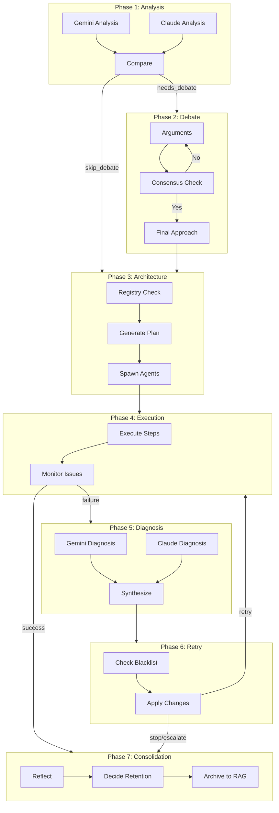

# Module : core/hive_mind/phases

## Role dans l'Architecture NEXUS V8.0

Implementation des **7 phases** du pipeline TRUE HIVE MIND. Chaque phase est une classe independante avec responsabilite unique, orchestree par `TrueHiveMind`.

## Vue d'Ensemble des Phases

```
+---------------+    +----------------+    +------------------+
| PHASE 1       | -> | PHASE 2        | -> | PHASE 3          |
| Independent   |    | Strategic      |    | Architecture     |
| Analysis      |    | Debate         |    | Generation       |
+---------------+    +----------------+    +------------------+
       |                    |                      |
  [Parallel]           [Adaptive              [BREAKPOINT:
   Gemini +             3-10 tours]            BEFORE_SPAWN]
   Claude                   |                      |
                    [BREAKPOINT:                   v
                     AFTER_DEBATE]        +------------------+
                                          | PHASE 4          |
                                          | Monitored        |
                                          | Execution        |
                                          +--------+---------+
                                                   |
                    +------------------------------+
                    |                              |
              [SUCCESS]                       [FAILURE]
                    |                              |
                    |                    +---------v---------+
                    |                    | PHASE 5           |
                    |                    | Failure           |
                    |                    | Diagnosis         |
                    |                    +---------+---------+
                    |                              |
                    |                    [BREAKPOINT:
                    |                     AFTER_DIAGNOSIS]
                    |                              |
                    |                    +---------v---------+
                    |                    | PHASE 6           |
                    |                    | Adaptive          |
                    |                    | Retry             |
                    |                    +---------+---------+
                    |                              |
                    |            [Loop back to Phase 4 or ESCALATE]
                    |                              |
                    +---------------+--------------+
                                    |
                          +---------v---------+
                          | PHASE 7           |
                          | Knowledge         |
                          | Consolidation     |
                          +---------+---------+
                                    |
                          [BREAKPOINT:
                           KNOWLEDGE_CONSOLIDATION]
                                    |
                                    v
                              [COMPLETE]
```

## Composants Cles

### Phase 1: Independent Analysis (`phase_analysis.py`)
| Classe | `IndependentAnalysisPhase` |
|--------|----------------------------|
| **Role** | Analyse independante par Gemini et Claude (en parallele) |
| **Innovation** | Agents ne voient PAS l'analyse de l'autre avant comparaison |
| **Sortie** | `AnalysisPhaseResult` avec `needs_debate: bool` |
| **Seuils** | `AGREEMENT_THRESHOLD = 0.85` (skip debate si > 85%) |

```python
# Flux simplifie
gemini_analysis = await self._analyze_gemini(task)  # Parallele
claude_analysis = await self._analyze_claude(task)  # Parallele
comparison = self._compare_analyses(gemini_analysis, claude_analysis)
return AnalysisPhaseResult(needs_debate=comparison.agreement_score < 0.85)
```

### Phase 2: Strategic Debate (`phase_debate.py`)
| Classe | `StrategicDebatePhase` |
|--------|------------------------|
| **Role** | Debat structure pour resoudre desaccords |
| **Format** | Argument/Contre-argument avec preuves |
| **Tours** | Adaptatifs 3-10 (selon complexite et erreurs) |
| **Sortie** | `DebatePhaseResult` avec `final_approach` |

```python
# Positions possibles dans le debat
positions = ["SUPPORT", "OPPOSE", "CONCEDE"]

# Fin du debat
- Consensus atteint (score >= threshold)
- Max tours atteint
- Vote force (stagnation detectee)
```

### Phase 3: Architecture Generation (`phase_architecture.py`)
| Classe | `ArchitectureGenerationPhase` |
|--------|-------------------------------|
| **Role** | Design de la topologie d'agents et plan d'execution |
| **Integration** | `AgentRegistry` pour anti-duplication |
| **Breakpoint** | `BEFORE_SPAWN` - utilisateur peut refuser spawns |
| **Sortie** | `ArchitecturePhaseResult` avec `AgentArchitecture` |

```python
# Structure architecture
AgentArchitecture:
  - agents_to_use: ["gemini", "claude", "existing_specialist"]
  - agents_to_spawn: [AgentSpec(...)]
  - execution_plan: ExecutionPlan(strategy="sequential"|"parallel"|"pipeline")
  - rag_config: RAGConfig(depth="shallow"|"standard"|"deep")
```

### Phase 4: Monitored Execution (`phase_execution.py`)
| Classe | `MonitoredExecutionPhase` |
|--------|---------------------------|
| **Role** | Execution avec monitoring temps-reel |
| **Detection** | Timeouts, erreurs, hallucinations |
| **Verification** | Artifacts crees valides |
| **Sortie** | `ExecutionPhaseResult` avec `step_results[]` |

```python
# Issue severities
IssueSeverity: INFO | WARNING | ERROR | CRITICAL

# Declencheur Phase 5
if any(issue.severity >= ERROR for issue in issues):
    needs_diagnosis = True
```

### Phase 5: Failure Diagnosis (`phase_diagnosis.py`)
| Classe | `FailureDiagnosisPhase` |
|--------|-------------------------|
| **Role** | Double diagnostic (Gemini + Claude) + synthese |
| **Innovation** | Cross-validation reduit les erreurs de diagnostic |
| **Breakpoint** | `AFTER_DIAGNOSIS` - utilisateur decide retry/abort |
| **Sortie** | `DiagnosisPhaseResult` avec `FailureDiagnosis` |

```python
# Types de failures
FailureType:
  - TIMEOUT
  - CAPABILITY_MISSING
  - HALLUCINATION
  - STRATEGY_WRONG
  - TOOL_ERROR
  - CONTEXT_LOST
  - BUDGET_EXCEEDED
  - UNKNOWN
```

### Phase 6: Adaptive Retry (`phase_retry.py`)
| Classe | `AdaptiveRetryPhase` |
|--------|----------------------|
| **Role** | Application changements + retry avec protection anti-circulaire |
| **Integration** | `StrategyBlacklist` pour eviter strategies echouees |
| **Limite** | `MAX_RETRIES = 3` avant escalation |
| **Sortie** | `RetryPhaseResult` avec `modified_architecture` |

```python
# Decisions possibles
RetryDecision.action:
  - "RETRY": Appliquer changements, re-executer Phase 4
  - "STOP": Arreter, retourner echec
  - "ESCALATE": Demander intervention humaine
```

### Phase 7: Knowledge Consolidation (`phase_consolidation.py`)
| Classe | `KnowledgeConsolidationPhase` |
|--------|-------------------------------|
| **Role** | Reflexion post-tache + decisions retention |
| **Innovation** | Agents debattent de quoi retenir |
| **Breakpoint** | `KNOWLEDGE_CONSOLIDATION` |
| **Sortie** | `ConsolidationPhaseResult` avec patterns appris |

```python
# Decisions de retention
RetentionDecision:
  - KEEP_PERMANENT: Garder l'agent indefiniment
  - ARCHIVE_KNOWLEDGE: Archiver savoir, supprimer agent
  - MERGE_INTO_EXISTING: Fusionner dans agent existant
  - DELETE: Supprimer completement
```

## Architecture & Flux

### Entrees (par phase)
| Phase | Entrees |
|-------|---------|
| 1 | `task: str` |
| 2 | `task`, `comparison: AnalysisComparison`, `complexity` |
| 3 | `task`, `debate_result: DebateResult` |
| 4 | `task`, `architecture: AgentArchitecture` |
| 5 | `task`, `step_results[]`, `issues[]`, `failure_step` |
| 6 | `diagnosis`, `current_architecture`, `recommendations[]` |
| 7 | `task`, `success`, `duration`, `agents_used[]`, `agents_spawned[]` |

### Sorties
Chaque phase retourne un `*PhaseResult` dataclass contenant:
- Status de completion
- Donnees pour phase suivante
- Metriques (tokens, duree)

### Configuration Heritee
Toutes les phases utilisent `CostEstimator` et `HiveMindContextManager` injectes depuis `TrueHiveMind`.

## Dependances

### Utilise
```python
from ..types import *  # Dataclasses et enums
from ..cost_estimator import CostEstimator
from ..context_manager import HiveMindContextManager
from ..agent_registry import AgentRegistry  # Phase 3, 7
from ..user_interaction import UserInteractionHandler  # Phase 3, 5, 7
from ..strategy_blacklist import StrategyBlacklist  # Phase 6
from ..adaptive_debate import AdaptiveDebateConfig  # Phase 2
```

### Utilise par
```python
from core.hive_mind.orchestrator import TrueHiveMind
```

## Diagramme: Interactions entre Phases



## Tests Associes

| Fichier | Coverage |
|---------|----------|
| `tests/test_hive_mind_e2e.py` | Integration complete |
| `tests/test_v8_integrations.py` | Tests unitaires phases |

## Notes Techniques

### Prompts JSON
Toutes les phases utilisent des prompts structurees avec format JSON attendu pour parsing fiable.

### Parallelisation
- Phase 1: Analyses Gemini/Claude en parallele (`asyncio.gather`)
- Phase 5: Diagnostics Gemini/Claude en parallele
- Phase 7: Reflexions Gemini/Claude en parallele

### Gestion d'Erreurs
Chaque phase capture exceptions et les propage avec contexte pour debugging.

### Extensibilite
Nouvelles phases peuvent etre ajoutees en:
1. Creant `phase_newphase.py` avec classe heritant pattern existant
2. Ajoutant export dans `__init__.py`
3. Integrant dans `TrueHiveMind._init_phases()`
