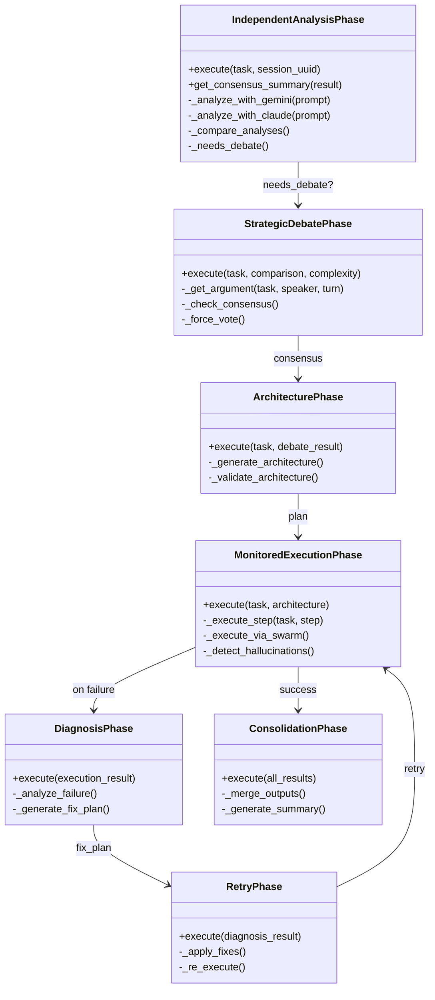

# HiveMind Phases


## SYNOPSIS

The **HiveMind Phases** implement the 7-phase cognitive pipeline for complex task orchestration. Each phase represents a distinct stage in the collaborative reasoning process between Gemini and Claude agents.

The pipeline follows a structured flow: **Analysis → Debate → Architecture → Execution → Diagnosis → Retry → Consolidation**.

---

## COMPONENT MAP (Mermaid)



---

## INTERACTION MATRIX

| Component | Calls (Outbound) | Called By (Inbound) | Data Type Exchanged |
|-----------|------------------|---------------------|---------------------|
| `phase_analysis.py` | GeminiDriver, ClaudeDriver, CostEstimator | HiveMindOrchestrator | `AnalysisPhaseResult` |
| `phase_debate.py` | GeminiDriver, ClaudeDriver, ContextManager | HiveMindOrchestrator | `DebatePhaseResult` |
| `phase_architecture.py` | GeminiDriver, ClaudeDriver | HiveMindOrchestrator | `ArchitecturePhaseResult` |
| `phase_execution.py` | GeminiDriver, ClaudeDriver, SwarmEngine, ToolExecutor | HiveMindOrchestrator | `ExecutionPhaseResult` |
| `phase_diagnosis.py` | GeminiDriver, ClaudeDriver | HiveMindOrchestrator | `DiagnosisPhaseResult` |
| `phase_retry.py` | MonitoredExecutionPhase | HiveMindOrchestrator | `RetryPhaseResult` |
| `phase_consolidation.py` | All phase results | HiveMindOrchestrator | `ConsolidationResult` |

---

## FILE INVENTORY

| File | Lines | Size | Role |
|------|-------|------|------|
| `__init__.py` | 30 | 1.1KB | Phase exports |
| `phase_analysis.py` | 546 | 19.9KB | Phase 1: Independent Analysis |
| `phase_debate.py` | 673 | 24.9KB | Phase 2: Strategic Debate |
| `phase_architecture.py` | 580 | 21.0KB | Phase 3: Architecture Design |
| `phase_execution.py` | 705 | 24.9KB | Phase 4: Monitored Execution |
| `phase_diagnosis.py` | 420 | 15.4KB | Phase 5: Error Diagnosis |
| `phase_retry.py` | 350 | 13.1KB | Phase 6: Retry with Fixes |
| `phase_consolidation.py` | 560 | 20.7KB | Phase 7: Result Consolidation |

---

## HIERARCHY

```
core/
└── hive_mind/
    ├── orchestrator.py      ← Orchestrates phases
    ├── context_manager.py   ← Shared context
    └── phases/              ← THIS FOLDER
        ├── phase_analysis.py
        ├── phase_debate.py
        ├── phase_architecture.py
        ├── phase_execution.py
        ├── phase_diagnosis.py
        ├── phase_retry.py
        └── phase_consolidation.py
```

This folder contains the implementation of each HiveMind phase. The parent `hive_mind/` orchestrator imports and coordinates these phases in sequence.

---

## KEY PATTERNS

- **Phase Result Pattern**: Each phase returns a typed `*PhaseResult` dataclass
- **Session Isolation**: All phases accept `session_uuid` for V10 context isolation
- **Fallback Handling**: Each phase has `_create_fallback_*` methods for graceful degradation
- **SwarmBridge**: Phase 4 can delegate to Swarm Engine via `_execute_via_swarm()`
