# phases

NEXUS V8.0 - Hive Mind Phases

The 7-phase architecture for TRUE collaborative intelligence.

Phase Flow:
1. Independent Analysis - Both agents analyze task separately
2. Strategic Debate - Resolve disagreements through argumentation
3. Architecture Generation - Design agent topology and execution plan
4. Monitored Execution - Execute with real-time monitoring
5. Failure Diagnosis - Dual-agent failure analysis
6. Adaptive Retry - Apply changes and retry with blacklist
7. Knowledge Consolidation - Post-task debate on what to retain

## Overview

| Metric | Value |
|--------|-------|
| **Path** | `C:\Code\NEXUS\NEXUS-N7A\core\hive_mind\phases` |
| **Modules** | 8 |
| **Total Lines** | 4245 |
| **Classes** | 16 |
| **Functions** | 0 |

## Architecture

```mermaid
classDiagram
    class AnalysisPhaseResult {
        +IndependentAnalysis gemini_analysis
        +IndependentAnalysis claude_analysis
        +AnalysisComparison comparison
        +bool needs_debate
        +Optional[str] skip_reason
    }
    class IndependentAnalysisPhase {
        +AGREEMENT_THRESHOLD
        +DISAGREEMENT_SEVERITY_THRESHOLD
        +gemini
        +claude
        +cost_estimator
        +context_manager
        -_task_id
        -_session_manager
        -__init__(self, gemini_driver: 'GeminiDriverV7', claude_driver: 'ClaudeDriverV7', cost_estimator: CostEstimator, context_manager: HiveMindContextManager, task_id: Optional[str]=..., session_manager: Optional['SwarmSessionManager']=...)
        +execute(self, task: str) AnalysisPhaseResult
        -_analyze_with_gemini(self, prompt: str, session_uuid: Optional[str]=...) IndependentAnalysis
        -_analyze_with_claude(self, prompt: str, session_uuid: Optional[str]=...) IndependentAnalysis
        -_parse_analysis_response(self, response, agent_id: str) Dict[str, Any]
        -_default_analysis_data(self) Dict[str, Any]
        -_create_fallback_analysis(self, agent_id: str, error: str) IndependentAnalysis
        -_compare_analyses(self, gemini: IndependentAnalysis, claude: IndependentAnalysis) AnalysisComparison
        -_text_similarity(self, text1: str, text2: str) float
        -_needs_debate(self, comparison: AnalysisComparison) bool
        -_get_skip_reason(self, comparison: AnalysisComparison) str
        +get_consensus_summary(self, result: AnalysisPhaseResult) Dict[str, Any]
        +task_id(self) str
        +session_integration(self) Optional[HiveMindSessionIntegration]
        +get_phase_transition_context(self, result: AnalysisPhaseResult, to_phase: str) 'ScopedContext'
    }
    class ArchitecturePhaseResult {
        +AgentArchitecture architecture
        +List[str] agents_spawned
        +bool user_approved_spawn
        +Optional[str] spawn_skipped_reason
    }
    class ArchitectureGenerationPhase {
        +gemini
        +claude
        +cost_estimator
        +context_manager
        +registry
        +user_handler
        +workspace_path
        -_task_id
        -_session_manager
        -__init__(self, gemini_driver: 'GeminiDriverV7', claude_driver: 'ClaudeDriverV7', cost_estimator: CostEstimator, context_manager: HiveMindContextManager, agent_registry: AgentRegistry, user_handler: UserInteractionHandler, workspace_path: Path, task_id: Optional[str]=..., session_manager: Optional['SwarmSessionManager']=...)
        +execute(self, task: str, debate_result: DebateResult) ArchitecturePhaseResult
        -_format_available_agents(self) str
        -_generate_architecture(self, task: str, approach: str, capabilities: List[str], available_agents: str) AgentArchitecture
        -_parse_architecture_response(self, response, capabilities: List[str]) AgentArchitecture
        -_create_fallback_architecture(self, capabilities: List[str]) AgentArchitecture
        -_check_for_duplicates(self, architecture: AgentArchitecture) AgentArchitecture
        -_spawn_agents(self, specs: List[AgentSpec]) List[str]
        +get_execution_ready_architecture(self, result: ArchitecturePhaseResult) Dict[str, Any]
    }
    class ConsolidationPhaseResult {
        +KnowledgeConsolidation consolidation
        +str gemini_reflection
        +str claude_reflection
        +str user_decision
        +int archived_to_rag
        +List[str] agents_retained
        +List[str] agents_deleted
    }
    class KnowledgeConsolidationPhase {
        +gemini
        +claude
        +cost_estimator
        +context_manager
        +registry
        +user_handler
        +project_memory
        -_task_id
        -_session_manager
        -__init__(self, gemini_driver: 'GeminiDriverV7', claude_driver: 'ClaudeDriverV7', cost_estimator: CostEstimator, context_manager: HiveMindContextManager, agent_registry: AgentRegistry, user_handler: UserInteractionHandler, project_memory: 'ProjectMemory'=..., task_id: Optional[str]=..., session_manager: Optional['SwarmSessionManager']=...)
        +execute(self, task: str, success: bool, duration: float, steps_completed: int, issues_count: int, approach: str, agents_used: List[str], agents_spawned: List[str]) ConsolidationPhaseResult
        -_reflect_with_gemini(self, prompt: str, session_uuid: Optional[str]=...) str
        -_reflect_with_claude(self, prompt: str, session_uuid: Optional[str]=...) str
        -_debate_consolidation(self, task: str, gemini_reflection: str, claude_reflection: str, success: bool) KnowledgeConsolidation
        -_parse_reflection(self, response) Dict[str, Any]
        -_merge_agent_decisions(self, gemini_decisions: List[Dict], claude_decisions: List[Dict]) List[AgentRetention]
        -_merge_knowledge_entries(self, gemini_entries: List[Dict], claude_entries: List[Dict]) List[KnowledgeEntry]
        -_apply_agent_decisions(self, decisions: List[AgentRetention]) tuple[List[str], List[str]]
        -_archive_knowledge(self, entries: List[KnowledgeEntry], task: str) int
        -_create_minimal_result(self, task: str, success: bool) ConsolidationPhaseResult
    }
    class MisalignmentFlag {
        +str flag_type
        +str pattern_matched
        +str severity
        +str agent_id
        +int turn_number
        +str context
    }
    class MisalignmentDetector {
        +MISALIGNMENT_PATTERNS
        +SEVERITY_MAP
        -__init__(self)
        +check_argument(self, argument: 'DebateArgument', agent_id: str, turn_number: int, previous_context: str=...) List[MisalignmentFlag]
        +get_all_flags(self) List[MisalignmentFlag]
        +get_high_severity_count(self) int
        +should_escalate(self, threshold: int=...) bool
        +reset(self)
    }
    class DebatePhaseResult {
        +DebateResult debate_result
        +str final_approach
        +List[str] final_capabilities
        +str final_mode
        +bool was_skipped
        +Optional[str] skip_reason
        +Optional[List[MisalignmentFlag]] misalignment_flags
    }
    class StrategicDebatePhase {
        +gemini
        +claude
        +cost_estimator
        +context_manager
        +debate_config
        -_task_id
        -_session_manager
        -_misalignment_detector
        -__init__(self, gemini_driver: 'GeminiDriverV7', claude_driver: 'ClaudeDriverV7', cost_estimator: CostEstimator, context_manager: HiveMindContextManager, debate_config: AdaptiveDebateConfig=..., task_id: Optional[str]=..., session_manager: Optional['SwarmSessionManager']=...)
        +execute(self, task: str, comparison: AnalysisComparison, complexity: TaskComplexity=...) DebatePhaseResult
        -_create_skipped_result(self, comparison: AnalysisComparison) DebatePhaseResult
        -_get_primary_disagreement(self, disagreements: List[Disagreement]) Disagreement
        -_get_argument(self, task: str, speaker: str, turn_number: int, disagreement: Disagreement, comparison: AnalysisComparison, debate_history: List[DebateArgument], params: DebateParams) DebateArgument
        -_parse_argument_response(self, response) Dict[str, Any]
        -_format_debate_history(self, history: List[DebateArgument]) str
        -_check_consensus(self, task: str, debate_history: List[DebateArgument], disagreement: Disagreement, comparison: AnalysisComparison) Dict[str, Any]
        -_force_vote(self, task: str, debate_history: List[DebateArgument], comparison: AnalysisComparison, params: DebateParams) DebatePhaseResult
        -_create_result(self, debate_history: List[DebateArgument], consensus: Dict[str, Any], status: str) DebatePhaseResult
    }
    class DiagnosisPhaseResult {
        +FailureDiagnosis diagnosis
        +str gemini_diagnosis
        +str claude_diagnosis
        +str user_decision
        +Optional[str] user_modifications
    }
    class FailureDiagnosisPhase {
        +gemini
        +claude
        +cost_estimator
        +context_manager
        +user_handler
        -_task_id
        -_session_manager
        -__init__(self, gemini_driver: 'GeminiDriverV7', claude_driver: 'ClaudeDriverV7', cost_estimator: CostEstimator, context_manager: HiveMindContextManager, user_handler: UserInteractionHandler, task_id: Optional[str]=..., session_manager: Optional['SwarmSessionManager']=...)
        +execute(self, task: str, step_results: List[MonitoredStepResult], issues: List[ExecutionIssue], failure_step: Optional[str]) DiagnosisPhaseResult
        -_format_execution_context(self, results: List[MonitoredStepResult]) str
        -_format_issues(self, issues: List[ExecutionIssue]) str
        -_diagnose_with_gemini(self, prompt: str, session_uuid: Optional[str]=...) str
        -_diagnose_with_claude(self, prompt: str, session_uuid: Optional[str]=...) str
        -_synthesize_diagnoses(self, task: str, gemini_diagnosis: str, claude_diagnosis: str) FailureDiagnosis
        -_parse_diagnosis_response(self, response, gemini_diagnosis: str, claude_diagnosis: str) FailureDiagnosis
        -_create_fallback_diagnosis(self, gemini_diagnosis: str, claude_diagnosis: str) FailureDiagnosis
        +get_retry_recommendations(self, result: DiagnosisPhaseResult) Dict[str, Any]
    }
    class ExecutionPhaseResult {
        +bool success
        +List[MonitoredStepResult] step_results
        +float total_duration
        +int total_tokens
        +List[ExecutionIssue] issues
        +List[str] artifacts_created
        +bool needs_diagnosis
        +Optional[str] failure_step
    }
    class MonitoredExecutionPhase {
        +HALLUCINATION_PATTERNS
        +ERROR_PATTERNS
        +gemini
        +claude
        +cost_estimator
        +context_manager
        +tool_executor
        +swarm_bridge
        -_task_id
        -_session_manager
        -__init__(self, gemini_driver: 'GeminiDriverV7', claude_driver: 'ClaudeDriverV7', cost_estimator: CostEstimator, context_manager: HiveMindContextManager, tool_executor: Callable=..., swarm_engine: 'HybridSwarmEngine'=..., task_id: Optional[str]=..., session_manager: Optional['SwarmSessionManager']=...)
        +execute(self, task: str, architecture: AgentArchitecture) ExecutionPhaseResult
        -_is_step_complete(self, step_name: str, results: List[MonitoredStepResult]) bool
        -_execute_step(self, task: str, step: ExecutionStep, previous_results: List[MonitoredStepResult]) MonitoredStepResult
        -_format_previous_results(self, results: List[MonitoredStepResult]) str
        -_parse_execution_response(self, response) Dict[str, Any]
        -_detect_hallucinations(self, response: str, step_name: str) List[ExecutionIssue]
        -_detect_errors(self, output: str, step_name: str) List[ExecutionIssue]
        -_verify_artifacts(self, artifacts: List[str]) bool
        +get_execution_summary(self, result: ExecutionPhaseResult) Dict[str, Any]
        -_execute_via_swarm(self, task: str, step: ExecutionStep, previous_results: List[MonitoredStepResult]) MonitoredStepResult
    }
    class RetryPhaseResult {
        +RetryDecision decision
        +Optional[AgentArchitecture] modified_architecture
        +int retry_count
        +bool blacklisted
    }
```

## Modules

| Module | Description | Classes | Functions |
|--------|-------------|---------|-----------|
| [phase_analysis](phase_analysis.py) | NEXUS V9.2 - Phase 1: Independent Analysis | 2 | 0 |
| [phase_architecture](phase_architecture.py) | NEXUS V9.2 - Phase 3: Architecture Generation | 2 | 0 |
| [phase_consolidation](phase_consolidation.py) | NEXUS V9.2 - Phase 7: Knowledge Consolidation | 2 | 0 |
| [phase_debate](phase_debate.py) | NEXUS V9.2 - Phase 2: Strategic Debate | 4 | 0 |
| [phase_diagnosis](phase_diagnosis.py) | NEXUS V9.2 - Phase 5: Failure Diagnosis | 2 | 0 |
| [phase_execution](phase_execution.py) | NEXUS V9.2 - Phase 4: Monitored Execution | 2 | 0 |
| [phase_retry](phase_retry.py) | NEXUS V8.0 - Phase 6: Adaptive Retry | 2 | 0 |

---
*Auto-generated by nexus-doc-generator 1.0.0 - 2025-12-16 19:13*