# interaction

Interaction Module - User Interaction Abstraction Layer.

NEXUS V9.8 DETOX - Headless Refactoring

This module provides a clean abstraction for user interaction,
enabling NEXUS to run in both interactive CLI and headless server modes.

Configuration:
    Set NEXUS_INTERACTION_MODE environment variable:
    - "cli" (default): Interactive terminal mode
    - "headless": Non-blocking, returns defaults
    - "strict": Headless but raises on missing defaults

Usage:
    from core.interaction import get_interaction_provider

    async def my_function():
        provider = get_interaction_provider()

        # Ask for input
        name = await provider.ask("Enter name", default="Anonymous")

        # Confirm action
        if await provider.confirm("Proceed?", default=True):
            await provider.announce("Processing...")

        # Multiple choice
        choice = await provider.choose(
            "Select option",
            choices=[
                Choice("a", "Option A"),
                Choice("b", "Option B"),
            ],
            default="a"
        )

Author: Claude (NEXUS DETOX)
Date: 2025-12-13

## Overview

| Metric | Value |
|--------|-------|
| **Path** | `C:\Code\NEXUS\NEXUS-N7A\core\interaction` |
| **Modules** | 5 |
| **Total Lines** | 1359 |
| **Classes** | 7 |
| **Functions** | 9 |

## Architecture

```mermaid
classDiagram
    class InteractionLevel {
        +DEBUG
        +INFO
        +WARNING
        +ERROR
        +CRITICAL
    }
    Enum <|-- InteractionLevel
    class InteractionRequiredError {
        +prompt
        +context
        -__init__(self, prompt: str, context: Optional[str]=...)
    }
    Exception <|-- InteractionRequiredError
    class Choice {
        +str key
        +str label
        +Optional[str] description
    }
    class InteractionProvider {
        +ask(self, prompt: str, default: Optional[str]=..., timeout: Optional[float]=..., required: bool=...) str
        +confirm(self, prompt: str, default: bool=..., timeout: Optional[float]=...) bool
        +choose(self, prompt: str, choices: List[Choice], default: Optional[str]=..., timeout: Optional[float]=...) str
        +announce(self, message: str, level: InteractionLevel=...) None
        +progress(self, message: str, current: int, total: int) None
        +is_interactive(self) bool
    }
    class CLIProvider {
        +prefix
        -__init__(self, prefix: str=...)
        +ask(self, prompt: str, default: Optional[str]=..., timeout: Optional[float]=..., required: bool=...) str
        +confirm(self, prompt: str, default: bool=..., timeout: Optional[float]=...) bool
        +choose(self, prompt: str, choices: List[Choice], default: Optional[str]=..., timeout: Optional[float]=...) str
        +announce(self, message: str, level: InteractionLevel=...) None
        +progress(self, message: str, current: int, total: int) None
        +is_interactive(self) bool
    }
    InteractionProvider <|-- CLIProvider
    class HeadlessProvider {
        +strict
        -_logger
        -_publish_events
        -_interactive
        -_interaction_timeout
        -__init__(self, strict: bool=..., logger_name: Optional[str]=..., publish_events: bool=..., interactive: bool=..., interaction_timeout: float=...)
        -_publish_event(self, event_type_name: str, payload: Dict[str, Any]) None
        +get_pending_requests(self) List[dict]
        +resolve_interaction(self, request_id: str, response: Any) bool
        -_wait_for_response(self, request_id: str, interaction_type: str, prompt: str, default: Any, extra_data: Optional[dict]=...) Any
        +ask(self, prompt: str, default: Optional[str]=..., timeout: Optional[float]=..., required: bool=...) str
        +confirm(self, prompt: str, default: bool=..., timeout: Optional[float]=...) bool
        +choose(self, prompt: str, choices: List[Choice], default: Optional[str]=..., timeout: Optional[float]=...) str
        +announce(self, message: str, level: InteractionLevel=...) None
        +progress(self, message: str, current: int, total: int) None
        +is_interactive(self) bool
    }
    InteractionProvider <|-- HeadlessProvider
    class HITLPersistence {
        +DEFAULT_TTL_HOURS
        +create_request(tenant_id: UUID, workspace_id: str, request_type: str, prompt: str, options: Optional[list]=..., context_data: Optional[dict]=..., ttl_hours: int=...) dict
        +get_pending(tenant_id: UUID, workspace_id: Optional[str]=...) List[dict]
        +answer_request(request_id: UUID, answer: str) Optional[dict]
        +cancel_request(request_id: UUID) bool
        +get_request(request_id: UUID) Optional[dict]
        +cleanup_expired() int
    }
```

## Modules

| Module | Description | Classes | Functions |
|--------|-------------|---------|-----------|
| [base](base.py) | InteractionProvider - Abstract Base for User Interaction. | 4 | 0 |
| [cli_provider](cli_provider.py) | CLIProvider - Interactive Command-Line Interaction Provider. | 1 | 0 |
| [headless_provider](headless_provider.py) | HeadlessProvider - Non-blocking Interaction Provider for Servers. | 1 | 0 |
| [hitl_persistence](hitl_persistence.py) | NEXUS V12.2 IRONCLAD - HITL Persistence Service | 1 | 6 |

---
*Auto-generated by nexus-doc-generator 1.0.0 - 2025-12-16 19:13*