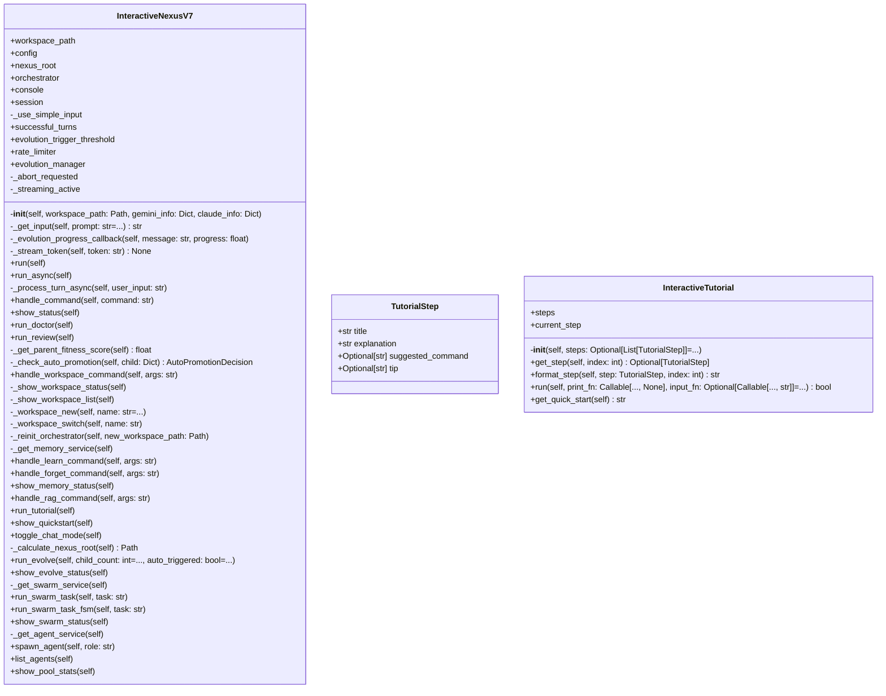

# interface

NEXUS V7 Interface Module

## Overview

| Metric | Value |
|--------|-------|
| **Path** | `C:\Code\NEXUS\NEXUS-N7A\core\interface` |
| **Modules** | 4 |
| **Total Lines** | 1856 |
| **Classes** | 3 |
| **Functions** | 5 |

## Architecture

## Modules

| Module | Description | Classes | Functions |
|--------|-------------|---------|-----------|
| [repl](repl.py) | REPL Interface V7 - Persistent Orchestrator | 1 | 0 |
| [slash_commands](slash_commands.py) | Slash Commands - Commandes système pour NEXUS V7.7 HIVE MIND | 0 | 5 |
| [tutorial](tutorial.py) | Interactive Tutorial - NEXUS V8.3.x TRUE HIVE MIND | 2 | 0 |

## Subpackages

| Package | Description | Modules |
|---------|-------------|---------|
| [commands/](C:\Code\NEXUS\NEXUS-N7A\core\interface\commands/README.md) |  | 0 |

## Aggregated Statistics

---
*Auto-generated by nexus-doc-generator 1.0.0 - 2025-12-16 19:13*