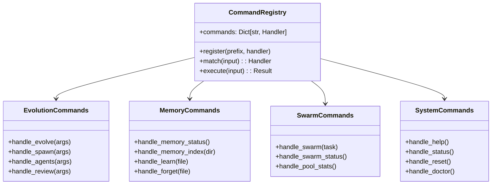

# REPL Commands


## SYNOPSIS

The **Commands** module implements the slash command system for the NEXUS REPL. Each file handles a specific command category (evolution, memory, swarm, etc.), parsing user input and delegating to the appropriate subsystem.

Commands are registered via the `@register` decorator and matched by prefix.

---

## COMPONENT MAP (Mermaid)



---

## INTERACTION MATRIX

| Component | Calls (Outbound) | Called By (Inbound) | Data Type Exchanged |
|-----------|------------------|---------------------|---------------------|
| `evolution.py` | EvolutionManager, BrainstormPhase | REPL (repl.py) | Command results |
| `memory.py` | ProjectMemory | REPL (repl.py) | Memory stats |
| `swarm.py` | HybridSwarmEngine, DyLANPool | REPL (repl.py) | Swarm status |
| `system.py` | Orchestrator, FSM | REPL (repl.py) | System state |
| `registry.py` | All command handlers | REPL (repl.py) | Handler dispatch |
| `misc.py` | Various utilities | REPL (repl.py) | Misc commands |
| `workspace.py` | WorkspaceManager | REPL (repl.py) | Workspace ops |
| `telemetry.py` | TelemetryService | REPL (repl.py) | Metrics |

---

## FILE INVENTORY

| File | Lines | Size | Role |
|------|-------|------|------|
| `__init__.py` | 40 | 1.4KB | Command exports |
| `evolution.py` | 980 | 34.9KB | /evolve, /spawn, /agents, /review |
| `memory.py` | 100 | 3.4KB | /memory, /learn, /forget |
| `swarm.py` | 85 | 3.0KB | /swarm, /swarm-status, /pool-stats |
| `system.py` | 160 | 5.8KB | /help, /status, /reset, /doctor |
| `registry.py` | 190 | 6.7KB | Command registration |
| `misc.py` | 540 | 19.2KB | /bootstrap, /tutorial, /quickstart |
| `workspace.py` | 30 | 1.0KB | /workspace commands |
| `telemetry.py` | 55 | 1.8KB | /telemetry, /budget |

---

## HIERARCHY

```
core/
└── interface/
    ├── repl.py          ← Main REPL loop
    ├── async_repl.py    ← Async REPL
    └── commands/        ← THIS FOLDER
        ├── evolution.py
        ├── memory.py
        ├── swarm.py
        ├── system.py
        └── ...
```

---

## KEY PATTERNS

- **Command Registration**: `CommandRegistry.register("/evolve", handler)`
- **Prefix Matching**: Commands matched by longest prefix first
- **Result Types**: Commands return `CommandResult(success, message, data)`
