# commands

NEXUS V9 Command System

This module provides:
1. Legacy slash command utilities (from slash_commands.py)
2. Strategy Pattern-based command dispatch system (V9)

Usage (V9 - New):
    from core.interface.commands import get_initialized_registry, CommandContext

    registry = get_initialized_registry()
    context = CommandContext(orchestrator, console, config, extras={"repl": repl})
    result = registry.dispatch("/status", context)

Usage (Legacy):
    from core.interface.commands import is_slash_command, parse_command

## Overview

| Metric | Value |
|--------|-------|
| **Path** | `C:\Code\NEXUS\NEXUS-N7A\core\interface\commands` |
| **Modules** | 9 |
| **Total Lines** | 2113 |
| **Classes** | 33 |
| **Functions** | 20 |

## Architecture

```mermaid
classDiagram
    class SpawnCommand {
        +name(self) str
        +aliases(self) List[str]
        +description(self) str
        +usage(self) str
        +execute(self, args: str, context: CommandContext) CommandResult
    }
    Command <|-- SpawnCommand
    class AgentsCommand {
        +name(self) str
        +aliases(self) List[str]
        +description(self) str
        +execute(self, args: str, context: CommandContext) CommandResult
    }
    Command <|-- AgentsCommand
    class PoolStatsCommand {
        +name(self) str
        +aliases(self) List[str]
        +description(self) str
        +execute(self, args: str, context: CommandContext) CommandResult
    }
    Command <|-- PoolStatsCommand
    class EvolveCommand {
        +name(self) str
        +aliases(self) List[str]
        +description(self) str
        +usage(self) str
        +execute(self, args: str, context: CommandContext) CommandResult
    }
    Command <|-- EvolveCommand
    class EvolveStatusCommand {
        +name(self) str
        +aliases(self) List[str]
        +description(self) str
        +execute(self, args: str, context: CommandContext) CommandResult
    }
    Command <|-- EvolveStatusCommand
    class ReviewCommand {
        +name(self) str
        +aliases(self) List[str]
        +description(self) str
        +execute(self, args: str, context: CommandContext) CommandResult
    }
    Command <|-- ReviewCommand
    class LearnCommand {
        +name(self) str
        +aliases(self) List[str]
        +description(self) str
        +usage(self) str
        +execute(self, args: str, context: CommandContext) CommandResult
    }
    Command <|-- LearnCommand
    class ForgetCommand {
        +name(self) str
        +aliases(self) List[str]
        +description(self) str
        +usage(self) str
        +execute(self, args: str, context: CommandContext) CommandResult
    }
    Command <|-- ForgetCommand
    class MemoryStatusCommand {
        +name(self) str
        +aliases(self) List[str]
        +description(self) str
        +execute(self, args: str, context: CommandContext) CommandResult
    }
    Command <|-- MemoryStatusCommand
    class RagCommand {
        +name(self) str
        +aliases(self) List[str]
        +description(self) str
        +usage(self) str
        +execute(self, args: str, context: CommandContext) CommandResult
    }
    Command <|-- RagCommand
    class ClearCommand {
        +name(self) str
        +aliases(self) List[str]
        +description(self) str
        +execute(self, args: str, context: CommandContext) CommandResult
    }
    Command <|-- ClearCommand
    class ModeCommand {
        +name(self) str
        +aliases(self) List[str]
        +description(self) str
        +usage(self) str
        +execute(self, args: str, context: CommandContext) CommandResult
    }
    Command <|-- ModeCommand
    class ResetCommand {
        +name(self) str
        +aliases(self) List[str]
        +description(self) str
        +execute(self, args: str, context: CommandContext) CommandResult
    }
    Command <|-- ResetCommand
    class DoctorCommand {
        +name(self) str
        +aliases(self) List[str]
        +description(self) str
        +execute(self, args: str, context: CommandContext) CommandResult
    }
    Command <|-- DoctorCommand
    class TelemetryCommand {
        +name(self) str
        +aliases(self) List[str]
        +description(self) str
        +usage(self) str
        +execute(self, args: str, context: CommandContext) CommandResult
    }
    Command <|-- TelemetryCommand
```

## Modules

| Module | Description | Classes | Functions |
|--------|-------------|---------|-----------|
| [agents](agents.py) | V9.1 Agent Commands - /spawn, /agents, /pool-stats | 3 | 2 |
| [evolution](evolution.py) | V9.1 Evolution Commands - /evolve, /evolve-status, /review | 3 | 2 |
| [memory](memory.py) | V9.1 Memory Commands - /learn, /forget, /memory-status, /rag | 4 | 2 |
| [misc](misc.py) | V9.1 Miscellaneous Commands - /mode, /reset, /doctor, /telemetry, /budget, /tutorial, /quickstart, /chat, /clear | 9 | 3 |
| [registry](registry.py) | V9 Command Registry - Strategy Pattern for REPL commands. | 5 | 2 |
| [swarm](swarm.py) | V9.1 Swarm Commands - /swarm, /swarm-status, /swarm-fsm | 3 | 2 |
| [system](system.py) | V9 System Commands - Status, Help, Doctor, etc. | 3 | 1 |
| [workspace](workspace.py) | V9.1 Workspace Commands - /bootstrap, /specialize, /workspace | 3 | 4 |

---
*Auto-generated by nexus-doc-generator 1.0.0 - 2025-12-16 19:13*