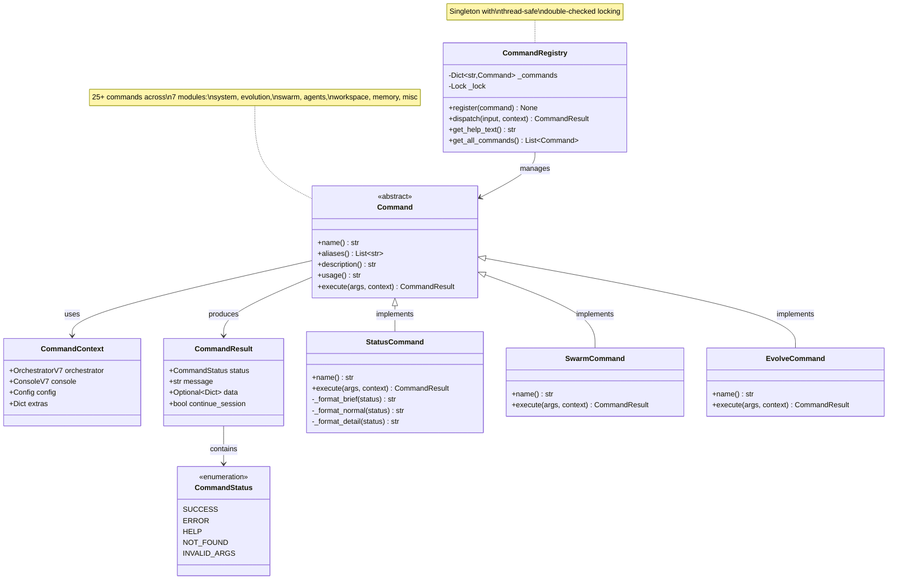

# Module: Commands - Strategy Pattern REPL Command System

**Version**: V9.1
**Last Updated**: 2025-12-11
**Parent**: [Interface Module](../README.md)

Strategy Pattern-based command dispatch system for NEXUS REPL with extensible, testable command architecture.

---

## SYNOPSIS

**Entrée:** User command string (e.g., `/status`, `/swarm analyze code`)
**Traitement:** Parse command, lookup in registry, execute via Strategy Pattern, return structured result
**Sortie:** CommandResult (status, message, data, continue_session flag)

---

## LOCAL MAP (Mermaid)



---

## INTERACTION MATRIX

| Composant | Appels Sortants | Appelé Par | Type de Données |
|-----------|-----------------|------------|-----------------|
| **CommandRegistry** | `Command.execute()` | `REPL.handle_user_input()` | `CommandResult` |
| **Command** (ABC) | - | All concrete commands | Abstract interface |
| **StatusCommand** | `orchestrator.get_system_status()` | `CommandRegistry.dispatch()` | `CommandResult` with system status |
| **SwarmCommand** | `SwarmService.run_task()` | `CommandRegistry.dispatch()` | `CommandResult` with swarm execution |
| **EvolveCommand** | `EvolutionService.run_evolution()` | `CommandRegistry.dispatch()` | `CommandResult` with evolution stats |
| **CommandContext** | - | All commands via `execute()` | Context object (orchestrator, console, config) |
| **get_initialized_registry()** | `register_*_commands()` (all 7 modules) | `REPL.__init__()` | Fully-initialized `CommandRegistry` |

---

## PARENT LINK

**Parent Directory:** `core/interface/`

This module implements the **V9 Strategy Pattern command system** for the parent Interface module. While `interface/` defines the overall user interaction layer (REPL, tutorial, slash commands), `commands/` focuses on **how** commands are dispatched and executed:

1. **CommandRegistry**: Singleton registry with thread-safe command lookup
2. **Command ABC**: Abstract base class for all commands
3. **7 Command Modules**: Organized by domain (system, evolution, swarm, agents, workspace, memory, misc)

**Replaces:** The 26-branch `elif` chain in `repl.py` with clean, testable Strategy Pattern

**Integration Points:**
- `REPL.handle_user_input()` calls `registry.dispatch(user_input, context)`
- Each command module registers its commands at startup via `get_initialized_registry()`
- Commands use **Service Layer Pattern** (EvolutionService, SwarmService, etc.) for business logic

**Related Modules:**
- [../repl.py](../repl.py) - Main REPL loop that uses CommandRegistry
- [../slash_commands.py](../slash_commands.py) - Legacy command definitions (backward compatibility)
- [../../evolution/](../../evolution/README.md) - Evolution commands delegate to EvolutionService
- [../../swarm/](../../swarm/README.md) - Swarm commands delegate to SwarmService

---

## Architecture

### Command Dispatch Flow

```
User Input: "/status detail"
       │
       ▼
┌─────────────────────┐
│  REPL               │
│  parse_input()      │
└──────────┬──────────┘
           │
           ▼
┌─────────────────────────────────────┐
│  CommandRegistry.dispatch()         │
│  1. Parse: "/status" + "detail"     │
│  2. Lookup: _commands["/status"]    │
│  3. Create context                  │
└──────────┬──────────────────────────┘
           │
           ▼
┌─────────────────────────────────────┐
│  StatusCommand.execute()            │
│  • Get system status                │
│  • Format based on args ("detail")  │
│  • Return CommandResult             │
└──────────┬──────────────────────────┘
           │
           ▼
┌─────────────────────────────────────┐
│  CommandResult                      │
│  status: SUCCESS                    │
│  message: "=== NEXUS Status ===..."  │
│  data: {...}                        │
│  continue_session: True             │
└─────────────────────────────────────┘
```

### Thread-Safe Singleton

```python
# Double-checked locking pattern
_registry_instance: Optional[CommandRegistry] = None
_registry_lock = threading.Lock()

def get_registry() -> CommandRegistry:
    global _registry_instance
    if _registry_instance is None:
        with _registry_lock:
            if _registry_instance is None:  # Double-check
                _registry_instance = CommandRegistry()
    return _registry_instance
```

---

## Components

### 1. registry.py - Core Infrastructure

**Key Classes:**

```python
class CommandStatus(Enum):
    SUCCESS = "success"
    ERROR = "error"
    HELP = "help"
    NOT_FOUND = "not_found"
    INVALID_ARGS = "invalid_args"

@dataclass
class CommandResult:
    status: CommandStatus
    message: str
    data: Optional[Dict[str, Any]] = None
    continue_session: bool = True

@dataclass
class CommandContext:
    orchestrator: OrchestratorV7
    console: ConsoleV7
    config: Config
    extras: Dict[str, Any] = field(default_factory=dict)

class Command(ABC):
    @property
    @abstractmethod
    def name(self) -> str:
        """Primary command name (e.g., '/status')"""
        pass

    @abstractmethod
    def execute(self, args: str, context: CommandContext) -> CommandResult:
        """Execute command with given args and context"""
        pass
```

### 2. system.py - System Commands

| Command | Aliases | Description |
|---------|---------|-------------|
| `/status` | `/s` | Show current system status (FSM state, agents, memory) |
| `/help` | `/h`, `/?` | Display categorized command help |
| `/doctor` | - | Run system diagnostics |
| `/reset` | - | Reset orchestrator to IDLE state |
| `/quit` | `/exit`, `/q` | Exit NEXUS REPL |

**Example:**
```python
class StatusCommand(Command):
    @property
    def name(self) -> str:
        return "/status"

    def execute(self, args: str, context: CommandContext) -> CommandResult:
        status = context.orchestrator.get_system_status()
        detail_level = args.strip().lower() or "normal"

        if detail_level == "brief":
            message = self._format_brief(status)
        elif detail_level == "detail":
            message = self._format_detail(status)
        else:
            message = self._format_normal(status)

        return CommandResult(
            status=CommandStatus.SUCCESS,
            message=message,
            data=status
        )
```

### 3. evolution.py - Evolution Commands

| Command | Description |
|---------|-------------|
| `/evolve [count]` | Create and evaluate child generations |
| `/evolve-status` | Show evolution stats and stagnation counter |
| `/review` | Review and evaluate pending children |
| `/spawn <role>` | Create specialized agent |
| `/specialize <mission>` | Create specialized NEXUS spinoff |

**Uses:** `EvolutionService` (Service Layer Pattern)

```python
class EvolveCommand(Command):
    def execute(self, args: str, context: CommandContext) -> CommandResult:
        service = _get_evolution_service(context)  # Helper function
        result = service.run_evolution(num_children=int(args or 3))

        if result.success:
            return CommandResult(
                status=CommandStatus.SUCCESS,
                message=result.message,
                data=result.data
            )
        else:
            return CommandResult(
                status=CommandStatus.ERROR,
                message=result.error_message
            )
```

### 4. swarm.py - Swarm Commands

| Command | Description |
|---------|-------------|
| `/swarm <task>` | Execute task using Hybrid Swarm Engine |
| `/swarm-status` | Show current swarm mode and DyLAN metrics |
| `/swarm-fsm <task>` | Route task via FSM states (debug mode) |
| `/pool-stats` | Show agent pool importance scores |

**Uses:** `SwarmService` (Service Layer Pattern)

### 5. agents.py - Agent Management

| Command | Description |
|---------|-------------|
| `/agents` | List all spawned agents |
| `/agent-info <name>` | Show detailed agent information |

### 6. workspace.py - Workspace Commands

| Command | Description |
|---------|-------------|
| `/workspace` | Show current workspace info |
| `/workspace new [name]` | Create new workspace, archive current |
| `/workspace list` | List all workspaces |
| `/workspace switch <name>` | Switch to another workspace |
| `/bootstrap [path]` | Analyze project and generate NEXUS.md |

### 7. memory.py - Memory Commands

| Command | Description |
|---------|-------------|
| `/learn [path]` | Index file/directory for ProjectMemory RAG |
| `/forget [path]` | Remove from ProjectMemory index |
| `/memory-status` | Show memory stats (chunks, terms, backend) |

### 8. misc.py - Miscellaneous

| Command | Description |
|---------|-------------|
| `/clear` | Clear terminal screen |
| `/chat` | Toggle chat-only mode (no tools) |
| `/mode <name>` | Change orchestrator mode |
| `/tutorial` | Interactive guide for new users |
| `/quickstart` | Quick start summary |

---

## Usage Examples

### Basic Command Execution

```python
from core.interface.commands import get_initialized_registry, CommandContext

# Get registry (singleton)
registry = get_initialized_registry()

# Create context
context = CommandContext(
    orchestrator=orchestrator,
    console=console,
    config=config,
    extras={"repl": repl}  # Optional extras
)

# Execute command
result = registry.dispatch("/status detail", context)
console.print(result.message)

if result.status == CommandStatus.SUCCESS:
    print("Command succeeded!")
elif result.status == CommandStatus.ERROR:
    print(f"Error: {result.message}")
```

### Adding Custom Command

```python
from core.interface.commands import Command, CommandResult, CommandStatus, get_registry

class MyCustomCommand(Command):
    @property
    def name(self) -> str:
        return "/mycmd"

    @property
    def aliases(self) -> List[str]:
        return ["/mc"]

    @property
    def description(self) -> str:
        return "My custom command"

    @property
    def usage(self) -> str:
        return "/mycmd [args]"

    def execute(self, args: str, context: CommandContext) -> CommandResult:
        # Custom logic here
        return CommandResult(
            status=CommandStatus.SUCCESS,
            message=f"Executed with args: {args}"
        )

# Register
registry = get_registry()
registry.register(MyCustomCommand())
```

### Service Layer Integration

```python
# Commands delegate to service layer for business logic
class SwarmCommand(Command):
    def execute(self, args: str, context: CommandContext) -> CommandResult:
        # Get service (cached in context.extras if available)
        service = _get_swarm_service(context)

        # Delegate to service
        result = service.run_task(args.strip())

        # Convert service result to CommandResult
        return CommandResult(
            status=CommandStatus.SUCCESS if result.success else CommandStatus.ERROR,
            message=result.message,
            data=result.data
        )
```

---

## Command Lifecycle

### 1. Registration (Startup)

```python
# In REPL.__init__() or main entry point
from core.interface.commands import get_initialized_registry

registry = get_initialized_registry()  # Auto-registers all commands
```

**Auto-Registration:**
```python
def get_initialized_registry() -> CommandRegistry:
    global _registry_initialized
    registry = get_registry()

    if not _registry_initialized:
        # Register all 7 command modules
        register_system_commands(registry)
        register_evolution_commands(registry)
        register_swarm_commands(registry)
        register_agent_commands(registry)
        register_workspace_commands(registry)
        register_memory_commands(registry)
        register_misc_commands(registry)

        _registry_initialized = True

    return registry
```

### 2. Dispatch (Runtime)

```python
# In REPL.handle_user_input()
result = registry.dispatch(user_input, context)

if not result.continue_session:
    break  # Exit REPL
```

### 3. Execution (Command Logic)

```python
# In Command.execute()
def execute(self, args: str, context: CommandContext) -> CommandResult:
    # 1. Validate args
    if not args.strip():
        return CommandResult(
            status=CommandStatus.INVALID_ARGS,
            message=f"Usage: {self.usage}"
        )

    # 2. Execute business logic (often via Service Layer)
    try:
        result = some_service.do_work(args)
        return CommandResult(
            status=CommandStatus.SUCCESS,
            message=result.message,
            data=result.data
        )
    except Exception as e:
        return CommandResult(
            status=CommandStatus.ERROR,
            message=f"Error: {e}"
        )
```

---

## Service Layer Pattern

Commands use **Service Layer Pattern** to separate:
- **Command Layer** (this module): User input parsing, result formatting
- **Service Layer** (e.g., `EvolutionService`, `SwarmService`): Business logic

**Benefits:**
- Testable business logic (no REPL dependency)
- Reusable services (can be called from anywhere)
- Clear separation of concerns

**Example Services:**
- `EvolutionService` (`core/evolution/service.py`)
- `SwarmService` (`core/swarm/service.py`)
- `TelemetryService` (`core/telemetry/service.py`)
- `BootstrapService` (`core/bootstrap/service.py`)

---

## Testing

```bash
# Test CommandRegistry
pytest tests/test_commands.py::TestCommandRegistry -v

# Test specific command modules
pytest tests/test_commands.py::TestSystemCommands -v
pytest tests/test_commands.py::TestEvolutionCommands -v
pytest tests/test_commands.py::TestSwarmCommands -v

# Test command dispatch
pytest tests/test_commands.py::test_dispatch_valid_command -v
pytest tests/test_commands.py::test_dispatch_invalid_command -v
pytest tests/test_commands.py::test_dispatch_with_args -v

# Test thread safety
pytest tests/test_commands.py::test_registry_singleton_thread_safe -v
```

---

## Design Benefits

### Before (V8.x - Giant elif chain)

```python
# In repl.py - 26 branches
def handle_user_input(self, user_input: str):
    if user_input.startswith("/status"):
        # Status logic here
    elif user_input.startswith("/swarm"):
        # Swarm logic here
    elif user_input.startswith("/evolve"):
        # Evolution logic here
    # ... 23 more branches
```

**Problems:**
- Hard to test individual commands
- No separation of concerns
- Difficult to extend
- REPL becomes bloated

### After (V9 - Strategy Pattern)

```python
# In repl.py - Clean dispatch
def handle_user_input(self, user_input: str):
    result = self.registry.dispatch(user_input, self.context)
    self.console.print(result.message)
    return result.continue_session
```

**Benefits:**
- Each command is independently testable
- Easy to add new commands (just implement `Command` ABC)
- Clear separation: Command → Service → Core Logic
- Registry handles lookup, context, error handling

---

## Configuration

**Environment Variables:** None (commands use config from `CommandContext.config`)

**Registry Settings:**
- Thread-safe singleton
- Double-checked locking for initialization
- Case-insensitive command lookup

---

## See Also

- [Interface Module](../README.md) - Parent user interaction layer
- [REPL](../repl.py) - Main loop using CommandRegistry
- [Evolution Service](../../evolution/service.py) - Business logic for evolution commands
- [Swarm Service](../../swarm/service.py) - Business logic for swarm commands
- [Legacy Slash Commands](../slash_commands.py) - Backward compatibility layer
