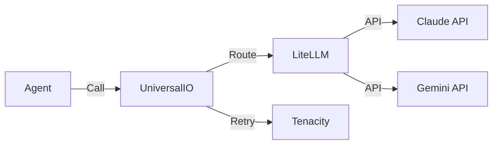

# Module: core/io

## Rôle dans l'Architecture NEXUS V9.2
Ce module fournit l'interface unifiée d'Entrée/Sortie pour tous les modèles de langage (LLM). Il abstrait les différences entre les fournisseurs (Anthropic, Google, OpenAI) via `litellm`.

## Composants Clés
*   `universal_io.py`: Classe `UniversalIO` (Singleton/Utility).
    *   `generate()`: Génération de texte standard.
    *   `embed()`: Génération d'embeddings (pour Semantic Memory).
    *   `transcribe()`: Audio-to-text (futur).

## Architecture & Flux
*   **Entrées :** Prompts, Messages (format standardisé), Images (base64).
*   **Sorties :** Texte, JSON, Embeddings (vecteurs).
*   **Configuration :** Clés API via `.env` (`ANTHROPIC_API_KEY`, `GEMINI_API_KEY`).

## Dépendances
*   **Utilise :** `litellm`, `tenacity` (retries).
*   **Utilisé par :** `core.drivers`, `core.memory.backends.dense`, `core.hive_mind.architect`.

## Diagramme

