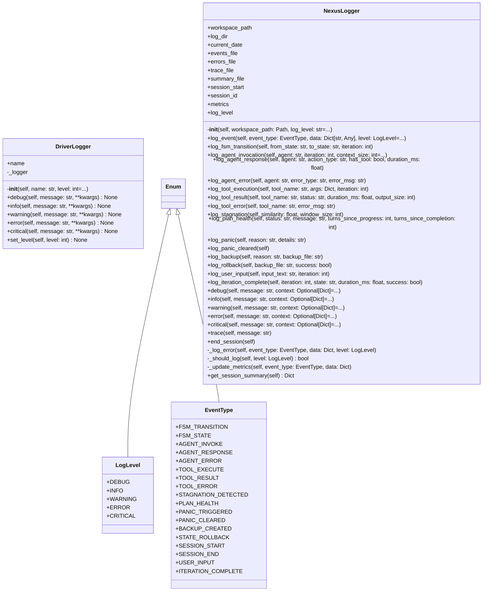

# logging

Logging module for NEXUS V7

Exports:
- NexusLogger: Main logger class
- LogLevel: Log level enum
- EventType: Event type enum
- init_logger: Initialize global logger
- get_logger: Get global logger instance
- cleanup_old_logs: Cleanup old log files
- get_driver_logger: Get lightweight driver logger (V8.4.5)
- configure_driver_logging: Configure driver log level (V8.4.5)

## Overview

| Metric | Value |
|--------|-------|
| **Path** | `C:\Code\NEXUS\NEXUS-N7A\core\logging` |
| **Modules** | 3 |
| **Total Lines** | 636 |
| **Classes** | 4 |
| **Functions** | 7 |

## Architecture

## Modules

| Module | Description | Classes | Functions |
|--------|-------------|---------|-----------|
| [driver_logger](driver_logger.py) | Driver Logger - Lightweight logging for driver modules. | 1 | 4 |
| [logger_v7](logger_v7.py) | Logging System V7 - Structured logging pour development et runtime | 3 | 3 |

---
*Auto-generated by nexus-doc-generator 1.0.0 - 2025-12-16 19:13*