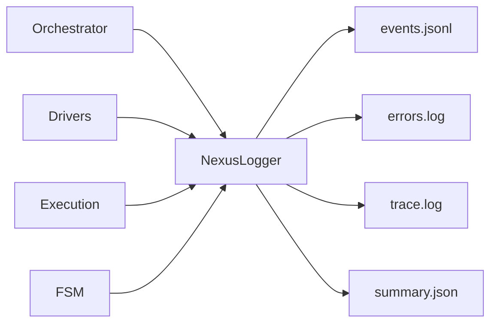

# Logging Module - NEXUS V7.6 "HIVE MIND"

Structured event-based logging system for NEXUS operations.

## Role in Architecture

The Logging module provides **operational telemetry** at the technical level:
- FSM state transitions
- Agent invocations and responses
- Tool executions
- Stagnation detection
- Panic events
- Session metrics

While `core.memory.AutoMemory` tracks **functional** outcomes (success/failure), the Logger captures **technical** execution details.

## Architecture

```
┌─────────────────────────────────────────────────────────────────┐
│                     LOGGING SYSTEM V7                           │
├─────────────────────────────────────────────────────────────────┤
│                                                                 │
│   ┌──────────────────────┐    ┌───────────────────────────────┐│
│   │    NexusLogger       │    │         Log Files             ││
│   │                      │    │                               ││
│   │  • log_event()       │───▶│  events_YYYYMMDD.jsonl        ││
│   │  • log_fsm_*()       │    │  errors_YYYYMMDD.log          ││
│   │  • log_agent_*()     │    │  trace_YYYYMMDD.log           ││
│   │  • log_tool_*()      │    │  summary_YYYYMMDD.json        ││
│   │  • get_session_*()   │    │                               ││
│   └──────────────────────┘    └───────────────────────────────┘│
│                                                                 │
│   ┌──────────────────────┐    ┌───────────────────────────────┐│
│   │     EventType        │    │       LogLevel                ││
│   │                      │    │                               ││
│   │  • FSM_TRANSITION    │    │  DEBUG   (trace)              ││
│   │  • AGENT_INVOKE      │    │  INFO    (normal ops)         ││
│   │  • AGENT_RESPONSE    │    │  WARNING (stagnation)         ││
│   │  • TOOL_EXECUTE      │    │  ERROR   (failures)           ││
│   │  • PANIC_TRIGGERED   │    │  CRITICAL (panic)             ││
│   └──────────────────────┘    └───────────────────────────────┘│
└─────────────────────────────────────────────────────────────────┘
```

## Files

| File | Purpose | Key Classes |
|------|---------|-------------|
| `logger_v7.py` | Main implementation | `NexusLogger`, `EventType`, `LogLevel` |
| `__init__.py` | Module exports | `init_logger`, `get_logger`, `cleanup_old_logs` |

## Key Classes

### NexusLogger (logger_v7.py:70-415)

Main logger class with structured event logging.

```python
from core.logging import init_logger, get_logger
from pathlib import Path

# Initialize (once at startup)
logger = init_logger(Path("./workspace"), log_level="INFO")

# Or get existing instance
logger = get_logger()

# Log events
logger.log_fsm_transition("IDLE", "BRAINSTORMING", iteration=1)
logger.log_agent_invocation("Gemini", iteration=1, context_size=5000)
logger.log_tool_execution("read", {"file_path": "auth.py"}, iteration=1)
logger.log_stagnation(similarity=0.85, window_size=3)
logger.log_panic("Stalemate", "Max stalemate count reached")

# Get session metrics
summary = logger.get_session_summary()
```

### EventType Enum (logger_v7.py:35-68)

| Event | Description | Level |
|-------|-------------|-------|
| `FSM_TRANSITION` | State change | DEBUG |
| `FSM_STATE` | Generic state info | varies |
| `AGENT_INVOKE` | Agent called | INFO |
| `AGENT_RESPONSE` | Agent returned | INFO |
| `AGENT_ERROR` | Agent failed | ERROR |
| `TOOL_EXECUTE` | Tool started | INFO |
| `TOOL_RESULT` | Tool completed | INFO |
| `TOOL_ERROR` | Tool failed | ERROR |
| `STAGNATION_DETECTED` | Loop detected | WARNING |
| `PLAN_HEALTH` | Plan status | varies |
| `PANIC_TRIGGERED` | Panic state | CRITICAL |
| `PANIC_CLEARED` | Panic resolved | INFO |
| `BACKUP_CREATED` | State backup | DEBUG |
| `STATE_ROLLBACK` | State restored | WARNING |
| `SESSION_START` | Session began | INFO |
| `SESSION_END` | Session ended | INFO |
| `USER_INPUT` | User message | DEBUG |
| `ITERATION_COMPLETE` | Turn finished | DEBUG |

### LogLevel Enum (logger_v7.py:26-32)

```python
class LogLevel(Enum):
    DEBUG = "DEBUG"      # Trace-level detail
    INFO = "INFO"        # Normal operations (default)
    WARNING = "WARNING"  # Potential issues (stagnation)
    ERROR = "ERROR"      # Recoverable errors
    CRITICAL = "CRITICAL" # Panic state
```

## Log Files

All logs stored in `workspace/logs/`:

| File | Format | Content |
|------|--------|---------|
| `events_YYYYMMDD.jsonl` | JSONL | All structured events |
| `errors_YYYYMMDD.log` | Text | Human-readable errors |
| `trace_YYYYMMDD.log` | Text | Verbose debug traces |
| `summary_YYYYMMDD.json` | JSON | Session metrics |

### JSONL Event Format

```json
{
  "timestamp": "2025-12-04T10:30:22.123456Z",
  "session_id": "20251204_103022",
  "event_type": "agent_invoke",
  "level": "INFO",
  "data": {
    "agent": "Gemini",
    "iteration": 5,
    "context_size": 12000
  }
}
```

## Session Metrics

The logger tracks session-wide metrics (logger_v7.py:112-124):

```python
metrics = {
    "session_id": "20251204_103022",
    "start_time": "2025-12-04T10:30:22",
    "total_iterations": 15,
    "total_tool_executions": 8,
    "total_errors": 2,
    "fsm_transitions": {"IDLE→BRAINSTORMING": 5, "BRAINSTORMING→EXECUTING_TOOL": 8},
    "agent_invocations": {"Gemini": 10, "Claude": 8},
    "tools_used": {"read": 5, "write": 2, "bash": 1},
    "panic_count": 0,
    "stagnation_count": 1
}
```

## Log Rotation

- **Daily rotation**: Files include date in name (`YYYYMMDD`)
- **Auto-cleanup**: `cleanup_old_logs(workspace, keep_days=7)`

```python
from core.logging import cleanup_old_logs
from pathlib import Path

# Keep only last 7 days of logs
cleanup_old_logs(Path("./workspace"), keep_days=7)
```

## Integration Points

### FSM Integration

```python
# In orchestration_v7.py
def _transition_to(self, new_state):
    if self.logger:
        self.logger.log_fsm_transition(
            self.state.name,
            new_state.name,
            self.iteration
        )
    self.state = new_state
```

### Driver Integration

```python
# In driver invocation
start = time.time()
response = driver.invoke(context)
if self.logger:
    self.logger.log_agent_response(
        agent="Gemini",
        action_type=response.get("action_type"),
        has_tool=response.get("tool_use") is not None,
        duration_ms=(time.time() - start) * 1000
    )
```

## Configuration

```bash
# Log level
LOG_LEVEL=INFO  # DEBUG, INFO, WARNING, ERROR, CRITICAL

# Log retention
LOG_RETENTION_DAYS=7
```

## Interaction with Other Modules



## See Also

- [Memory Module](../memory/README.md) - Functional outcome tracking (AutoMemory)
- [Telemetry Module](../telemetry/README.md) - Metrics export
- [FSM Module](../fsm/README.md) - State transitions logged
