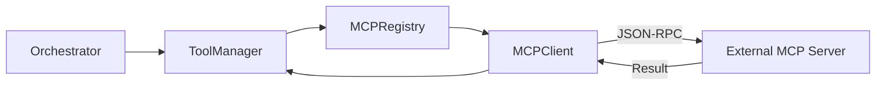

# MCP Module - NEXUS V9.2

## Rôle
Le module `core/mcp` implémente le **Model Context Protocol (MCP)**, permettant à NEXUS d'utiliser des outils externes exposés via des serveurs MCP (stdio/JSON-RPC). Il agit comme un client universel pour étendre les capacités de l'agent sans modifier son code core.

## Fichiers Clés
| Fichier | Lignes | Responsabilité |
|---------|--------|----------------|
| `client.py` | ~400 | **MCP Client**: Gère la connexion subprocess (stdio) et le cycle de vie JSON-RPC. |
| `protocol.py` | ~300 | **Types**: Définitions Pydantic des messages MCP (Request, Response, Tool). |
| `registry.py` | ~300 | **Config**: Charge `mcp_config.json` et instancie les clients pour chaque serveur. |

## API Publique
```python
from core.mcp import (
    MCPClient,    # Client bas niveau (connexion directe)
    MCPRegistry,  # Gestionnaire de serveurs (chargement config)
    MCPTool       # Type definition pour un outil
)
```

## Flux de Données

### Tool Execution Flow


## Dépendances

**Importe :**
- `subprocess` : Communication stdio avec les serveurs.
- `pydantic` : Validation des messages JSON-RPC.
- `json` : Sérialisation.

**Importé par :**
- `core/execution/tool_manager.py` : Intégration des outils MCP dans le pool d'outils global.

## Configuration

Le fichier `workspace/mcp_config.json` définit les serveurs actifs :

```json
{
  "mcpServers": {
    "filesystem": {
      "command": "npx",
      "args": ["-y", "@modelcontextprotocol/server-filesystem", "workspace"]
    }
  }
}
```

## Tests

- `tests/mcp/test_client.py` (Mock stdio)
- `tests/mcp/test_registry.py` (Config loading)
- `tests/e2e/test_mcp_integration.py` (Live server test)
