# mcp

NEXUS V9.0 - MCP Module (Client + Server)

Model Context Protocol support for bidirectional agent communication.

Components:
- protocol.py: JSON-RPC 2.0 types (Request, Response, Tool, etc.)
- client.py: MCPClient class for consuming external MCP servers
- registry.py: Server configuration loader
- server.py: V9.0 - NEXUS as MCP Server (for Claude Desktop, etc.)

Usage (Client - consume external servers):
    from core.mcp import MCPClient, MCPRegistry

    registry = MCPRegistry(workspace_path)
    client = MCPClient(command=["npx", "-y", "@modelcontextprotocol/server-filesystem"])
    client.initialize()
    result = client.call_tool("read_file", {"path": "/tmp/test.txt"})

Usage (Server - expose NEXUS to external clients):
    # Run NEXUS as MCP server:
    python -m core.mcp.server

    # Configure in Claude Desktop (claude_desktop_config.json):
    {
        "mcpServers": {
            "nexus": {
                "command": "python",
                "args": ["-m", "core.mcp.server"],
                "cwd": "/path/to/nexus"
            }
        }
    }

## Overview

| Metric | Value |
|--------|-------|
| **Path** | `C:\Code\NEXUS\NEXUS-N7A\core\mcp` |
| **Modules** | 5 |
| **Total Lines** | 1775 |
| **Classes** | 22 |
| **Functions** | 6 |

## Architecture

```mermaid
classDiagram
    class MCPClientError {
    }
    Exception <|-- MCPClientError
    class MCPConnectionError {
    }
    MCPClientError <|-- MCPConnectionError
    class MCPTimeoutError {
    }
    MCPClientError <|-- MCPTimeoutError
    class MCPServerError {
        +error
        -__init__(self, error: MCPError)
    }
    MCPClientError <|-- MCPServerError
    class MCPClientState {
        +bool initialized
        +Optional[Dict] server_info
        +Optional[MCPCapabilities] capabilities
        +List[MCPTool] available_tools
    }
    class MCPClient {
        +CLIENT_NAME
        +CLIENT_VERSION
        +PROTOCOL_VERSION
        +DEFAULT_TIMEOUT
        +INIT_TIMEOUT
        +command
        +env
        +cwd
        +timeout
        -_state
        -_request_id
        -_lock
        -_reader_stop
        -__init__(self, command: List[str], env: Optional[Dict[str, str]]=..., cwd: Optional[Path]=..., timeout: float=...)
        -__enter__(self) 'MCPClient'
        -__exit__(self, exc_type, exc_val, exc_tb) None
        +start(self) None
        +initialize(self) MCPInitializeResult
        +close(self) None
        +is_connected(self) bool
        +is_initialized(self) bool
        +list_tools(self) List[MCPTool]
        +call_tool(self, name: str, arguments: Optional[Dict[str, Any]]=..., timeout: Optional[float]=...) MCPToolResult
        +get_tool(self, name: str) Optional[MCPTool]
        -_ensure_initialized(self) None
        -_next_request_id(self) int
        -_send_request(self, method: str, params: Optional[Dict[str, Any]]=..., timeout: Optional[float]=...) MCPResponse
        -_send_notification(self, method: str, params: Optional[Dict[str, Any]]=...) None
        -_reader_loop(self) None
    }
    class MCPRequest {
        +str method
        +int id
        +Optional[Dict[str, Any]] params
        +str jsonrpc
        +to_json(self) str
        +from_dict(cls, data: Dict) 'MCPRequest'
    }
    class MCPError {
        +int code
        +str message
        +Optional[Any] data
        +to_dict(self) Dict
        +from_dict(cls, data: Dict) 'MCPError'
    }
    class MCPResponse {
        +int id
        +Optional[Any] result
        +Optional[MCPError] error
        +str jsonrpc
        +is_error(self) bool
        +is_success(self) bool
        +to_json(self) str
        +from_dict(cls, data: Dict) 'MCPResponse'
        +from_json(cls, json_str: str) 'MCPResponse'
    }
    class MCPToolInputSchema {
        +str type
        +Dict[str, Any] properties
        +List[str] required
        +to_dict(self) Dict
        +from_dict(cls, data: Dict) 'MCPToolInputSchema'
    }
    class MCPTool {
        +str name
        +str description
        +Optional[MCPToolInputSchema] inputSchema
        +to_dict(self) Dict
        +from_dict(cls, data: Dict) 'MCPTool'
    }
    class MCPContentType {
        +TEXT
        +IMAGE
        +RESOURCE
    }
    Enum <|-- MCPContentType
    class MCPContent {
        +str type
        +Optional[str] text
        +Optional[str] data
        +Optional[str] mimeType
        +Optional[str] uri
        +to_dict(self) Dict
        +from_dict(cls, data: Dict) 'MCPContent'
    }
    class MCPToolResult {
        +List[MCPContent] content
        +bool isError
        +text(self) str
        +to_dict(self) Dict
        +from_dict(cls, data: Dict) 'MCPToolResult'
    }
    class MCPCapabilities {
        +bool tools
        +bool resources
        +bool prompts
        +bool logging
        +from_dict(cls, data: Dict) 'MCPCapabilities'
    }
```

## Modules

| Module | Description | Classes | Functions |
|--------|-------------|---------|-----------|
| [client](client.py) | MCP Client - Subprocess communication with MCP servers | 6 | 1 |
| [protocol](protocol.py) | MCP Protocol Types - JSON-RPC 2.0 over stdio | 13 | 0 |
| [registry](registry.py) | MCP Registry - Server configuration loader | 2 | 1 |
| [server](server.py) | NEXUS V9.0 MCP Server - Expose NEXUS as a Tool for External Agents | 1 | 4 |

---
*Auto-generated by nexus-doc-generator 1.0.0 - 2025-12-16 19:13*