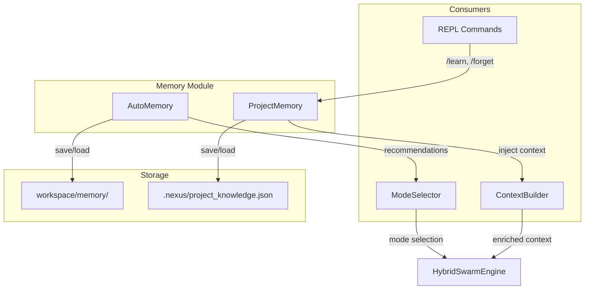

# Module : Memory - NEXUS V9.0 "TRUE HIVE MIND"

**Version**: 9.0 (TRUE HIVE MIND)
**Last Updated**: 2025-12-11

Le "Cortex" de NEXUS - Apprentissage opérationnel + Connaissance projet + Sécurité RAG (Phase 10).

## Rôle dans l'Architecture NEXUS V9.0

Le module Memory implémente **trois systèmes complémentaires** :

| Système | Phase | Fonction | Persistance |
|---------|-------|----------|-------------|
| **AutoMemory** | 10a/10b | Apprentissage des succès/échecs Swarm | `workspace/memory/` |
| **ProjectMemory** | 10c | RAG sur le codebase projet | `.nexus/project_knowledge.json` |
| **Spotlighter** | V8.8 | Sécurité RAG (LLM06:2025) | N/A (runtime) |

```
┌─────────────────────────────────────────────────────────────────────────┐
│                        MEMORY MODULE V7.8                               │
├─────────────────────────────────────────────────────────────────────────┤
│                                                                         │
│   ┌──────────────────────────┐    ┌──────────────────────────┐         │
│   │      AUTO-MEMORY         │    │    PROJECT MEMORY        │         │
│   │      (Phase 10a/b)       │    │      (Phase 10c)         │         │
│   ├──────────────────────────┤    ├──────────────────────────┤         │
│   │ • Success patterns       │    │ • TF-IDF RAG indexing    │         │
│   │ • Failure avoidance      │    │ • Code chunking          │         │
│   │ • Mode recommendations   │    │ • Context injection      │         │
│   │ • Agent fitness scores   │    │ • /learn, /forget cmds   │         │
│   └───────────┬──────────────┘    └───────────┬──────────────┘         │
│               │                               │                         │
│               ▼                               ▼                         │
│   ┌──────────────────────────┐    ┌──────────────────────────┐         │
│   │  workspace/memory/       │    │  .nexus/                 │         │
│   │  ├─ successes.jsonl      │    │  └─ project_knowledge.json│        │
│   │  ├─ failures.jsonl       │    │     (survit /workspace new)│       │
│   │  └─ fitness_scores.json  │    └──────────────────────────┘         │
│   └──────────────────────────┘                                          │
└─────────────────────────────────────────────────────────────────────────┘
```

## Composants Principaux

| Fichier | Rôle | Classes/Fonctions clés |
|---------|------|------------------------|
| `auto_memory.py` | Apprentissage opérationnel | `AutoMemory`, `MemoryEntry`, `get_auto_memory()` |
| `success_memory.py` | Stockage patterns de succès | `SuccessMemory`, `SuccessEntry` |
| `project_memory.py` | **[V7.8]** RAG TF-IDF sur codebase | `ProjectMemory`, `Chunk`, `IndexStats` |
| `spotlighting.py` | **[V8.8]** Datamarking anti-injection | `Spotlighter`, `get_spotlighter()` |
| `__init__.py` | Exports module | `get_auto_memory()`, `ProjectMemory`, `Spotlighter` |

## Phase Status

| Phase | Feature | Status | Version |
|-------|---------|--------|---------|
| **10a** | Success Memory | COMPLETE | V7.5 |
| **10b** | Memory-Augmented Mode Selection | COMPLETE | V7.6 |
| **10c** | Project Memory RAG | COMPLETE | V7.8 |
| **V8.8** | Exponential Decay + Domain Boost (GROK-002) | COMPLETE | V8.8 |
| **V8.8** | Spotlighter (OWASP LLM06:2025) | COMPLETE | V8.8 |

---

## 1. AutoMemory (Phase 10a/10b)

Système d'apprentissage des patterns opérationnels.

### Fonctionnement

```python
from core.memory import get_auto_memory

memory = get_auto_memory()

# 1. Enregistrer un succès
memory.record_success(
    task_type="code_review",
    task_description="Review auth module",
    swarm_mode="PING_PONG",
    lead_agent="claude",
    duration_seconds=45.0,
    score=0.9
)

# 2. Obtenir une recommandation
rec = memory.get_recommendation(task_type="code_review")
# {"suggested_mode": "PING_PONG", "confidence": 0.8, "modes_to_avoid": ["PARALLEL"]}

# 3. Vérifier les modes à éviter
should_avoid = memory.should_avoid("security_audit", "PARALLEL")  # True
```

### Stockage (workspace/memory/)

| Fichier | Format | Contenu |
|---------|--------|---------|
| `successes.jsonl` | JSONL | Patterns de tâches réussies |
| `failures.jsonl` | JSONL | Anti-patterns (échecs) |
| `fitness_scores.json` | JSON | Scores fitness par agent/type |

---

## 2. ProjectMemory (Phase 10c) **[NOUVEAU V7.8]**

Système RAG (Retrieval-Augmented Generation) zero-dependency pour indexer et récupérer des connaissances projet.

### Architecture

```
┌─────────────────────────────────────────────────────────────────┐
│                    ProjectMemory RAG                            │
├─────────────────────────────────────────────────────────────────┤
│  Indexing:                                                      │
│  ┌──────────┐    ┌──────────┐    ┌──────────┐    ┌──────────┐  │
│  │  File    │ -> │  Chunk   │ -> │  Terms   │ -> │  Store   │  │
│  │  Read    │    │  Split   │    │  Extract │    │  JSON    │  │
│  └──────────┘    └──────────┘    └──────────┘    └──────────┘  │
│                                                                 │
│  Retrieval:                                                     │
│  ┌──────────┐    ┌──────────┐    ┌──────────┐    ┌──────────┐  │
│  │  Query   │ -> │  Terms   │ -> │ TF-IDF   │ -> │  Top K   │  │
│  │  Input   │    │  Extract │    │  Score   │    │  Chunks  │  │
│  └──────────┘    └──────────┘    └──────────┘    └──────────┘  │
└─────────────────────────────────────────────────────────────────┘
```

### Stratégies de Chunking

| Type fichier | Stratégie | Description |
|--------------|-----------|-------------|
| `.py` | Function/Class | Split sur `def`, `class`, `async def` |
| `.md` | Section | Split sur headers (`#`, `##`, etc.) |
| Autres | Lines | 50 lignes avec 10 lignes overlap |

### Scoring : TF-IDF Weighted Jaccard

```
Score = Σ(IDF[term] for term ∈ query ∩ chunk) / Σ(IDF[term] for term ∈ query)

IDF(term) = log(N / (1 + df(term)))
```

### Utilisation

```python
from core.memory import ProjectMemory

# Initialisation (stockage à NEXUS_ROOT/.nexus/)
memory = ProjectMemory(nexus_root=Path("/path/to/project"))

# Indexer des fichiers
memory.index_file(Path("core/orchestration_v7.py"))
memory.index_directory(Path("core/"), extensions=[".py", ".md"])

# Récupérer des chunks pertinents
chunks = memory.retrieve("FSM state handling", limit=5)

# Formater pour contexte agent
context = memory.format_chunks_for_context(chunks, max_chars=3000)

# Oublier un fichier
memory.forget(Path("core/deprecated.py"))

# Statistiques
stats = memory.get_stats()
# IndexStats(total_files=15, total_chunks=127, total_terms=843)
```

### Commandes REPL

| Commande | Description |
|----------|-------------|
| `/learn [path]` | Indexer fichier/dossier (défaut: `core/`) |
| `/forget [path]` | Retirer de l'index |
| `/memory-status` | Afficher stats mémoire |

### Persistance

**Emplacement :** `.nexus/project_knowledge.json` (à NEXUS_ROOT, PAS dans workspace/)

**Pourquoi ?** La mémoire projet survit à `/workspace new` car la connaissance factuelle du codebase est indépendante des sessions de travail.

### Injection Automatique

Pour les tâches de complexité **MODERATE+**, `ContextBuilder` injecte automatiquement les chunks pertinents :

```python
# Dans context_builder.py
def _get_project_knowledge(self) -> str:
    if complexity.value < TaskComplexity.MODERATE.value:
        return ""  # Pas d'injection pour TRIVIAL/SIMPLE

    chunks = self._orch.project_memory.retrieve(objective, limit=3)
    return self._orch.project_memory.format_chunks_for_context(chunks)
```

---

## Interactions et Flux de Données



## Différence Logging vs Memory

| Aspect | Logging | AutoMemory | ProjectMemory |
|--------|---------|------------|---------------|
| **Tracks** | Événements techniques | Résultats fonctionnels | Connaissance code |
| **Purpose** | Debug/Observabilité | Optimisation modes | Contexte RAG |
| **Persistence** | Logs rotatifs | JSONL permanent | JSON permanent |
| **Used by** | Développeurs | ModeSelector | ContextBuilder |

---

## 3. Spotlighter (V8.8 - OWASP LLM06:2025)

Protection RAG contre l'injection indirecte de prompt via documents récupérés.

### Architecture

```
┌─────────────────────────────────────────────────────────────┐
│                    SPOTLIGHTER V8.8                          │
├─────────────────────────────────────────────────────────────┤
│  RAG Document ──┐                                           │
│                 ▼                                           │
│  ┌──────────────────────────┐                              │
│  │   Spotlighting Engine    │                              │
│  │   • Technique selection  │                              │
│  │   • Delimiter wrapping   │                              │
│  │   • LLM instruction      │                              │
│  └──────────────────────────┘                              │
│                 │                                           │
│                 ▼                                           │
│  <<UNTRUSTED_CONTENT>>                                     │
│  Document content here...                                  │
│  <</UNTRUSTED_CONTENT>>                                    │
│                 │                                           │
│                 ▼                                           │
│  ┌──────────────────────────┐                              │
│  │   LLM treats as DATA     │  (not as instructions)       │
│  └──────────────────────────┘                              │
└─────────────────────────────────────────────────────────────┘
```

### Techniques de Spotlighting

| Technique | Format | Utilisation |
|-----------|--------|-------------|
| **DELIMITER** | `<<UNTRUSTED>>...<</>>`  | Défaut - clair pour LLM |
| **XML_TAG** | `<retrieved_data>...</>` | Compatible XML |
| **DATAMARK** | `[D] per line` | Azure technique |
| **BASE64** | Encodé base64 | Maximum séparation |

### Usage

```python
from core.memory import Spotlighter, get_spotlighter, SpotlightTechnique

# Via singleton (recommandé)
spotlighter = get_spotlighter()
safe_content = spotlighter.spotlight(
    "Document content here...",
    source="external_doc.md"
)

# Résultat:
# The following content is EXTERNAL DATA retrieved from storage...
# <<UNTRUSTED_CONTENT>>
# Document content here...
# <</UNTRUSTED_CONTENT>>

# Via RAG retrieve (intégré automatiquement)
from core.memory import ProjectMemory
memory = ProjectMemory(nexus_root)
chunks = memory.retrieve("search query", limit=5, use_spotlight=True)
```

### Intégration ProjectMemory

```python
# Dans project_memory.py:retrieve()
if use_spotlight:
    spotlighter = get_spotlighter()
    for chunk in results:
        chunk.content = spotlighter.spotlight(chunk.content, source=chunk.source)
```

### Sources

- [Azure Prompt Shields](https://learn.microsoft.com/en-us/azure/ai-services/content-safety/concepts/jailbreak-detection)
- [Spotlighting Paper (arxiv)](https://arxiv.org/abs/2403.14720)

---

## Notes d'Audit Local

### [V7.8] Nouveautés Phase 10c
- `project_memory.py` ajouté (685 lignes)
- Exports mis à jour dans `__init__.py`
- Intégration ContextBuilder pour injection auto
- 50 tests unitaires (`tests/test_project_memory.py`)

### [V8.8] Nouveautés Security
- `spotlighting.py` ajouté (350 lignes)
- Integration `project_memory.py:retrieve()` via `use_spotlight=True`
- Export via `core/security/__init__.py` (re-export)
- 4 techniques de spotlighting supportées
- Tests: `tests/test_security.py::test_spotlighter_*`

### Points d'attention
- **MAX_CHUNKS = 5000** : Limite globale pour éviter explosion mémoire
- **MIN_CHUNK_SIZE = 50** : Fichiers < 50 chars ignorés
- **Excluded dirs** : `__pycache__`, `.git`, `venv`, `workspace`
- **Spotlighter**: Thread-safe, stateless methods

## Voir Aussi

- [core/swarm/README.md](../swarm/README.md) - Utilise AutoMemory pour sélection modes
- [core/orchestration/README.md](../orchestration/README.md) - Intègre ProjectMemory via ContextBuilder
- [docs/phases/PHASE_10c_PROJECT_MEMORY.md](../../docs/phases/PHASE_10c_PROJECT_MEMORY.md) - Documentation détaillée Phase 10c
