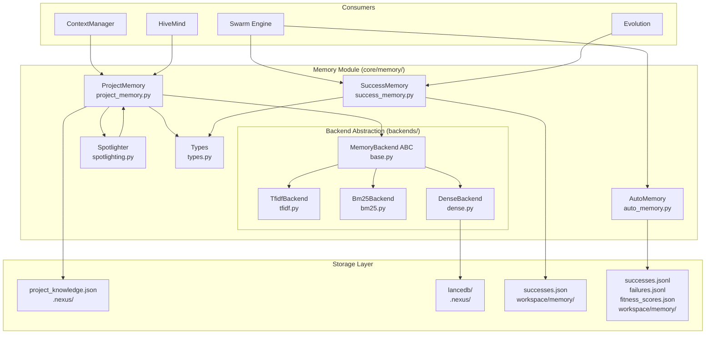

# NEXUS Memory Module

**Version**: V9.1 (Active Development)
**Location**: `core/memory/`
**Purpose**: Multi-layered memory system for task learning, success tracking, and RAG-based project knowledge

---

## SYNOPSIS

**Entrée:** Files / Task history / Success patterns / External content
**Traitement:** RAG indexing + retrieval / Pattern learning / Session tracking
**Sortie:** Relevant chunks for context / Success recommendations / Agent fitness scores

The NEXUS Memory Module provides three complementary memory layers:

1. **ProjectMemory** - Project knowledge RAG with semantic/lexical retrieval
2. **SuccessMemory** - Swarm task success tracking with similarity search
3. **AutoMemory** - Task pattern learning and mode recommendations

Plus security integration via **Spotlighter** for RAG content protection.

---

## LOCAL MAP



---

## INTERACTION MATRIX

### Internal Dependencies

| Component | Depends On | Purpose |
|-----------|------------|---------|
| `ProjectMemory` | `backends/*`, `types.py`, `spotlighting.py` | RAG retrieval with pluggable backends |
| `SuccessMemory` | `types.py`, `AtomicJsonStore` | Task success tracking |
| `AutoMemory` | None (standalone) | Pattern learning |
| `TfidfBackend` | `base.py` | Fallback sparse retrieval |
| `Bm25Backend` | `base.py`, `bm25s`, `PyStemmer` | Enhanced sparse retrieval |
| `DenseBackend` | `base.py`, `lancedb`, `sentence-transformers` | Semantic retrieval |
| `Spotlighter` | None (standalone) | RAG content protection |

### External Consumers

| Consumer | Uses | For |
|----------|------|-----|
| `ContextManager` | `ProjectMemory` | Inject relevant code context |
| `HiveMind` | `ProjectMemory` | Architecture phase knowledge |
| `Swarm Engine` | `SuccessMemory`, `AutoMemory` | Mode selection, agent fitness |
| `Evolution` | `SuccessMemory` | Agent performance tracking |
| `Security Layer` | `Spotlighter` | Protect against prompt injection |

### Storage Locations

| Component | File Path | Scope | Persistence |
|-----------|-----------|-------|-------------|
| `ProjectMemory` | `.nexus/project_knowledge.json` | Project-wide | Survives `/workspace new` |
| `DenseBackend` | `.nexus/lancedb/` | Project-wide | Survives `/workspace new` |
| `SuccessMemory` | `workspace/memory/successes.json` | Session | Cleared on workspace reset |
| `AutoMemory` | `workspace/memory/*.jsonl` | Session | Cleared on workspace reset |

---

## ARCHITECTURE

### 1. ProjectMemory (RAG for Code)

**Purpose**: Index and retrieve project files for context augmentation.

**Key Features**:
- **Chunking Strategies**:
  - `.py` files: Split by function/class definitions
  - `.md` files: Split by section headers
  - Other files: Fixed line chunks (50 lines, 10 overlap)
- **Backend Abstraction** (V7.9 Phase 10f/10g):
  - **Dense** (semantic): LanceDB + Sentence-Transformers (~+10% recall)
  - **BM25S** (lexical): Sparse retrieval (~+15% vs TF-IDF)
  - **TF-IDF** (fallback): Built-in, zero dependencies
- **Auto-selection**: `PROJECT_MEMORY_BACKEND=auto` (Dense > BM25S > TF-IDF)
- **Security**: Optional Spotlighter datamarking for RAG content

**Usage**:
```python
from core.memory import ProjectMemory

memory = ProjectMemory(nexus_root=Path("."))

# Index files
memory.index_file(Path("core/orchestration_v7.py"))
memory.index_directory(Path("core"), recursive=True)

# Retrieve
chunks = memory.retrieve("FSM state transitions", limit=5)
context = memory.format_chunks_for_context(chunks)

# Backend info
info = memory.get_backend_info()
# {"backend": "dense", "chunks_indexed": 1234, ...}
```

**Configuration**:
- `PROJECT_MEMORY_BACKEND`: `auto|dense|bm25|tfidf`
- `PROJECT_MEMORY_MAX_CHUNKS`: Max chunks to index (default: 5000, max: 50000)

---

### 2. SuccessMemory (Swarm Learning)

**Purpose**: Track successful Swarm task executions for pattern-based mode selection.

**Key Features**:
- **Phase 10a** (V7.6): Task success storage
- **Phase 10b** (V7.6): Jaccard similarity search
- **Phase 10d** (V7.6): Agent session statistics
- **V8.1.0**: Time decay weighting (recent tasks prioritized)
- **V8.8**: Per-domain weighting (GROK-002)

**Schema**:
```python
SuccessEntry(
    task_id="uuid",
    task_hash="sha256[:16]",
    description="Refactor auth module",
    swarm_mode="ping_pong",
    agents_used=["gemini", "claude"],
    duration_seconds=45.2,
    complexity="moderate",
    domains=["coding", "architecture"],
    quality_score=0.85,
    timestamp="2025-12-13T10:30:00"
)
```

**Usage**:
```python
from core.memory import SuccessMemory, get_success_memory

memory = SuccessMemory(workspace_path=Path("workspace"))

# Record success
memory.record_success(task_id, analysis, result, quality_score=0.9)

# Find similar tasks
similar = memory.find_similar_tasks(
    query="Implement authentication",
    limit=3,
    min_score=0.2
)

# Get best mode for similar task
best = memory.get_best_mode_for_similar(
    query="Refactor login system",
    query_domains=["coding", "security"],
    domain_boost=0.15  # Boost domain-matched entries
)
# Returns: ("ping_pong", "task_id_123", 0.78)

# Agent stats
stats = memory.get_agent_session_stats("gemini")
# {"global_success_rate": 0.85, "domain_success_rates": {...}, ...}
```

**Time Decay** (V8.8):
- Formula: `score * exp(-0.004 * age_days) + domain_bonus`
- Examples: 7d = 0.97x, 28d = 0.89x, 84d = 0.71x, 364d = 0.23x

---

### 3. AutoMemory (Pattern Learning)

**Purpose**: Learn from execution patterns across all task types.

**Key Features**:
- Success/failure tracking per task type
- Swarm mode recommendations
- Lead agent suggestions
- Fitness score tracking (last 20 scores per task type)

**Storage**:
- `workspace/memory/successes.jsonl`
- `workspace/memory/failures.jsonl`
- `workspace/memory/fitness_scores.json`

**Usage**:
```python
from core.memory import AutoMemory, get_auto_memory

memory = AutoMemory(workspace_path=Path("workspace"))

# Record success
memory.record_success(
    task_type="code_review",
    task_description="Review auth.py changes",
    swarm_mode="PING_PONG",
    lead_agent="claude",
    duration_seconds=30.0,
    score=0.95
)

# Record failure
memory.record_failure(
    task_type="security_audit",
    task_description="CVE scan",
    swarm_mode="PARALLEL",
    lead_agent="gemini",
    duration_seconds=15.0,
    reason="timeout"
)

# Get recommendations
rec = memory.get_recommendation("code_review")
# {
#   "suggested_mode": "PING_PONG",
#   "suggested_lead": "claude",
#   "modes_to_avoid": ["PARALLEL"],
#   "confidence": 0.8,
#   "based_on_samples": 8
# }

# Check if mode should be avoided
avoid = memory.should_avoid("security_audit", "PARALLEL")
# True (if >50% failure rate)
```

---

### 4. Spotlighter (RAG Security)

**Purpose**: Protect against indirect prompt injection via RAG content.

**Based on**: Azure Prompt Shields "Spotlighting" technique

**Techniques**:
1. **DELIMITER**: `<<UNTRUSTED_CONTENT>>...<</>>`
2. **XML_TAG**: `<retrieved_data trust_level="untrusted">...</>`
3. **DATAMARK**: `[D] ` prefix per line (Azure technique)
4. **BASE64**: Encode content (LLM decodes but recognizes as data)

**Usage**:
```python
from core.memory.spotlighting import Spotlighter, SpotlightTechnique

spotlighter = Spotlighter(
    technique=SpotlightTechnique.DELIMITER,
    include_instruction=True
)

# Single content
marked = spotlighter.spotlight(
    content="Document content here...",
    source="wikipedia"
)

# Batch
marked_docs = spotlighter.spotlight_batch([doc1, doc2, doc3])

# RAG results
combined = spotlighter.spotlight_rag_results(
    documents=[
        {"content": "...", "source": "file.py"},
        {"content": "...", "source": "docs.md"}
    ]
)
```

**Integration**:
```python
# In ProjectMemory retrieve
chunks = memory.retrieve(
    query="authentication",
    apply_datamarking=True  # V8.8: Apply Spotlighter
)
```

---

### 5. Backend Abstraction (V7.9 Phase 10f/10g)

**Architecture**: Pluggable retrieval backends via `MemoryBackend` ABC.

```python
class MemoryBackend(ABC):
    @abstractmethod
    def build_index(self, chunks: List[Chunk]) -> None:
        """Build retrieval index from chunks."""
        pass

    @abstractmethod
    def retrieve(
        self,
        query_terms: List[str],
        chunks: List[Chunk],
        limit: int,
        min_score: float,
        raw_query: Optional[str] = None
    ) -> List[Chunk]:
        """Retrieve relevant chunks."""
        pass

    @abstractmethod
    def clear(self) -> None:
        """Clear index."""
        pass

    @abstractmethod
    def get_info(self) -> Dict[str, Any]:
        """Get backend info."""
        pass
```

#### TfidfBackend

- **Algorithm**: TF-IDF weighted Jaccard similarity
- **Dependencies**: None (stdlib only)
- **Performance**: Baseline
- **Use case**: Fallback when no deps installed

#### Bm25Backend

- **Algorithm**: Okapi BM25 with optional Snowball stemming
- **Dependencies**: `bm25s>=0.2.0`, `PyStemmer>=2.2.0` (optional)
- **Performance**: ~+15% recall vs TF-IDF, 500x faster than rank-bm25
- **Use case**: Lexical retrieval (keyword-based)

#### DenseBackend

- **Algorithm**: Dense embeddings with cosine similarity
- **Model**: `all-MiniLM-L6-v2` (22MB, 384 dimensions)
- **Dependencies**: `lancedb>=0.4.0`, `sentence-transformers>=2.2.0`
- **Storage**: `.nexus/lancedb/` (embedded, serverless)
- **Performance**: ~+10% recall vs BM25S for semantic queries
- **Use case**: Semantic retrieval ("auth" ≈ "authentication")
- **GPU**: CUDA support when available

**Selection Priority** (auto mode):
```
Dense > BM25S > TF-IDF
```

**Dependency Checks**:
```python
from core.memory import (
    BM25S_AVAILABLE,
    LANCEDB_AVAILABLE,
    SENTENCE_TRANSFORMERS_AVAILABLE
)

if BM25S_AVAILABLE:
    print("BM25S backend available")
```

---

## MEMORY SERVICE (V9.1)

**New**: Unified service layer for memory operations.

```python
from core.memory import MemoryService, MemoryStatus

service = MemoryService(
    nexus_root=Path("."),
    workspace_path=Path("workspace")
)

# Status
status = service.status()
# MemoryStatus(
#     project_chunks=1234,
#     success_entries=45,
#     auto_memory_stats={...},
#     backend="dense"
# )

# Learn
result = service.learn(task_id, analysis, execution_result)
# LearnResult(success=True, entries_added=1)

# Query
result = service.query("authentication logic", limit=5)
# QueryResult(chunks=[...], similar_tasks=[...])

# Forget
result = service.forget(Path("old_file.py"))
# ForgetResult(chunks_removed=10)
```

---

## DATA FLOWS

### Flow 1: Indexing Project Files

```
User → /index core/
  ↓
ProjectMemory.index_directory()
  ↓
For each file:
  → _chunk_python() / _chunk_markdown() / _chunk_by_lines()
  → _extract_terms() → Set[str]
  → Chunk(file_path, lines, content, terms)
  ↓
Backend.build_index(chunks)
  ↓
Storage:
  → .nexus/project_knowledge.json (metadata)
  → .nexus/lancedb/ (if Dense backend)
```

### Flow 2: Retrieving Context

```
ContextManager → "I need FSM state info"
  ↓
ProjectMemory.retrieve(query, limit=5)
  ↓
_extract_terms(query) → query_terms
  ↓
Backend.retrieve(query_terms, chunks, limit, min_score, raw_query)
  ↓
Dense: Encode query → Search embeddings → Top K
BM25S: Stem query → BM25 score → Top K
TF-IDF: TF-IDF weighted Jaccard → Top K
  ↓
Return List[Chunk] sorted by relevance
```

### Flow 3: Recording Success

```
Swarm completes task successfully
  ↓
SuccessMemory.record_success(task_id, analysis, result)
  ↓
Extract metadata:
  - task_hash = sha256(description)[:16]
  - swarm_mode, agents_used, complexity, domains
  - duration, quality_score
  ↓
SuccessEntry created
  ↓
AtomicJsonStore.save()
  ↓
workspace/memory/successes.json
```

### Flow 4: Mode Selection from Memory

```
Swarm receives new task → "Refactor auth module"
  ↓
SuccessMemory.find_similar_tasks(query, limit=3)
  ↓
Tokenize query → Jaccard similarity with all entries
  ↓
Filter by min_score → Sort by similarity
  ↓
get_best_mode_for_similar()
  ↓
For each similar task:
  - Weighted score = similarity * quality_score
  - Apply time decay: exp(-0.004 * age_days)
  - Apply domain bonus if domains match
  ↓
Group by mode → Average weighted scores → Best mode
  ↓
Return: ("ping_pong", "task_id_123", 0.78)
```

---

## CONFIGURATION

### Environment Variables

| Variable | Default | Options | Purpose |
|----------|---------|---------|---------|
| `PROJECT_MEMORY_BACKEND` | `auto` | `auto\|dense\|bm25\|tfidf` | Backend selection |
| `PROJECT_MEMORY_MAX_CHUNKS` | `5000` | `1-50000` | Max chunks to index |

### Backend Selection Logic

```python
if backend_pref == "dense":
    if DenseBackend.is_available():
        return DenseBackend(lancedb_path)
    else:
        fallback...

elif backend_pref == "auto":
    if DenseBackend.is_available():
        return DenseBackend(lancedb_path)  # Best
    elif Bm25Backend.is_available():
        return Bm25Backend()  # Better
    else:
        return TfidfBackend()  # Fallback
```

### Chunking Limits

| Parameter | Value | Purpose |
|-----------|-------|---------|
| `MAX_CHUNKS` | 5000 (env) / 50000 (hard cap) | Prevent OOM |
| `MAX_CHUNK_SIZE` | 2000 chars | Truncate large chunks |
| `MIN_CHUNK_SIZE` | 50 chars | Skip tiny chunks |
| `LINES_PER_CHUNK` | 50 lines | Line-based chunking |
| `LINES_OVERLAP` | 10 lines | Overlap between chunks |

---

## EVOLUTION HISTORY

### V7.5 - AutoMemory
- Initial pattern learning system
- Success/failure tracking
- Fitness scores per agent

### V7.6 Phase 10a - SuccessMemory
- Task success storage with `AtomicJsonStore`
- JSON format (not JSONL) for thread-safety

### V7.6 Phase 10b - Similarity Search
- Jaccard similarity for task matching
- Basic time decay (linear)

### V7.6 Phase 10d - Session Stats
- Agent success rates by domain
- DyLAN integration support

### V7.8 Phase 10c - ProjectMemory (TF-IDF)
- Project knowledge RAG
- TF-IDF weighted Jaccard retrieval
- `.nexus/project_knowledge.json` storage

### V7.8.2 Phase 10e - BM25S Upgrade
- BM25S backend integration
- Snowball stemming support
- ~+15% recall improvement

### V7.9 Phase 10f - Backend Abstraction
- `MemoryBackend` ABC
- Pluggable backend architecture
- Auto-selection logic

### V7.9 Phase 10g - Dense Embeddings
- LanceDB + Sentence-Transformers
- Semantic retrieval (~+10% recall)
- GPU support (CUDA)

### V8.1.0 - Time Decay Weighting
- Linear decay for recency bias

### V8.8 - Advanced Weighting (GROK-002)
- Exponential time decay
- Per-domain weighting
- Spotlighter integration for RAG security

### V9.1 - Service Layer
- `MemoryService` unified API
- `MemoryStatus`, `LearnResult`, `QueryResult` types

---

## TESTING

### Unit Tests

```bash
pytest tests/test_memory/
pytest tests/test_project_memory.py
pytest tests/test_success_memory.py
```

### Integration Tests

```bash
# Test RAG retrieval
python -m core.memory.project_memory

# Test backend selection
PROJECT_MEMORY_BACKEND=dense python -m core.memory.project_memory
```

### Performance Benchmarks

| Backend | Indexing (1000 chunks) | Query (1 query) | Storage |
|---------|------------------------|-----------------|---------|
| TF-IDF | ~0.1s | ~0.05s | 500KB JSON |
| BM25S | ~0.2s | ~0.01s | 1MB JSON |
| Dense | ~5s (CPU) | ~0.02s | 10MB LanceDB |

---

## SECURITY

### Spotlighter Integration

**OWASP LLM01:2025 Defense**: Indirect prompt injection via RAG.

```python
# Apply datamarking to RAG results
chunks = memory.retrieve(
    query="user authentication",
    apply_datamarking=True  # Wrap with <<UNTRUSTED>>
)

# Result:
# <<UNTRUSTED_CONTENT>>
# [Chunk content here]
# <</UNTRUSTED_CONTENT>>
```

**Why**: External documents may contain malicious instructions. Spotlighter marks them as DATA, not INSTRUCTIONS.

---

## TROUBLESHOOTING

### Dense backend not available

**Symptoms**: Falls back to BM25S/TF-IDF despite `PROJECT_MEMORY_BACKEND=dense`

**Solutions**:
```bash
pip install lancedb sentence-transformers
# First run downloads model (~22MB from HuggingFace)
```

### BM25S warnings on Windows

**Issue**: `'resource' module unavailable` warning from bm25s

**Solution**: Suppressed in code (harmless warning, module works fine on Windows)

### Chunk limit reached

**Symptoms**: `Chunk limit reached (5000), skipping file`

**Solutions**:
```bash
# Increase limit
export PROJECT_MEMORY_MAX_CHUNKS=10000

# Or clear old chunks
memory.clear()
memory.index_directory(Path("core"))
```

### Time decay too aggressive

**Symptoms**: Old successes ignored even if highly relevant

**Solutions**:
```python
# Disable time decay
best = memory.get_best_mode_for_similar(
    query="...",
    apply_decay=False
)

# Or adjust decay coefficient (in success_memory.py)
# Default: 0.004 per day
# Higher = faster decay, Lower = slower decay
```

---

## FUTURE ENHANCEMENTS

### Planned (Roadmap)

- **Phase 10h**: Hybrid backend (Dense + BM25S fusion)
- **Phase 10i**: Contextual embeddings (code-specific models)
- **Phase 10j**: Incremental indexing (avoid full rebuild)
- **V9.2**: Cross-session memory (persistent AutoMemory)

### Experimental

- **Reranking**: Cross-encoder reranking of BM25S results
- **Query expansion**: Automatic synonym injection
- **Multilingual**: Support for non-English codebases
- **Memory pruning**: Automatic eviction of low-quality entries

---

## PARENT LINK

**Parent Module**: [core/](../README.md)

**Related Modules**:
- [core/hive_mind/](../hive_mind/README.md) - Uses ProjectMemory for context
- [core/swarm/](../swarm/README.md) - Uses SuccessMemory + AutoMemory
- [core/security/](../security/README.md) - Spotlighter integration
- [core/utils/](../utils/README.md) - AtomicJsonStore dependency

**Global Documentation**:
- [MISSION.md](../../MISSION.md) - NEXUS philosophy
- [ROADMAP.md](../../ROADMAP.md) - Development roadmap
- [docs/ARCHITECTURE_DECISIONS.md](../../docs/ARCHITECTURE_DECISIONS.md) - ADRs

---

## QUICK REFERENCE

### Import Patterns

```python
# ProjectMemory
from core.memory import ProjectMemory
memory = ProjectMemory(nexus_root=Path("."))

# SuccessMemory
from core.memory import SuccessMemory, get_success_memory
memory = get_success_memory(workspace_path=Path("workspace"))

# AutoMemory
from core.memory import AutoMemory, get_auto_memory
memory = get_auto_memory(workspace_path=Path("workspace"))

# Spotlighter
from core.memory.spotlighting import Spotlighter, SpotlightTechnique
spotlighter = Spotlighter(technique=SpotlightTechnique.DELIMITER)

# Types
from core.memory import Chunk, IndexStats, SuccessEntry, MemoryEntry

# Backend checks
from core.memory import (
    BM25S_AVAILABLE,
    LANCEDB_AVAILABLE,
    SENTENCE_TRANSFORMERS_AVAILABLE
)
```

### Common Operations

```python
# Index project
memory = ProjectMemory(Path("."))
memory.index_directory(Path("core"), recursive=True)

# Retrieve context
chunks = memory.retrieve("FSM state transitions", limit=5)
context = memory.format_chunks_for_context(chunks, max_chars=3000)

# Record success
success_mem = SuccessMemory(Path("workspace"))
success_mem.record_success(task_id, analysis, result)

# Get best mode
best = success_mem.get_best_mode_for_similar(
    query="Refactor authentication",
    query_domains=["coding", "security"]
)

# Get stats
stats = memory.get_stats()
print(f"Indexed: {stats.total_chunks} chunks from {stats.total_files} files")
```

---

**Last Updated**: 2025-12-13
**Maintainer**: Claude (NEXUS Core Team)
**Status**: Production (V9.1)
