# memory

NEXUS V9.1 Memory Module

Memory systems for NEXUS:
- AutoMemory: Learning from task execution patterns (V7.5)
- SuccessMemory: Swarm task success storage (V7.6 Phase 10a)
- ProjectMemory: Project knowledge RAG (V7.8 Phase 10c)
- Backend Abstraction: Pluggable retrieval backends (V7.9 Phase 10f)
- Dense Embeddings: Semantic retrieval (V7.9 Phase 10g)
- MemoryService: Service Layer for memory operations (V9.1)

## Overview

| Metric | Value |
|--------|-------|
| **Path** | `C:\Code\NEXUS\NEXUS-N7A\core\memory` |
| **Modules** | 9 |
| **Total Lines** | 4068 |
| **Classes** | 20 |
| **Functions** | 9 |

## Architecture

```mermaid
classDiagram
    class MemoryEntry {
        +str timestamp
        +str task_type
        +str task_description
        +str swarm_mode
        +str lead_agent
        +float duration_seconds
        +str outcome
        +Optional[str] reason
        +Optional[float] score
    }
    class AutoMemory {
        +workspace
        +memory_dir
        +successes_file
        +failures_file
        +fitness_file
        -__init__(self, workspace_path: Path=...)
        -_load_cache(self)
        +record_success(self, task_type: str, task_description: str, swarm_mode: str, lead_agent: str, duration_seconds: float, score: float=...)
        +record_failure(self, task_type: str, task_description: str, swarm_mode: str, lead_agent: str, duration_seconds: float, reason: str)
        -_append_to_file(self, filepath: Path, entry: Dict)
        -_update_fitness(self, agent: str, task_type: str, score: float)
        -_apply_time_decay(self, score: float, timestamp_str: str, decay_coefficient: float=...) float
        +suggest_mode(self, task_type: str, apply_decay: bool=...) Optional[str]
        +suggest_lead(self, task_type: str, apply_decay: bool=...) Optional[str]
        +should_avoid(self, task_type: str, swarm_mode: str) bool
        +get_stats(self) Dict[str, Any]
        +get_recommendation(self, task_type: str, task_description: str=...) Dict[str, Any]
    }
    class DomainWeights {
        +float semantic_weight
        +float procedural_weight
        +int sample_count
        +int success_count
        +success_rate(self) float
        +to_dict(self) Dict
    }
    class MemorySource {
        +SUCCESS
        +AUTO
        +BOTH
        +NONE
    }
    Enum <|-- MemorySource
    class UnifiedRecommendation {
        +Optional[str] mode
        +Optional[str] lead
        +float confidence
        +MemorySource source
        +List[str] modes_to_avoid
        +str reasoning
        +to_dict(self) Dict
    }
    class MemoryCoordinator {
        +SEMANTIC_WEIGHT
        +PROCEDURAL_WEIGHT
        +MIN_CONFIDENCE
        +HIGH_CONFIDENCE
        +success
        +auto
        -_logger
        -_weights_path
        -__init__(self, success_memory: Optional['SuccessMemory'], auto_memory: Optional['AutoMemory'], weights_path: Optional[Path]=...)
        +get_recommendation(self, task_description: str, task_type: str, domains: Optional[List[str]]=...) UnifiedRecommendation
        -_combine_recommendations(self, success_rec: Dict, success_score: float, auto_rec: Dict, auto_score: float, task_description: str, semantic_weight: float, procedural_weight: float) UnifiedRecommendation
        +consolidate(self) int
        +get_stats(self) Dict
        +get_weights_for_domain(self, domain: str) Tuple[float, float]
        +record_feedback(self, domain: str, source: MemorySource, success: bool) None
        -_adapt_weights(self, dw: DomainWeights, source: MemorySource, decrease: bool) None
        -_load_weights(self) None
        -_save_weights(self) None
    }
    class EmbeddingEngine {
        -Optional['EmbeddingEngine'] _instance
        -_lock
        -_initialized
        -_logger
        -_model_name
        -_executor
        -__new__(cls) 'EmbeddingEngine'
        -__init__(self) None
        +embedding_dim(self) int
        +model_name(self) str
        +device(self) Optional[str]
        +backend(self) Optional[str]
        +is_loaded(self) bool
        -_ensure_model(self) bool
        -_try_load_onnx(self, SentenceTransformer: type) bool
        -_try_load_pytorch(self, SentenceTransformer: type) bool
        +encode(self, texts: Union[str, List[str]], batch_size: int=..., show_progress: bool=...) List[List[float]]
        +encode_single(self, text: str) List[float]
        +encode_async(self, texts: Union[str, List[str]], batch_size: int=...) List[List[float]]
        +get_info(self) dict
        -_check_onnx_available(self) bool
        +preload(self) bool
        -__repr__(self) str
    }
    class ProjectMemory {
        +STORAGE_FILE
        +nexus_root
        +storage_dir
        +storage_path
        -_logger
        -__init__(self, nexus_root: Path, embedding_engine: Optional['EmbeddingEngine']=...)
        -_select_backend(self) MemoryBackend
        +index_file(self, path: Path, force: bool=...) int
        +index_directory(self, path: Path, extensions: List[str]=..., recursive: bool=...) int
        -_chunk_python(self, content: str, file_path: str) List[Chunk]
        -_chunk_markdown(self, content: str, file_path: str) List[Chunk]
        -_chunk_by_lines(self, content: str, file_path: str) List[Chunk]
        -_create_chunk(self, file_path: str, start_line: int, end_line: int, content: str, chunk_type: str, name: Optional[str]) Chunk
        -_extract_terms(self, text: str) Set[str]
        -_rebuild_backend_index(self)
        +retrieve(self, query: str, limit: int=..., min_score: float=..., apply_datamarking: bool=...) List[Chunk]
        +get_backend_info(self) Dict[str, Any]
        +forget(self, path: Path) int
        +clear(self)
        +get_stats(self) IndexStats
        +save(self)
        -_load(self)
        +format_chunks_for_context(self, chunks: List[Chunk], max_chars: int=...) str
    }
    class MemoryStatus {
        +int total_files
        +int total_chunks
        +int total_terms
        +str storage_path
        +List[str] indexed_files
    }
    class LearnResult {
        +bool success
        +int chunks_added
        +Optional[str] error
    }
    class ForgetResult {
        +bool success
        +int chunks_removed
        +Optional[str] error
    }
    class QueryResult {
        +bool success
        +List['Chunk'] chunks
        +Optional[str] error
    }
    class MemoryService {
        +project_memory
        +workspace_path
        +console
        -__init__(self, project_memory: 'ProjectMemory', workspace_path: Path, console: 'ConsoleV7')
        +learn(self, path_str: str) LearnResult
        +forget(self, path_str: str) ForgetResult
        +get_status(self) Optional[MemoryStatus]
        +query(self, query_str: str, limit: int=...) QueryResult
        +init_rag(self) LearnResult
        +clear(self) bool
        +handle_rag_command(self, args: str) None
    }
    class SpotlightTechnique {
        +DELIMITER
        +BASE64
        +XML_TAG
        +DATAMARK
    }
    Enum <|-- SpotlightTechnique
    class SpotlightedContent {
        +str original
        +str spotlighted
        +SpotlightTechnique technique
        +Optional[str] source
        +Dict[str, Any] metadata
        -__str__(self) str
    }
```

## Modules

| Module | Description | Classes | Functions |
|--------|-------------|---------|-----------|
| [auto_memory](auto_memory.py) | Auto-Memory - NEXUS V7.5 HIVE MIND | 2 | 2 |
| [coordinator](coordinator.py) | Memory Coordinator - V12.4 COGNITIVE BOOST | 4 | 0 |
| [embedding_engine](embedding_engine.py) | NEXUS V10 MEMORY FORGE - Global Embedding Engine Singleton | 1 | 2 |
| [project_memory](project_memory.py) | NEXUS V10 MEMORY FORGE - Project Memory RAG | 1 | 0 |
| [service](service.py) | NEXUS V9.1 - MemoryService | 5 | 0 |
| [spotlighting](spotlighting.py) | NEXUS V8.8 - Spotlighter (RAG Content Protection) | 3 | 3 |
| [success_memory](success_memory.py) | SuccessMemory - Phase 10a: Auto-Memory Storage | 2 | 2 |
| [types](types.py) | NEXUS V7.9 - Memory Types (Phase 10f) | 2 | 0 |

## Subpackages

| Package | Description | Modules |
|---------|-------------|---------|
| [backends/](C:\Code\NEXUS\NEXUS-N7A\core\memory\backends/README.md) |  | 0 |

## Aggregated Statistics

---
*Auto-generated by nexus-doc-generator 1.0.0 - 2025-12-16 19:13*