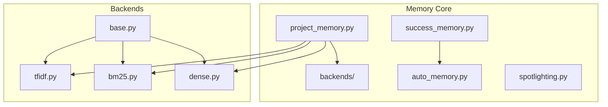

# Memory Module


## SYNOPSIS

The **Memory** module provides persistent learning capabilities through Project Memory RAG and Success/Failure tracking. It indexes codebases for semantic retrieval and learns from past task outcomes.

This is the **learning engine** of NEXUS.

---

## COMPONENT MAP (Mermaid)



---

## INTERACTION MATRIX

| Component | Calls (Outbound) | Called By (Inbound) | Data Type Exchanged |
|-----------|------------------|---------------------|---------------------|
| `project_memory.py` | backends/, file system | HiveMind phases, REPL | `List[Chunk]` |
| `success_memory.py` | Blackboard, file system | Swarm, HiveMind | `SuccessEntry` |
| `auto_memory.py` | success_memory | Orchestrator | Auto-learning hooks |
| `spotlighting.py` | None (pure transform) | project_memory | Highlighted content |
| `backends/` | sklearn, bm25s, lancedb | project_memory | Retrieval results |

---

## FILE INVENTORY

| File | Lines | Size | Role |
|------|-------|------|------|
| `project_memory.py` | 720 | 26.2KB | Main RAG facade |
| `success_memory.py` | 760 | 27.9KB | Success/failure tracking |
| `auto_memory.py` | 320 | 11.5KB | Auto-learning hooks |
| `spotlighting.py` | 310 | 11.3KB | Content highlighting |
| `types.py` | 50 | 1.7KB | Chunk dataclass |
| `backends/` | (see backends/README.md) | 4 backend files |

---

## HIERARCHY

```
core/
└── memory/                 ← THIS FOLDER
    ├── project_memory.py   ← Main RAG facade
    ├── success_memory.py   ← Success/failure learning
    ├── auto_memory.py      ← Automatic hooks
    ├── spotlighting.py     ← Highlighting
    └── backends/           ← TF-IDF, BM25S, Dense
```

---

## KEY PATTERNS

- **Facade Pattern**: `project_memory.py` abstracts backend selection
- **Auto-Select**: Dense > BM25S > TF-IDF based on availability
- **Chunk Structure**: `Chunk(content, source, metadata, score)`
