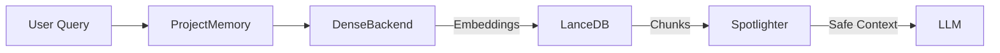

# Memory Module - NEXUS V9.2

## Rôle
Le module `core/memory` gère la mémoire à long terme de NEXUS. Il implémente un système RAG (Retrieval-Augmented Generation) modulaire (`ProjectMemory`) et une mémoire d'apprentissage (`SuccessMemory`) pour améliorer les performances au fil du temps.

## Fichiers Clés
| Fichier | Lignes | Responsabilité |
|---------|--------|----------------|
| `project_memory.py` | ~260 | **RAG Engine**: Indexation et recherche de documents projet. |
| `semantic_memory.py` | ~150 | **Semantic Search**: Recherche vectorielle (LanceDB) pour le contexte sémantique. |
| `success_memory.py` | ~280 | **Learning**: Stocke les patterns de réussite pour guider les futures décisions. |
| `spotlighting.py` | ~350 | **Security**: Sanitisation des données RAG (Layer 2 Defense). |
| `backends/` | - | **Pluggable Backends**: TF-IDF, BM25, Dense Embeddings. |

## API Publique
```python
from core.memory import (
    ProjectMemory,
    SuccessMemory,
    get_success_memory
)

# Usage
memory = ProjectMemory(workspace_path)
docs = await memory.search("auth logic", limit=5)
```

## Flux de Données

### RAG Retrieval Flow


## Dépendances

**Importe :**
- `lancedb` : Base de données vectorielle (optionnelle).
- `sentence-transformers` : Modèles d'embedding (optionnel).
- `core/security` : Pour la sanitisation (`Spotlighter`).

**Importé par :**
- `core/orchestration_v7.py` : Pour fournir du contexte au démarrage.
- `core/ui/dashboard_server.py` : Pour visualiser la mémoire.
- `core/hive_mind/context_manager.py` : Pour gérer la fenêtre de contexte.

## Configuration

| Variable | Default | Description |
|----------|---------|-------------|
| `PROJECT_MEMORY_BACKEND` | `auto` | Choix du backend (`dense`, `bm25`, `tfidf`). |
| `MEMORY_INDEX_INTERVAL` | `300` | Intervalle de réindexation automatique (secondes). |

## Tests

- `tests/memory/test_project_memory.py`
- `tests/memory/test_spotlighting.py`
- `tests/e2e/test_rag_flow.py`
