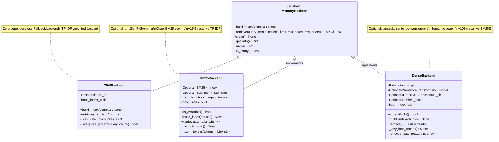

# Module: Backends - Pluggable RAG Retrieval Backends

**Version**: V7.9 (Phase 10f + 10g)
**Last Updated**: 2025-12-11
**Parent**: [Memory Module](../README.md)

Pluggable retrieval backends for ProjectMemory RAG system with automatic fallback.

---

## SYNOPSIS

**Entrée:** Chunks (list of documents) + query terms OR raw query string
**Traitement:** Build search index (TF-IDF, BM25S, or Dense embeddings) and retrieve relevant chunks
**Sortie:** Ranked list of relevant chunks with similarity scores

---

## LOCAL MAP (Mermaid)



---

## INTERACTION MATRIX

| Composant | Appels Sortants | Appelé Par | Type de Données |
|-----------|-----------------|------------|-----------------|
| **MemoryBackend** (ABC) | - | All concrete backends | Abstract interface |
| **TfidfBackend** | `math.log()`, standard library | `ProjectMemory` (fallback) | `List[Chunk]` with scores |
| **Bm25Backend** | `bm25s.BM25()`, `Stemmer.Stemmer()` | `ProjectMemory` (if available) | `List[Chunk]` with BM25 scores |
| **DenseBackend** | `lancedb.connect()`, `SentenceTransformer()` | `ProjectMemory` (if available) | `List[Chunk]` with cosine similarity |
| **ProjectMemory** | Backend selection logic, `build_index()`, `retrieve()` | `ContextBuilder`, REPL commands (`/learn`) | Selected backend instance |

---

## PARENT LINK

**Parent Directory:** `core/memory/`

This module provides **pluggable retrieval backends** for the parent Memory module's ProjectMemory RAG system. While `memory/` defines the overall memory architecture (AutoMemory, ProjectMemory, Spotlighter), `backends/` focuses on **how** ProjectMemory performs similarity search:

1. **TfidfBackend**: Zero-dependency fallback using TF-IDF weighted Jaccard
2. **Bm25Backend**: Better recall (~15%) using Okapi BM25 scoring
3. **DenseBackend**: Semantic search (~+10%) using sentence embeddings

**Integration Points:**
- `ProjectMemory` (facade) selects the best available backend at initialization
- Automatic fallback: Dense → BM25S → TF-IDF based on dependencies
- All backends implement the same `MemoryBackend` interface for easy swapping

**Related Modules:**
- [../project_memory.py](../project_memory.py) - Facade that uses these backends
- [../auto_memory.py](../auto_memory.py) - Separate operational learning system
- [../../orchestration/](../../orchestration/README.md) - Consumes RAG context via ContextBuilder

---

## Backend Comparison

| Backend | Recall | Speed | Dependencies | Use Case |
|---------|--------|-------|--------------|----------|
| **TfidfBackend** | Baseline | Fast (O(n)) | None (stdlib only) | Fallback, CI/CD, zero-deps environments |
| **Bm25Backend** | +15% | 500x vs rank-bm25 | `bm25s`, `PyStemmer` (optional) | Production lexical search |
| **DenseBackend** | +10% vs BM25 | Slower (GPU helps) | `lancedb`, `sentence-transformers` | Semantic queries ("auth" ≈ "authentication") |

---

## Components

### 1. base.py - MemoryBackend ABC

**Abstract interface** defining the contract all backends must implement:

```python
class MemoryBackend(ABC):
    @abstractmethod
    def build_index(self, chunks: List[Chunk]) -> None:
        """Build retrieval index from chunks."""
        pass

    @abstractmethod
    def retrieve(
        self,
        query_terms: List[str],
        chunks: List[Chunk],
        limit: int,
        min_score: float,
        raw_query: Optional[str] = None
    ) -> List[Chunk]:
        """Retrieve relevant chunks for query."""
        pass

    @abstractmethod
    def clear(self) -> None:
        """Clear internal index."""
        pass

    @abstractmethod
    def get_info(self) -> Dict[str, Any]:
        """Return backend info (name, status, capabilities)."""
        pass

    @property
    @abstractmethod
    def name(self) -> str:
        """Backend identifier ('tfidf', 'bm25s', 'dense')."""
        pass
```

### 2. tfidf.py - TfidfBackend

**Zero-dependency fallback** using TF-IDF weighted Jaccard similarity:

```python
# Scoring formula:
Score = sum(idf[term] for term in intersection) / sum(idf[term] for term in query)

# Where:
IDF(term) = log(N / (1 + df(term)))
N = total chunks
df = document frequency (chunks containing term)
```

**Advantages:**
- No external dependencies (stdlib only)
- Fast indexing and retrieval
- Deterministic results

**Limitations:**
- Cannot capture synonyms or semantic meaning
- Purely lexical matching

### 3. bm25.py - Bm25Backend

**Advanced lexical search** using Okapi BM25 scoring:

```python
# Dependencies (optional, graceful fallback):
pip install bm25s PyStemmer

# Features:
- Okapi BM25 scoring (better than TF-IDF for IR)
- Optional Snowball stemming (+5% recall)
- ~500x faster indexing than rank-bm25
```

**Advantages:**
- +15% better recall than TF-IDF
- Extremely fast (500x vs rank-bm25)
- Optional stemming for term normalization

**Availability Check:**
```python
from core.memory.backends import Bm25Backend, BM25S_AVAILABLE, STEMMER_AVAILABLE

if Bm25Backend.is_available():
    backend = Bm25Backend()
```

### 4. dense.py - DenseBackend

**Semantic search** using LanceDB + Sentence-Transformers:

```python
# Dependencies (optional, graceful fallback):
pip install lancedb sentence-transformers

# Model: all-MiniLM-L6-v2
- Size: 22MB
- Dimensions: 384
- Performance: ~5k sentences/sec on CPU
- Storage: .nexus/lancedb/ (embedded, serverless)
```

**Advantages:**
- Semantic understanding ("auth" ≈ "authentication")
- +10% better recall than BM25S for conceptual queries
- Persistent vector storage
- GPU support when available (CUDA)

**Limitations:**
- Slower than sparse methods (embedding overhead)
- Requires model download from HuggingFace
- May be blocked on corporate networks with SSL inspection

**Corporate Network Workaround (KI-001):**
```bash
# Pre-download model on unrestricted network:
huggingface-cli download sentence-transformers/all-MiniLM-L6-v2

# Copy cache to target machine:
cp -r ~/.cache/huggingface/hub/ /target/machine/.cache/huggingface/
```

See `docs/KNOWN_ISSUES.md` for details.

---

## Backend Selection Logic

```python
# Automatic selection (in ProjectMemory.__init__)
def _select_backend(storage_path: Path) -> MemoryBackend:
    if DenseBackend.is_available():
        logger.info("Using DenseBackend (semantic search)")
        return DenseBackend(storage_path)
    elif Bm25Backend.is_available():
        logger.info("Using Bm25Backend (lexical search)")
        return Bm25Backend()
    else:
        logger.info("Using TfidfBackend (fallback)")
        return TfidfBackend()
```

**Decision flow:**
1. Try DenseBackend (best recall for semantic queries)
2. Fallback to Bm25Backend (good lexical search)
3. Final fallback to TfidfBackend (always available)

---

## Usage Examples

### Basic Usage

```python
from core.memory.backends import TfidfBackend, Bm25Backend, DenseBackend
from core.memory.types import Chunk

# Create backend
backend = TfidfBackend()

# Build index
chunks = [
    Chunk(content="Authentication using JWT tokens", terms=["auth", "jwt", "token"], ...),
    Chunk(content="User login validation", terms=["user", "login", "valid"], ...),
]
backend.build_index(chunks)

# Retrieve relevant chunks
results = backend.retrieve(
    query_terms=["authentication", "token"],
    chunks=chunks,
    limit=5,
    min_score=0.05
)

for chunk in results:
    print(f"Score: {chunk.score:.3f} | {chunk.content[:50]}")
```

### Dense Backend with Raw Query

```python
from pathlib import Path

# Dense backend uses raw query for embeddings
dense = DenseBackend(Path(".nexus/lancedb"))
dense.build_index(chunks)

results = dense.retrieve(
    query_terms=["auth"],  # Still required for fallback
    chunks=chunks,
    limit=5,
    min_score=0.3,
    raw_query="how does authentication work?"  # Used for embedding
)
```

### Backend Availability Check

```python
from core.memory.backends import (
    BM25S_AVAILABLE,
    STEMMER_AVAILABLE,
    LANCEDB_AVAILABLE,
    SENTENCE_TRANSFORMERS_AVAILABLE
)

print(f"BM25S: {BM25S_AVAILABLE}")
print(f"Stemmer: {STEMMER_AVAILABLE}")
print(f"LanceDB: {LANCEDB_AVAILABLE}")
print(f"SentenceTransformers: {SENTENCE_TRANSFORMERS_AVAILABLE}")
```

---

## Configuration

**Environment Variables:**

| Variable | Default | Description |
|----------|---------|-------------|
| `PROJECT_MEMORY_BACKEND` | `auto` | Force backend: `tfidf`, `bm25`, `dense`, or `auto` |
| `DENSE_MODEL` | `all-MiniLM-L6-v2` | SentenceTransformer model name |
| `DENSE_BATCH_SIZE` | `32` | Batch size for embedding encoding |

---

## Performance

| Backend | Build Index | Query | Memory |
|---------|-------------|-------|--------|
| **TfidfBackend** | O(n) | O(n) | Low (IDF dict) |
| **Bm25Backend** | O(n) | O(log n) | Medium (sparse index) |
| **DenseBackend** | O(n) embeddings | O(log n) ANN | High (embeddings + vectors) |

Where n = number of chunks.

---

## Testing

```bash
# Run all backend tests
pytest tests/test_project_memory.py -v -k backend

# Test specific backend
pytest tests/test_project_memory.py::TestTfidfBackend -v
pytest tests/test_project_memory.py::TestBm25Backend -v
pytest tests/test_project_memory.py::TestDenseBackend -v

# Test backend selection
pytest tests/test_project_memory.py::test_backend_selection -v
```

---

## Extending with New Backends

To add a new backend:

1. **Create backend file** (e.g., `hybrid.py`)
2. **Inherit from MemoryBackend**:
```python
from .base import MemoryBackend

class HybridBackend(MemoryBackend):
    @property
    def name(self) -> str:
        return "hybrid"

    def build_index(self, chunks: List[Chunk]) -> None:
        # Implementation
        pass

    def retrieve(self, query_terms, chunks, limit, min_score, raw_query=None):
        # Implementation
        pass

    # ... other methods
```

3. **Add availability check**:
```python
@classmethod
def is_available(cls) -> bool:
    try:
        import some_dependency
        return True
    except ImportError:
        return False
```

4. **Export in `__init__.py`**:
```python
from .hybrid import HybridBackend
__all__ = [..., "HybridBackend"]
```

5. **Update ProjectMemory selection logic** if needed

---

## See Also

- [Memory Module](../README.md) - Parent memory architecture
- [Project Memory](../project_memory.py) - Facade using these backends
- [Context Builder](../../orchestration/context_builder.py) - Consumes RAG results
- [docs/phases/PHASE_10f_BACKENDS.md](../../../docs/phases/PHASE_10f_BACKENDS.md) - Phase 10f specification
