# backends

NEXUS V12.4 COGNITIVE BOOST - Memory Backends

Pluggable retrieval backends for ProjectMemory.

Available backends:
- TfidfBackend: Zero-dependency fallback (stdlib only)
- Bm25Backend: Better recall (~15%), requires bm25s
- DenseBackend: Semantic retrieval (~+10% recall), requires lancedb + sentence-transformers
- HybridBackend: V12.4 RRF fusion of Dense + BM25S (~+15% recall)

Usage:
    from core.memory.backends import MemoryBackend, HybridBackend, DenseBackend, Bm25Backend

    # V12.4: Prefer Hybrid for best results
    if HybridBackend.is_available():
        backend = HybridBackend(storage_path)  # RRF fusion
    elif DenseBackend.is_available():
        backend = DenseBackend(storage_path)  # Semantic search
    elif Bm25Backend.is_available():
        backend = Bm25Backend()  # Sparse lexical
    else:
        backend = TfidfBackend()  # Fallback

    backend.build_index(chunks)
    results = backend.retrieve(query_terms, chunks, limit=5, min_score=0.05, raw_query="...")

## Overview

| Metric | Value |
|--------|-------|
| **Path** | `C:\Code\NEXUS\NEXUS-N7A\core\memory\backends` |
| **Modules** | 6 |
| **Total Lines** | 1233 |
| **Classes** | 5 |
| **Functions** | 0 |

## Architecture

```mermaid
classDiagram
    class MemoryBackend {
        +build_index(self, chunks: List['Chunk']) None
        +retrieve(self, query_terms: List[str], chunks: List['Chunk'], limit: int, min_score: float, raw_query: Optional[str]=...) List['Chunk']
        +clear(self) None
        +get_info(self) Dict[str, Any]
        +name(self) str
        +is_ready(self) bool
    }
    class Bm25Backend {
        -_logger
        -_index_built
        -__init__(self)
        +name(self) str
        +is_ready(self) bool
        +is_available(cls) bool
        -_init_stemmer(self) None
        -_stem_tokens(self, tokens: List[str]) List[str]
        +build_index(self, chunks: List['Chunk']) None
        +retrieve(self, query_terms: List[str], chunks: List['Chunk'], limit: int, min_score: float, raw_query: Optional[str]=...) List['Chunk']
        +clear(self) None
        +get_info(self) Dict[str, Any]
    }
    MemoryBackend <|-- Bm25Backend
    class DenseBackend {
        -_logger
        -_storage_path
        -_index_built
        -_chunk_count
        -__init__(self, storage_path: Path, embedding_engine: Optional['EmbeddingEngine']=...)
        +name(self) str
        +is_ready(self) bool
        +is_available(cls) bool
        -_ensure_engine(self) bool
        -_ensure_db(self) bool
        -_chunk_to_id(self, chunk: 'Chunk') str
        -_chunk_to_metadata(self, chunk: 'Chunk') str
        -_metadata_to_chunk(self, metadata: str) 'Chunk'
        +build_index(self, chunks: List['Chunk']) None
        +retrieve(self, query_terms: List[str], chunks: List['Chunk'], limit: int, min_score: float, raw_query: Optional[str]=...) List['Chunk']
        +clear(self) None
        +get_info(self) Dict[str, Any]
    }
    MemoryBackend <|-- DenseBackend
    class HybridBackend {
        -_logger
        -_storage_path
        -_dense_weight
        -_sparse_weight
        -_index_built
        -_chunk_count
        -__init__(self, storage_path: Optional[Path]=..., dense_weight: float=..., sparse_weight: float=...)
        +name(self) str
        +is_ready(self) bool
        +is_available(cls) bool
        -_ensure_backends(self) bool
        +build_index(self, chunks: List['Chunk']) None
        +retrieve(self, query_terms: List[str], chunks: List['Chunk'], limit: int, min_score: float, raw_query: Optional[str]=...) List['Chunk']
        -_compute_rrf_scores(self, dense_results: List['Chunk'], sparse_results: List['Chunk']) Dict['Chunk', float]
        +clear(self) None
        +get_info(self) Dict[str, Any]
        +set_weights(self, dense_weight: float, sparse_weight: float) None
    }
    MemoryBackend <|-- HybridBackend
    class TfidfBackend {
        -_logger
        -_index_built
        -__init__(self)
        +name(self) str
        +is_ready(self) bool
        +build_index(self, chunks: List['Chunk']) None
        +retrieve(self, query_terms: List[str], chunks: List['Chunk'], limit: int, min_score: float, raw_query: Optional[str]=...) List['Chunk']
        -_score_chunk(self, query_terms: Set[str], chunk_terms: Set[str]) float
        +clear(self) None
        +get_info(self) Dict[str, Any]
    }
    MemoryBackend <|-- TfidfBackend
```

## Modules

| Module | Description | Classes | Functions |
|--------|-------------|---------|-----------|
| [base](base.py) | NEXUS V7.9 - Memory Backend ABC (Phase 10f + 10g) | 1 | 0 |
| [bm25](bm25.py) | NEXUS V7.9 - BM25S Memory Backend (Phase 10f) | 1 | 0 |
| [dense](dense.py) | NEXUS V10 MEMORY FORGE - Dense Embeddings Backend | 1 | 0 |
| [hybrid](hybrid.py) | NEXUS V12.4 COGNITIVE BOOST - HybridBackend RAG | 1 | 0 |
| [tfidf](tfidf.py) | NEXUS V7.9 - TF-IDF Memory Backend (Phase 10f) | 1 | 0 |

---
*Auto-generated by nexus-doc-generator 1.0.0 - 2025-12-16 19:13*