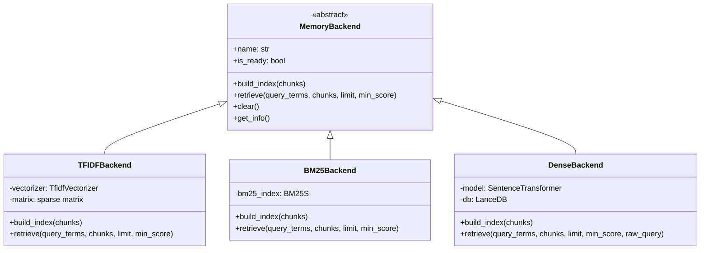

# Memory Backends


## SYNOPSIS

The **Memory Backends** provide pluggable retrieval implementations for Project Memory RAG. Each backend implements the `MemoryBackend` abstract base class, enabling automatic fallback and capability detection.

Priority: **Dense (LanceDB) > BM25S > TF-IDF** (automatic selection)

---

## COMPONENT MAP (Mermaid)



---

## INTERACTION MATRIX

| Component | Calls (Outbound) | Called By (Inbound) | Data Type Exchanged |
|-----------|------------------|---------------------|---------------------|
| `base.py` | None (ABC) | All backends | `MemoryBackend` ABC |
| `tfidf.py` | sklearn.TfidfVectorizer | ProjectMemory facade | `List[Chunk]` |
| `bm25.py` | bm25s library | ProjectMemory facade | `List[Chunk]` |
| `dense.py` | sentence_transformers, lancedb | ProjectMemory facade | `List[Chunk]` |

---

## FILE INVENTORY

| File | Lines | Size | Role |
|------|-------|------|------|
| `__init__.py` | 35 | 1.3KB | Backend exports |
| `base.py` | 99 | 2.6KB | Abstract base class |
| `tfidf.py` | 120 | 4.4KB | TF-IDF (always available) |
| `bm25.py` | 180 | 6.4KB | BM25S (if bm25s installed) |
| `dense.py` | 400 | 13.9KB | Dense embeddings (if lancedb + sentence-transformers) |

---

## HIERARCHY

```
core/
└── memory/
    ├── project_memory.py   ← Main facade
    ├── types.py            ← Chunk dataclass
    └── backends/           ← THIS FOLDER
        ├── base.py         ← ABC
        ├── tfidf.py        ← Fallback
        ├── bm25.py         ← Lexical (better)
        └── dense.py        ← Semantic (best)
```

---

## KEY PATTERNS

- **Strategy Pattern**: Backends are interchangeable implementations
- **Graceful Degradation**: TF-IDF always works, better backends used if deps available
- **raw_query Parameter**: Dense backend uses original query for embeddings
