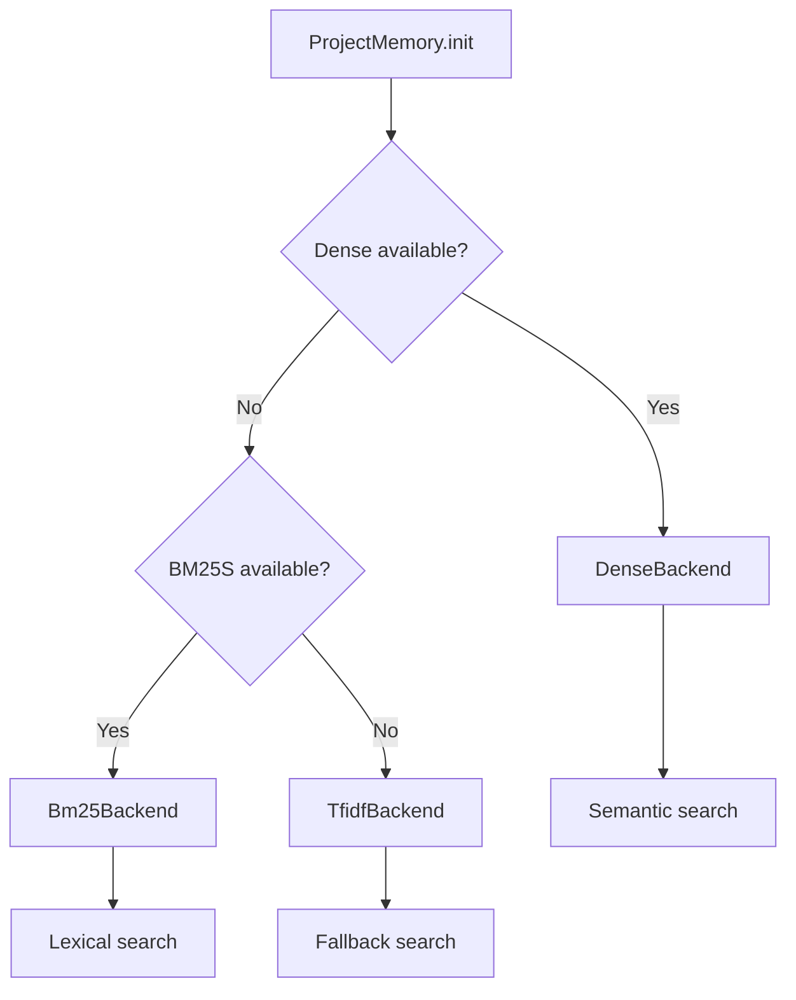

# Module : core/memory/backends

## Role dans l'Architecture NEXUS V8.0

**Backends RAG pluggables** pour le systeme de memoire projet (ProjectMemory).

Permet le choix du meilleur backend de retrieval selon les dependances disponibles, avec fallback automatique vers la solution zero-dependance.

```
ProjectMemory (facade)
       |
       v
+------+-------+-------+
|      |       |       |
v      v       v       v
TF-IDF BM25S  Dense  (Future)
 |       |      |
 v       v      v
stdlib  bm25s lancedb
only    pkg   + ST
```

## Composants Cles

| Fichier | Classe | Role |
|---------|--------|------|
| `base.py` | `MemoryBackend` | ABC definissant l'interface backend |
| `tfidf.py` | `TfidfBackend` | TF-IDF Jaccard (zero deps, fallback) |
| `bm25.py` | `Bm25Backend` | BM25S sparse (~15% meilleur recall) |
| `dense.py` | `DenseBackend` | Embeddings semantiques (~+10% recall) |

## Comparaison des Backends

| Backend | Recall | Vitesse | Dependencies | Use Case |
|---------|--------|---------|--------------|----------|
| **TfidfBackend** | Baseline | Rapide | Aucune (stdlib) | Fallback, CI/CD |
| **Bm25Backend** | +15% | 500x vs rank-bm25 | `bm25s`, `PyStemmer` | Production lexicale |
| **DenseBackend** | +10% vs BM25 | Plus lent (GPU aide) | `lancedb`, `sentence-transformers` | Recherche semantique |

## Architecture & Flux

### Interface MemoryBackend (ABC)

```python
class MemoryBackend(ABC):
    @abstractmethod
    def build_index(self, chunks: List[Chunk]) -> None:
        """Construit l'index depuis les chunks."""

    @abstractmethod
    def retrieve(
        self,
        query_terms: List[str],
        chunks: List[Chunk],
        limit: int,
        min_score: float,
        raw_query: Optional[str] = None  # Pour embeddings
    ) -> List[Chunk]:
        """Retourne chunks pertinents tries par score."""

    @abstractmethod
    def clear(self) -> None:
        """Efface l'index interne."""

    @abstractmethod
    def get_info(self) -> Dict[str, Any]:
        """Info backend (nom, status, capabilities)."""

    @property
    @abstractmethod
    def name(self) -> str:
        """Identifiant backend ('tfidf', 'bm25s', 'dense')."""
```

### Entrees
- `chunks: List[Chunk]` - Documents a indexer
- `query_terms: List[str]` - Termes de requete preprocesses
- `raw_query: str` - Requete brute (pour dense embeddings)

### Sorties
- `List[Chunk]` - Chunks pertinents tries par score descendant

### Configuration

| Variable ENV | Default | Description |
|--------------|---------|-------------|
| `PROJECT_MEMORY_BACKEND` | auto | Force backend: `tfidf`, `bm25`, `dense` |

## Details par Backend

### TfidfBackend (Fallback)
```python
# Scoring: TF-IDF weighted Jaccard
Score = sum(idf[term] for term in intersection) / sum(idf[term] for term in query)
IDF(term) = log(N / (1 + df(term)))
```
- **Avantage**: Aucune dependance externe
- **Limite**: Ne capture pas synonymes/semantique

### Bm25Backend (Lexical Avance)
```python
# Okapi BM25 scoring (meilleur que TF-IDF pour IR)
# + Snowball stemming optionnel
pip install bm25s PyStemmer
```
- **Avantage**: 500x plus rapide que rank-bm25, +15% recall
- **Optionnel**: PyStemmer ajoute ~5% recall

### DenseBackend (Semantique)
```python
# Embeddings: all-MiniLM-L6-v2 (22MB, 384 dims)
# Stockage: LanceDB (embedded, serverless)
pip install lancedb sentence-transformers
```
- **Avantage**: Comprend synonymes ("auth" ~ "authentication")
- **Stockage**: `.nexus/lancedb/`
- **GPU**: Accelere si CUDA disponible

## Dependances

### Utilise
```python
from typing import TYPE_CHECKING
if TYPE_CHECKING:
    from ..types import Chunk  # Type annotation only
```

### Utilise par
```python
from core.memory.project_memory import ProjectMemory  # Facade
```

### Dependencies Externes

| Backend | Package | Version | Optional |
|---------|---------|---------|----------|
| BM25S | `bm25s` | >=0.2.0 | Yes |
| BM25S | `PyStemmer` | >=2.2.0 | Yes (stemming) |
| Dense | `lancedb` | >=0.4.0 | Yes |
| Dense | `sentence-transformers` | >=2.2.0 | Yes |

## Diagramme: Selection Automatique



## Exemple d'Utilisation

```python
from core.memory.backends import (
    MemoryBackend,
    TfidfBackend,
    Bm25Backend,
    DenseBackend
)

# Selection automatique du meilleur backend
def get_best_backend(storage_path: Path) -> MemoryBackend:
    if DenseBackend.is_available():
        return DenseBackend(storage_path)
    elif Bm25Backend.is_available():
        return Bm25Backend()
    else:
        return TfidfBackend()

# Usage direct
backend = TfidfBackend()
backend.build_index(chunks)
results = backend.retrieve(
    query_terms=["authentication", "token"],
    chunks=chunks,
    limit=5,
    min_score=0.05
)

# Dense avec raw_query pour embeddings
dense = DenseBackend(Path(".nexus/lancedb"))
dense.build_index(chunks)
results = dense.retrieve(
    query_terms=["auth"],
    chunks=chunks,
    limit=5,
    min_score=0.3,
    raw_query="how does authentication work?"  # Pour embedding
)
```

## Tests Associes

| Fichier | Coverage |
|---------|----------|
| `tests/test_project_memory.py` | Integration backends |

## Notes Techniques

### Performance
- TF-IDF: O(n) build, O(n) query
- BM25S: O(n) build, O(log n) query (index sparse)
- Dense: O(n) build (embeddings), O(log n) query (ANN)

### Lazy Loading
DenseBackend charge le modele uniquement au premier `build_index()` pour eviter impact startup.

### Thread Safety
Tous les backends sont thread-safe pour lecture. Seul `build_index()` modifie l'etat.

### Extensibilite
Nouveau backend:
1. Herited de `MemoryBackend`
2. Implementer les 5 methodes abstraites
3. Ajouter `is_available()` classmethod
4. Exporter dans `__init__.py`
