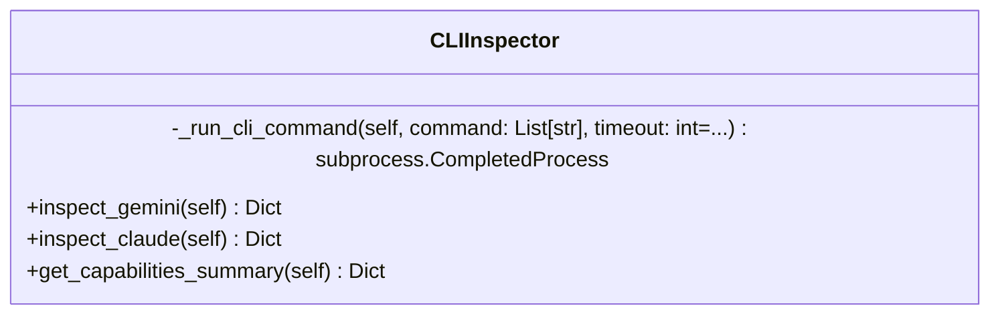

# meta

NEXUS V7 Meta Module - CLI Inspection

## Overview

| Metric | Value |
|--------|-------|
| **Path** | `C:\Code\NEXUS\NEXUS-N7A\core\meta` |
| **Modules** | 2 |
| **Total Lines** | 268 |
| **Classes** | 1 |
| **Functions** | 0 |

## Architecture

## Modules

| Module | Description | Classes | Functions |
|--------|-------------|---------|-----------|
| [cli_inspector](cli_inspector.py) | CLI Inspector - Détection dynamique des modèles disponibles | 1 | 0 |

---
*Auto-generated by nexus-doc-generator 1.0.0 - 2025-12-16 19:13*