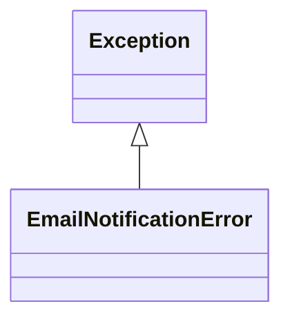

# notifications

NEXUS Notifications Module

Multi-channel notification system for evolution reviews.

## Overview

| Metric | Value |
|--------|-------|
| **Path** | `C:\Code\NEXUS\NEXUS-N7A\core\notifications` |
| **Modules** | 4 |
| **Total Lines** | 478 |
| **Classes** | 1 |
| **Functions** | 7 |

## Architecture

## Modules

| Module | Description | Classes | Functions |
|--------|-------------|---------|-----------|
| [email_notifier](email_notifier.py) | Email Notifier - Outlook SMTP | 1 | 2 |
| [file_notifier](file_notifier.py) | File Notifier - PENDING_REVIEW.md | 0 | 3 |
| [repl_alert](repl_alert.py) | REPL Alert - Boot-time notification | 0 | 2 |

---
*Auto-generated by nexus-doc-generator 1.0.0 - 2025-12-16 19:13*