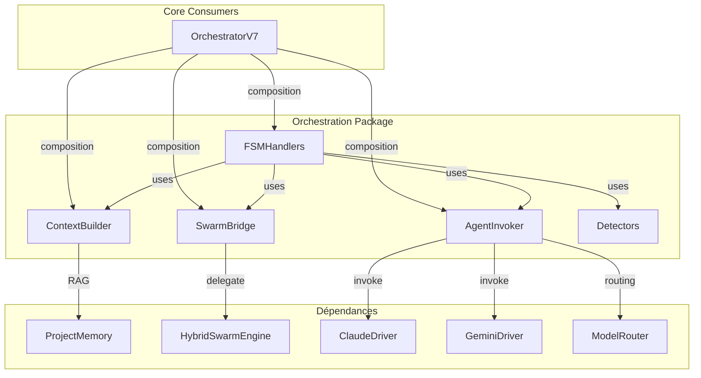

# Module: Orchestration Package

**Version**: 8.0 TRUE HIVE MIND
**Last Updated**: 2025-12-08
**Phase**: 14c Complete + V8.0 Hive Mind Integration

---

## Role dans l'Architecture NEXUS V8.0

Package modulaire contenant les composants extraits de `orchestration_v7.py`.

**Principe**: Decoupage du "God Object" OrchestratorV7 (2223 lignes -> 783 lignes) en modules specialises suivant le Single Responsibility Principle.

**Resultat V7.8**: Reduction de **65%** du code orchestrateur, testabilite accrue.

**V8.0 Integration**: `FSMHandlers` route MODERATE/COMPLEX/EXPERT vers `TrueHiveMind`.

---

## Alignement ROADMAP V7.8

| Phase | Impact | Status |
|-------|--------|--------|
| **Phase 14c.2a** | Extraction ContextBuilder | ✅ COMPLETE |
| **Phase 14c.2b** | Extraction AgentInvoker | ✅ COMPLETE |
| **Phase 14c.2c** | Extraction SwarmBridge | ✅ COMPLETE |
| **Phase 14c.2d** | Extraction FSMHandlers | ✅ COMPLETE |
| **Phase 10c** | Integration ProjectMemory via ContextBuilder | ✅ COMPLETE |
| **V8.0** | Base pour StateHandler pattern complet | FUTUR |

---

## Structure du Package

```
core/orchestration/
├── __init__.py          # Exports publics
├── README.md            # Cette documentation
├── context_builder.py   # Construction des contextes agents + RAG
├── detectors.py         # Détection de formats (mutations, etc.)
├── agent_invoker.py     # Invocation des agents (Claude, Gemini, Spawned)
├── swarm_bridge.py      # Intégration HybridSwarmEngine
└── fsm_handlers.py      # Handlers par état FSM (11 états)
```

---

## Composants Principaux

### 1. `context_builder.py`

**Classe**: `ContextBuilder`

Construit les contextes pour les différents modes d'exécution.

| Méthode | Description |
|---------|-------------|
| `build_context()` | Contexte complet pour brainstorming + RAG injection |
| `build_context_with_tool_result()` | Contexte léger pour CFL validation |
| `build_swarm_context()` | Contexte enrichi pour swarm execution |
| `build_simple_context()` | Contexte minimal pour tâches simples |
| `_get_project_knowledge()` | **[V7.8]** Injection RAG pour MODERATE+ |

**Intégration ProjectMemory (Phase 10c)**:
```python
def _get_project_knowledge(self) -> str:
    """Inject relevant project knowledge for MODERATE+ tasks."""
    complexity = getattr(self._orch, '_current_complexity', None)
    if not complexity or complexity.value < TaskComplexity.MODERATE.value:
        return ""

    chunks = self._orch.project_memory.retrieve(objective, limit=3)
    return self._orch.project_memory.format_chunks_for_context(chunks)
```

---

### 2. `detectors.py`

**Classes**: `MutationDetector`, `ResponseDetector`

Détection de patterns dans les réponses agents.

| Méthode | Description |
|---------|-------------|
| `detect_mutation_complete()` | Détecte mutation JSON ou SEARCH/REPLACE |
| `detect_search_replace_format()` | Détecte format SEARCH/REPLACE |
| `detect_json_format()` | Détecte format JSON legacy |
| `is_finish_signal()` | Détecte signaux de fin de tâche |
| `has_error_pattern()` | Détecte patterns d'erreur |

---

### 3. `agent_invoker.py`

**Classe**: `AgentInvoker`

Invocation centralisée des agents avec routing intelligent.

| Méthode | Description |
|---------|-------------|
| `get_claude_driver()` | Crée driver Claude avec model routing |
| `invoke_agent()` | Invoque agent actif avec budget check |
| `invoke_for_swarm()` | Invoque pour HybridSwarmEngine |
| `invoke_spawned_agent()` | Invoque agent spawné avec system prompt |
| `invoke_agent_direct()` | Invocation thread-safe directe |
| `record_invocation()` | Enregistre métriques DyLAN |
| `calculate_quality_score()` | Calcule score qualité réponse |

---

### 4. `swarm_bridge.py`

**Classe**: `SwarmBridge`

Pont entre orchestrateur et HybridSwarmEngine.

| Méthode | Description |
|---------|-------------|
| `start_swarm_mode()` | Initialise mode swarm avec force_mode optionnel |
| `process_with_swarm()` | Exécute pipeline swarm complet |
| `get_swarm_stats()` | Récupère statistiques swarm |

---

### 5. `fsm_handlers.py`

**Classe**: `FSMHandlers`

Handlers pour chaque état FSM (pattern Dispatcher).

| Handler | Etat FSM | Description |
|---------|----------|-------------|
| `handle_idle()` | IDLE | Routing par complexite, fast path |
| `handle_waiting_user()` | WAITING_USER | Attente nouvelle entree |
| `handle_brainstorming()` | BRAINSTORMING | Debat agents |
| `handle_executing_tool()` | EXECUTING_TOOL | Execution outil |
| `handle_validating_cfl()` | VALIDATING_CFL | Validation CFL |
| `handle_evolution_brainstorm()` | EVOLUTION_BRAINSTORM | Mode evolution |
| `handle_swarm_analyzing()` | SWARM_ANALYZING | Analyse tache swarm |
| `handle_swarm_negotiating()` | SWARM_NEGOTIATING | Negociation mode |
| `handle_swarm_executing()` | SWARM_EXECUTING | Execution collaborative |
| `handle_error()` | ERROR | Etat erreur recuperable |
| `handle_panic()` | PANIC | Etat panique fatal |

**V8.0 Hive Mind Routing** (dans `handle_idle()` et `_route_to_hive_mind()`):
```python
def _should_use_hive_mind(self, complexity: TaskComplexity) -> bool:
    """Determine si la tache doit etre routee vers V8 Hive Mind."""
    if not HIVE_MIND_AVAILABLE or not self._orch.config.hive_mind_enabled:
        return False
    if complexity in (TaskComplexity.COMPLEX, TaskComplexity.EXPERT):
        return True
    if complexity == TaskComplexity.MODERATE and self._orch.config.hive_mind_moderate:
        return True
    return False
```

---

## Intégration avec OrchestratorV7

```python
# core/orchestration_v7.py (783 lignes)
class OrchestratorV7:
    def __init__(self, ...):
        # V7.8 Phase 14c: Extracted modules
        self.context_builder = ContextBuilder(self)
        self.mutation_detector = get_mutation_detector()
        self.agent_invoker = AgentInvoker(self)
        self.swarm_bridge = SwarmBridge(self)
        self.fsm_handlers = FSMHandlers(self)

        # V7.8 Phase 10c: Project Memory
        self.project_memory = ProjectMemory(nexus_root)

    def process_turn(self, user_input: Optional[str] = None) -> Dict:
        # Dispatcher pattern - minimal logic
        state_handlers = {
            OrchestratorState.IDLE: lambda: self.fsm_handlers.handle_idle(user_input),
            OrchestratorState.BRAINSTORMING: self.fsm_handlers.handle_brainstorming,
            OrchestratorState.EXECUTING_TOOL: self.fsm_handlers.handle_executing_tool,
            # ... all 11 states
        }
        return state_handlers[self.state]()
```

---

## Interactions et Flux de Données



---

## Métriques Phase 14c FINAL

| Métrique | Avant (V7.6) | Après (V7.8) | Réduction |
|----------|--------------|--------------|-----------|
| Lignes `orchestration_v7.py` | 2223 | 783 | **-65%** |
| Modules créés | 1 | 6 | +5 |
| Responsabilités par module | ~10 | 1-2 | ✅ |
| Testabilité | Faible | Élevée | ✅ |
| Couplage | Fort | Faible | ✅ |

### Progression Phase 14c

| Sprint | Changement | Lignes |
|--------|------------|--------|
| 14c.2a | ContextBuilder extraction | 2223 → 1849 |
| 14c.2b | AgentInvoker extraction | 1849 → 1657 |
| 14c.2c | SwarmBridge extraction | 1657 → 1322 |
| 14c.2d | FSMHandlers extraction | 1322 → 785 |
| 14c cleanup | GoT removal | 785 → 764 |
| Final | Adjustments | 764 → 783 |

---

## Tests

```bash
# Vérifier que les imports fonctionnent
python -c "from core.orchestration import ContextBuilder, FSMHandlers, AgentInvoker, SwarmBridge; print('OK')"

# Tests d'intégration
python -m pytest tests/test_hive_mind_execution.py tests/test_global_integration.py -v
```

---

## Notes d'Audit Local

### [V7.8] Refactoring Complete
- **ContextBuilder**: 387 lignes - Contexte + RAG injection
- **AgentInvoker**: 330 lignes - Invocation multi-agent
- **SwarmBridge**: 175 lignes - Pont Swarm
- **FSMHandlers**: 450 lignes - 11 handlers d'état
- **Detectors**: 185 lignes - Pattern detection

### Points d'attention
- **KERNEL Check**: Préservé dans FSMHandlers.handle_idle()
- **Thread-safety**: AgentInvoker.invoke_agent_direct() thread-safe
- **Backward Compatible**: API publique OrchestratorV7 inchangée

---

## Voir Aussi

- [core/README.md](../README.md) - Documentation core module
- [core/fsm/README.md](../fsm/README.md) - FSM states documentation
- [core/swarm/README.md](../swarm/README.md) - HybridSwarmEngine
- [ROADMAP_HIVE_MIND.md](../../ROADMAP_HIVE_MIND.md) - Phase 14c details
