# orchestration

NEXUS V7.8 - Orchestration Package (Phase 14c)

This package contains the refactored orchestration components:
- OrchestratorV7: Main orchestrator (re-exported from parent for compatibility)
- ContextBuilder: Context construction for agents
- MutationDetector: Format detection for evolution
- AgentInvoker: Agent invocation handling
- SwarmBridge: Swarm engine integration
- FSMHandlers: State machine handlers

Phase 14c Migration Strategy:
1. Extracted modules are used via COMPOSITION by OrchestratorV7
2. Original orchestration_v7.py remains as entry point
3. New modules can be used directly for testing/extension

Usage:
    # Standard usage (unchanged):
    from core.orchestration_v7 import OrchestratorV7

    # Direct module access:
    from core.orchestration.context_builder import ContextBuilder
    from core.orchestration.detectors import MutationDetector
    from core.orchestration.agent_invoker import AgentInvoker
    from core.orchestration.swarm_bridge import SwarmBridge
    from core.orchestration.fsm_handlers import FSMHandlers

## Overview

| Metric | Value |
|--------|-------|
| **Path** | `C:\Code\NEXUS\NEXUS-N7A\core\orchestration` |
| **Modules** | 7 |
| **Total Lines** | 4020 |
| **Classes** | 9 |
| **Functions** | 3 |

## Architecture

```mermaid
classDiagram
    class AgentInvoker {
        -_orch
        -_logger
        -_registry
        -__init__(self, orchestrator: 'OrchestratorV7')
        +get_claude_driver(self, task_type: TaskType, timeout_override: Optional[int]=...) ClaudeDriverHybrid
        +invoke_agent(self, task_type: TaskType, context: str) Dict
        +invoke_for_swarm(self, agent_id: str, task_type: str, context: str, session_uuid: Optional[str]=..., isolated_env: Optional[Dict[str, str]]=...) str
        +is_spawned_agent(self, agent_id: str) bool
        +invoke_spawned_agent(self, agent_id: str, task_type: str, context: str, isolated_env: Optional[Dict[str, str]]=...) str
        +invoke_agent_direct(self, task_type: TaskType, context: str, target_agent: str, session_uuid: Optional[str]=..., isolated_env: Optional[Dict[str, str]]=...) Dict
        +record_invocation(self, agent_name: str, task_type: str, success: bool, duration: float, quality_score: float=..., response_text: Optional[str]=...) None
        +calculate_quality_score(self, message: dict, validation_ok: bool, is_stagnant: bool) float
    }
    class ContextBuilder {
        -_orch
        -_registry
        -__init__(self, orchestrator: 'OrchestratorV7')
        +build_context(self) str
        +build_context_with_tool_result(self) str
        +build_swarm_context(self, task_context: str, task_type: str, target_agent: Optional[str]=...) str
        +build_simple_context(self, user_input: str, task_analysis: TaskAnalysis) str
        -_get_project_knowledge(self) str
    }
    class MutationDetector {
        -_logger
        -__init__(self)
        +detect_mutation_complete(self, content: str) bool
        +detect_search_replace_format(self, content: str) bool
        +detect_json_format(self, content: str) bool
    }
    class ResponseDetector {
        +FINISH_KEYWORDS
        +ERROR_PATTERNS
        +is_finish_signal(cls, content: str) bool
        +has_error_pattern(cls, content: str) bool
    }
    class FSMHandlers {
        -_orch
        -_logger
        -_registry
        -__init__(self, orchestrator: 'OrchestratorV7')
        +handle_idle(self, user_input: Optional[str]) Dict
        +handle_waiting_user(self, user_input: Optional[str]) Dict
        +handle_brainstorming(self) Dict
        +handle_executing_tool(self) Dict
        +handle_validating_cfl(self) Dict
        +handle_error(self) Dict
        +handle_panic(self) Dict
        +handle_evolution_brainstorm(self, user_input: Optional[str]=...) Dict
        -_handle_evolution_tool(self, message: Dict, sender: str, content: str) Dict
        +handle_swarm_analyzing(self) Dict
        +handle_swarm_negotiating(self) Dict
        +handle_swarm_executing(self) Dict
        -_handle_trivial(self, user_input: str) Dict
        -_handle_moderate_plus(self, user_input: str, task_analysis) Dict
        -_should_use_hive_mind(self, complexity: TaskComplexity) bool
        -_route_to_hive_mind(self, user_input: str, task_analysis) Dict
        -_fallback_to_swarm_or_brainstorm(self, user_input: str, task_analysis) Dict
        -_format_swarm_result(self, swarm_result: Dict) Dict
        -_make_result(self, state: str, output, agent, finished: bool, **kwargs) Dict
        -_build_context(self) str
        -_build_context_with_tool_result(self) str
        -_invoke_agent(self, task_type: TaskType, context: str) Dict
        -_get_claude_driver(self, task_type: TaskType, timeout_override: int=...)
        -_validate_message(self, response: Dict, expect_heavy: bool=...) Dict
        -_calculate_quality_score(self, message: dict, validation_ok: bool, is_stagnant: bool) float
        -_record_invocation(self, agent_name: str, task_type: str, success: bool, duration: float, quality: float)
        -_detect_mutation_complete(self, content: str) bool
        -_execute_simple_task(self, user_input: str, task_analysis) Dict
        -_light_cfl_validate(self, tool_use: Dict, user_input: str) Tuple[bool, str]
        -_validate_artifacts_f2(self, content: str, user_input: str) Tuple[bool, str]
        -_reflection_loop_f3(self, content: str, user_input: str, agent: str, context: str) Tuple[str, int, bool]
        -_handle_fast_path(self, user_input: str) Dict
        -_is_actual_task(self, user_input: str) bool
        -_fast_path_validation(self, user_input: str, response: str) bool
        +handle_brainstorming_async(self) Dict
        +handle_validating_cfl_async(self) Dict
        +handle_fast_path_async(self, user_input: str) Dict
        -_invoke_agent_async(self, task_type: TaskType, context: str, agent: str=...) Dict
        +has_async_handlers(self) bool
    }
    class SwarmBridge {
        -_orch
        -_logger
        -__init__(self, orchestrator: 'OrchestratorV7')
        +is_enabled(self) bool
        +start_swarm_mode(self, objective: str, force_mode: Optional[CollaborationMode]=...) Dict
        +process_with_swarm(self, task_input: str, force_mode: Optional[CollaborationMode]=..., skip_negotiation: bool=..., on_negotiation_turn: Optional[Callable]=..., on_execution_round: Optional[Callable]=...) Dict
        +get_swarm_stats(self) Optional[Dict]
        -_make_result(self, state: str, output: Optional[str], agent: Optional[str], finished: bool, **kwargs) Dict
    }
    class SyncEventType {
        +TASK_CREATED
        +CHECKPOINT_CREATED
        +CHECKPOINT_RESTORED
        +ROLLBACK_STARTED
        +ROLLBACK_COMPLETED
        +TASK_COMPLETED
        +VALIDATION_FAILED
        +VALIDATION_PASSED
    }
    Enum <|-- SyncEventType
    class SyncEvent {
        +SyncEventType event_type
        +str source
        +str task_id
        +datetime timestamp
        +Dict[str, Any] data
        +List[str] propagated_to
        +to_dict(self) Dict[str, Any]
    }
    class OrchestratorSyncBridge {
        -_workspace
        -_lock
        -_async_lock
        -__init__(self, saga_manager: Optional['SagaManager']=..., session_manager: Optional['SwarmSessionManager']=..., workspace_path: Optional[Path]=...)
        +set_saga_manager(self, saga: 'SagaManager') None
        +set_session_manager(self, session: 'SwarmSessionManager') None
        +is_connected(self) bool
        +create_unified_task(self, objective: str, swarm_mode: str=..., metadata: Optional[Dict[str, Any]]=...) str
        +complete_unified_task(self, task_id: str, success: bool=..., cleanup_saga: bool=...) bool
        +sync_checkpoint(self, source: str, task_id: str, phase_or_mode: str, checkpoint_data: Optional[Dict[str, Any]]=...) bool
        +sync_checkpoint_sync(self, source: str, task_id: str, phase_or_mode: str, checkpoint_data: Optional[Dict[str, Any]]=...) bool
        +coordinated_rollback(self, task_id: str, target_phase: str, context_manager: Optional[Any]=...) bool
        +validate_consistency(self, task_id: str) Dict[str, Any]
        -_record_event(self, event: SyncEvent) None
        +on_sync(self, callback: Callable[..., None]) None
        -_setup_telemetry(self) None
        +get_events(self, task_id: Optional[str]=..., event_type: Optional[SyncEventType]=..., limit: int=...) List[SyncEvent]
        +clear_events(self) int
        +get_status(self) Dict[str, Any]
        -__repr__(self) str
    }
```

## Modules

| Module | Description | Classes | Functions |
|--------|-------------|---------|-----------|
| [agent_invoker](agent_invoker.py) | NEXUS V7.8 - Agent Invoker Module (Phase 14c) | 1 | 0 |
| [context_builder](context_builder.py) | NEXUS V7.8 - Context Builder Module (Phase 14c) | 1 | 0 |
| [detectors](detectors.py) | NEXUS V7.8 - Format Detectors Module (Phase 14c) | 2 | 1 |
| [fsm_handlers](fsm_handlers.py) | NEXUS V7.8 - FSM State Handlers Module (Phase 14c) | 1 | 0 |
| [swarm_bridge](swarm_bridge.py) | NEXUS V7.8 - Swarm Bridge Module (Phase 14c) | 1 | 0 |
| [sync_bridge](sync_bridge.py) | OrchestratorSyncBridge - State Synchronization Between HiveMind and Swarm | 3 | 2 |

---
*Auto-generated by nexus-doc-generator 1.0.0 - 2025-12-16 19:13*