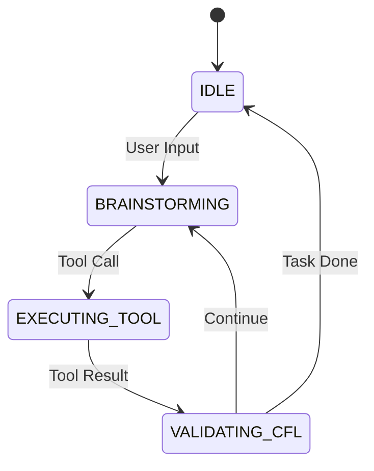

# Module: core/orchestration

## Rôle dans l'Architecture NEXUS V9.2
Ce module gère le flux d'exécution principal via une Machine à États Finis (FSM). Il est le "cœur battant" de NEXUS, coordonnant les interactions entre l'utilisateur, les agents et les outils.

## Composants Clés
*   `fsm_handlers.py`: Gestionnaires de transition d'état (IDLE -> BRAINSTORMING -> EXECUTING).
*   `orchestration_v7.py`: Classe `OrchestratorV7` (Singleton).
*   `states.py`: Définition des 11 états (`OrchestratorState`).

## Architecture & Flux (V9.2)
*   **Entrées :** Commandes utilisateur (`/swarm`, `/spawn`), événements système.
*   **Sorties :** Actions d'agents, mises à jour de l'interface.
*   **Telemetry (V9.1) :** Émet des événements (`TASK_STARTED`, `TOOL_USE`) vers le Dashboard via `core.ui.telemetry`.

## Dépendances
*   **Utilise :** `core.agents`, `core.swarm`, `core.ui.telemetry`.
*   **Utilisé par :** `nexus7.py` (Point d'entrée).

## Diagramme FSM

