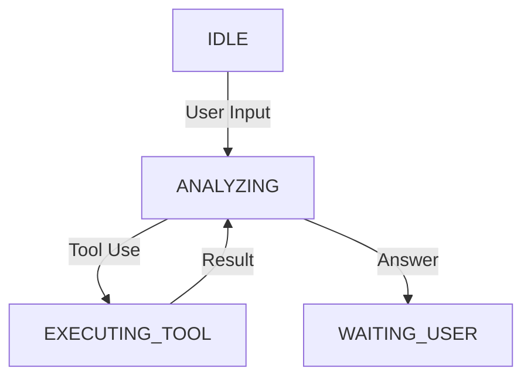

# Orchestration Module - NEXUS V9.2

## Rôle
Le module `core/orchestration` contient les composants de bas niveau de la machine à états (FSM) de NEXUS. Il gère l'invocation des agents, la construction du contexte, et les transitions d'états tactiques.

## Fichiers Clés
| Fichier | Lignes | Responsabilité |
|---------|--------|----------------|
| `fsm_handlers.py` | ~750 | **FSM Logic**: Implémente la logique de transition pour chaque état (IDLE, EXECUTING, etc.). |
| `agent_invoker.py` | ~210 | **Invocation**: Wrapper pour appeler les drivers LLM avec gestion d'erreurs et retry. |
| `context_builder.py` | ~120 | **Context**: Construit le prompt système et l'historique des messages. |
| `detectors.py` | ~80 | **Parsing**: Détecte les blocs JSON/Code dans les réponses brutes. |
| `swarm_bridge.py` | ~60 | **Bridge**: Connecte l'orchestrateur FSM au moteur Swarm. |

## API Publique
```python
from core.orchestration import (
    FSMHandlers,
    AgentInvoker,
    ContextBuilder
)
```

## Flux de Données

### FSM Loop


## Dépendances

**Importe :**
- `core/drivers` : Pour appeler les modèles.
- `core/memory` : Pour récupérer le contexte RAG.
- `core/security` : Pour valider les entrées/sorties.

**Importé par :**
- `core/orchestration_v7.py` : L'orchestrateur principal compose ces modules.
- `core/interface/repl.py` : La boucle REPL interagit avec l'orchestrateur.

## Configuration

Pas de configuration directe, hérite de la configuration de `OrchestratorV7`.

## Tests

- `tests/orchestration/test_fsm_handlers.py`
- `tests/orchestration/test_context_builder.py`
- `tests/e2e/test_full_system_flow.py`
