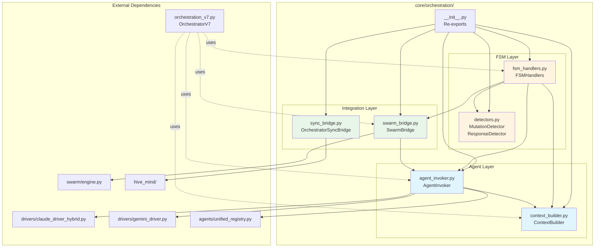

# core/orchestration/

## SYNOPSIS

**Entrée:** FSM state + Messages
**Traitement:** Extracted orchestration components (V7.8 Phase 14c)
**Sortie:** Tool results + State transitions

Le module `orchestration` contient les composants d'orchestration refactorisés extraits de `orchestration_v7.py` selon le principe de responsabilité unique (SRP). Chaque module gère un aspect spécifique de l'orchestration: invocation d'agents, construction de contexte, détection de formats, gestion d'états FSM, intégration Swarm et synchronisation d'état.

## Architecture Modulaire (V7.8 Phase 14c)

**Stratégie de migration:**
1. Les modules extraits sont utilisés via COMPOSITION par OrchestratorV7
2. L'orchestration originale `orchestration_v7.py` reste le point d'entrée
3. Les nouveaux modules peuvent être utilisés directement pour tests/extensions

**Modules:**

| Module | Responsabilité | Extraction |
|--------|----------------|------------|
| `agent_invoker.py` | Invocation d'agents AI (Claude/Gemini/Spawned) | Phase 14c |
| `context_builder.py` | Construction de contexte markdown | Phase 14c |
| `detectors.py` | Détection de formats (mutations, signaux) | Phase 14c |
| `fsm_handlers.py` | Gestionnaires d'états FSM | Phase 14c |
| `swarm_bridge.py` | Intégration HybridSwarmEngine | Phase 14c |
| `sync_bridge.py` | Synchronisation HiveMind/Swarm | V9.4 |

---

## LOCAL MAP



---

## INTERACTION MATRIX

### agent_invoker.py - AgentInvoker

**Responsabilité:** Invocation d'agents AI avec routage de modèles et métriques DyLAN.

**Méthodes Clés:**
- `get_claude_driver(task_type, timeout_override)` - Créer driver Claude avec modèle adapté
- `invoke_agent(task_type, context)` - Invoquer agent actif avec routage intelligent
- `invoke_for_swarm(agent_id, task_type, context, session_uuid)` - Callback pour Swarm Engine
- `invoke_spawned_agent(agent_id, task_type, context)` - Invoquer agents personnalisés
- `invoke_agent_direct(task_type, context, target_agent, session_uuid)` - Thread-safe invocation
- `record_invocation(agent_name, task_type, success, duration, quality_score)` - Métriques DyLAN
- `calculate_quality_score(message, validation_ok, is_stagnant)` - Scoring qualité 0.0-1.0

**Dépendances:**
- `ClaudeDriverHybrid` - Driver Claude avec sélection Opus/Sonnet
- `GeminiDriver` - Driver Gemini
- `ModelRouter` - Routage TaskType → Model
- `AgentPool` - Métriques DyLAN
- `BudgetTracker` - Phase 14d: Enforcement budget

**Routage Modèle (V7 Sprint 8):**
```python
TaskType.BRAINSTORM → Opus
TaskType.REDTEAM → Opus
TaskType.ARCHITECT → Opus
TaskType.EVOLUTION → Opus
TaskType.TOOL → Sonnet
TaskType.VALIDATION → Sonnet
TaskType.SIMPLE → Sonnet
```

**Thread Safety (V8.1.6):**
- `invoke_agent_direct` utilise `target_agent` explicite (pas `self.active_agent`)
- `session_uuid` pour isolation fichiers en mode PARALLEL
- Pas de race conditions en exécution parallèle

**Agents Spawned (V7.5 HIVE MIND):**
- Détection via `provider == "spawned"` dans AgentPool
- Chargement de `system_prompt.md` personnalisé
- V8.1.8-B: Routage provider depuis `BIRTH_CERTIFICATE.yaml`

---

### context_builder.py - ContextBuilder

**Responsabilité:** Construction de contextes markdown pour différents modes d'exécution.

**Méthodes Clés:**
- `build_context()` - Contexte complet pour brainstorming (historique, plan, outils)
- `build_context_with_tool_result()` - Contexte léger pour validation CFL (rapide, focalisé)
- `build_swarm_context(task_context, task_type, target_agent)` - Contexte enrichi pour Swarm
- `build_simple_context(user_input, task_analysis)` - Contexte minimal pour tâches SIMPLE

**Types de Contexte:**

| Type | Usage | Contenu | Performance |
|------|-------|---------|-------------|
| Full | BRAINSTORMING | System prompt + objectif + plan + 50 messages + RAG | Standard |
| CFL | VALIDATING_CFL | Objectif + outil exécuté + résultat | Ultra-rapide |
| Swarm | SWARM_EXECUTING | System prompt + 10 messages + instructions swarm | Optimisé |
| Simple | SIMPLE task | System prompt + tâche + analyse + outils | Léger |

**Project Memory RAG (V7.8 Phase 10c):**
- Injection automatique pour tâches MODERATE+
- `project_memory.retrieve(objective, limit=3, min_score=0.05)`
- Chunks formatés max 2000 chars
- Échec silencieux (ne casse pas la construction)

**Compressed History:**
- Résumé long-terme via `compressed_history_summary`
- Historique récent: 50 derniers messages (augmenté de 30)
- Équilibre contexte long-terme vs. détails récents

**Chain-of-Thought (V7.7 Phase 14e):**
- Force `<thinking>...</thinking>` pour complexité EXPERT
- Injection automatique basée sur `_current_complexity`

---

### detectors.py - MutationDetector & ResponseDetector

**Responsabilité:** Détection de formats et signaux dans les réponses agents.

**MutationDetector:**
Détecte les propositions de mutation valides (mode EVOLUTION_BRAINSTORM).

Formats supportés:
1. **SEARCH/REPLACE** (PRIORITÉ - format prompt):
   ```
   FILE: path/to/file.py
   <<<<<<< SEARCH
   original code
   =======
   replacement code
   >>>>>>> REPLACE
   ```

2. **JSON Array** (FALLBACK - legacy):
   ```json
   [{"file": "...", "change": "...", "reason": "...", "expected_asi_impact": ...}]
   ```

**Méthodes:**
- `detect_mutation_complete(content)` - Vérifier présence mutation valide
- `detect_search_replace_format(content)` - Parser SEARCH/REPLACE
- `detect_json_format(content)` - Parser JSON avec validation champs

**ResponseDetector:**
Détecte patterns de réponse généraux.

**Méthodes:**
- `is_finish_signal(content)` - Détecte fin de tâche (done, complete, finished, etc.)
- `has_error_pattern(content)` - Détecte patterns d'erreur (error, failed, exception, etc.)

**Singleton:**
```python
from core.orchestration.detectors import get_mutation_detector
detector = get_mutation_detector()
```

---

### fsm_handlers.py - FSMHandlers

**Responsabilité:** Gestionnaires d'états FSM (11 états + 24 états HiveMind).

**États Principaux:**

| État | Méthode | Description |
|------|---------|-------------|
| IDLE | `handle_idle()` | Analyse complexité → routage TRIVIAL/SIMPLE/MODERATE+ |
| WAITING_USER | `handle_waiting_user()` | Attente nouvelle input après tâche terminée |
| BRAINSTORMING | `handle_brainstorming()` | Débat agents + consensus outil |
| EXECUTING_TOOL | `handle_executing_tool()` | Exécution outil synchrone |
| VALIDATING_CFL | `handle_validating_cfl()` | Validation résultat par agent alternatif |
| EVOLUTION_BRAINSTORM | `handle_evolution_brainstorm()` | Débat pour mutations (format spécial) |
| ERROR | `handle_error()` | État erreur récupérable (/reset) |
| PANIC | `handle_panic()` | État panique (V9.3: récupérable via /reset) |

**Swarm States:**
- `handle_swarm_analyzing()` - Analyse tâche Swarm
- `handle_swarm_negotiating()` - Négociation mode collaboration
- `handle_swarm_executing()` - Exécution swarm

**Routage par Complexité (handle_idle):**
```
TRIVIAL → Fast Path (Gemini rapide < 2s) ou static fallback
SIMPLE → Single agent direct execution (pas de CFL)
MODERATE+ → Swarm (si activé) sinon Brainstorming classique
COMPLEX/EXPERT → Hive Mind V8.0 (si activé)
```

**V8.0 TRUE HIVE MIND Integration:**
- `_should_use_hive_mind(complexity)` - Gating logic
  - COMPLEX/EXPERT: Toujours Hive Mind
  - MODERATE: Si `hive_mind_moderate=True` (défaut)
  - TRIVIAL/SIMPLE: Jamais Hive Mind
- `_route_to_hive_mind(user_input, task_analysis)` - Pipeline 7 phases
- Fallback: Swarm → Brainstorming si Hive Mind échoue

**Plan Health & Panic System:**
- Détection ZOMBIE plans (stagnation)
- Stalemate detection (échecs CFL répétés)
- V9.3 ISSUE-004 FIX: Single source of truth pour stalemate counter

**Simple Task Execution (V7.8 Phase 14c):**
- Single agent (sélection basée fit score)
- Exécution outils directe (PAS de CFL validation)
- Max 5 itérations outil
- Mode léger: contexte minimal

**Fast Path (V7.5 Phase 9):**
- Bypass FSM pour conversations triviales
- Gemini direct call < 2s
- Max 150 tokens
- Fallback static si Gemini échoue

**Async Handlers (V8.4.4 P3):**
- `handle_brainstorming_async()` - Version non-bloquante
- `handle_validating_cfl_async()` - CFL async
- `handle_fast_path_async()` - Fast path async
- `_invoke_agent_async()` - Invocation avec `await`
- Permet event loop responsive (pas de blocage)

---

### swarm_bridge.py - SwarmBridge

**Responsabilité:** Pont entre orchestrateur et HybridSwarmEngine.

**Méthodes Clés:**
- `start_swarm_mode(objective, force_mode)` - Initialiser mode Swarm
- `process_with_swarm(task_input, force_mode, skip_negotiation, callbacks)` - Pipeline Swarm complet
- `get_swarm_stats()` - Statistiques Swarm Engine
- `is_enabled` - Propriété vérifiant disponibilité Swarm

**Pipeline Swarm:**
1. **Analyse** - TaskAnalyzer détermine complexité + domaines
2. **Négociation** - Agents débattent mode optimal (max 4 tours)
3. **Sélection** - Mode consensus ou proposition initiale
4. **Exécution** - Executor spécifique au mode (PARALLEL, SEQUENTIAL, etc.)
5. **Résultat** - Formatage + intégration historique

**Modes de Collaboration (6):**
```
PARALLEL      - Travail simultané, fusion résultats
SEQUENTIAL    - Exécution ordonnée (dépendances)
LEAD_SUPPORT  - Lead drive, support review
PING_PONG     - Alternance rapide jusqu'à convergence
SPECIALIST    - Expert unique gère tout
RED_BLUE      - Adversarial propose/attack/defend
```

**Callbacks Temps Réel (V7.5):**
- `on_negotiation_turn` - Display négociation en cours
- `on_execution_round` - Display exécution en cours
- Permet UX interactive pour tâches longues

**Résultat Formaté:**
```python
{
    "state": "COMPLETED",
    "output": "...",
    "agent": "Swarm",
    "mode": "PARALLEL",
    "finished": True,
    "analysis": {...},
    "execution": {...}
}
```

---

### sync_bridge.py - OrchestratorSyncBridge

**Responsabilité:** Synchronisation d'état entre HiveMind et Swarm (V9.4 ISSUE-003).

**Problème Résolu:**
- SagaManager (HiveMind) et SwarmSessionManager (Swarm) opéraient indépendamment
- Checkpoints non corrélés entre systèmes
- Rollback dans un système n'affectait pas l'autre
- Pas de cross-validation au démarrage

**Solution - Pattern Médiateur:**
- Génération task_id unifié
- Propagation checkpoints bidirectionnelle
- Rollback coordonné
- Validation croisée

**Méthodes Clés:**
- `create_unified_task(objective, swarm_mode, metadata)` - Task_id partagé
- `sync_checkpoint(source, task_id, phase_or_mode, checkpoint_data)` - Propager checkpoint
- `coordinated_rollback(task_id, target_phase, context_manager)` - Rollback atomique
- `validate_consistency(task_id)` - Détection incohérences
- `complete_unified_task(task_id, success, cleanup_saga)` - Finalisation coordonnée

**Event System:**
```python
class SyncEventType(Enum):
    TASK_CREATED
    CHECKPOINT_CREATED
    CHECKPOINT_RESTORED
    ROLLBACK_STARTED
    ROLLBACK_COMPLETED
    TASK_COMPLETED
    VALIDATION_FAILED
    VALIDATION_PASSED
```

**Audit Trail:**
- Tous événements sync enregistrés
- `get_events(task_id, event_type, limit)` - Query historique
- Callbacks extensibles: `on_sync(callback)`

**Thread Safety:**
- RLock pour toutes modifications d'état
- Safe pour mode PARALLEL (accès concurrent)

**Singleton Global:**
```python
from core.orchestration.sync_bridge import get_sync_bridge, reset_sync_bridge

sync_bridge = get_sync_bridge()
sync_bridge.set_saga_manager(saga)
sync_bridge.set_session_manager(session_manager)
```

**Validation Consistency:**
```python
result = sync_bridge.validate_consistency(task_id)
# {
#     "task_id": "...",
#     "consistent": True/False,
#     "issues": [...],
#     "swarm_state": {...},
#     "saga_state": {...}
# }
```

**Research Sources:**
- AWS Saga Orchestration Patterns
- Microsoft Saga Design Pattern
- Temporal.io: Mastering Saga Patterns

---

## PARENT LINK

**Module Parent:** `core/orchestration_v7.py` (OrchestratorV7)

**Hiérarchie:**
```
core/
├── orchestration_v7.py        # Main orchestrator (composition)
└── orchestration/             # Extracted components (SRP)
    ├── agent_invoker.py       # Agent invocation layer
    ├── context_builder.py     # Context construction
    ├── detectors.py           # Format detection
    ├── fsm_handlers.py        # State handlers
    ├── swarm_bridge.py        # Swarm integration
    └── sync_bridge.py         # HiveMind/Swarm sync
```

**OrchestratorV7 Composition:**
```python
class OrchestratorV7:
    def __init__(self, ...):
        # Extracted modules (V7.8 Phase 14c)
        self.agent_invoker = AgentInvoker(self)
        self.context_builder = ContextBuilder(self)
        self.mutation_detector = get_mutation_detector()
        self.fsm_handlers = FSMHandlers(self)
        self.swarm_bridge = SwarmBridge(self)

        # V9.4: Sync bridge
        self.sync_bridge = get_sync_bridge()
```

**Backward Compatibility:**
- `__init__.py` re-exporte tous composants
- OrchestratorV7 utilise via composition
- Modules utilisables directement pour tests/extensions

**Migration Path:**
1. Phase 14c (V7.8): Extraction initiale
2. OrchestratorV7 utilise modules extraits
3. Tests passent sans changement
4. Nouveau code peut utiliser modules directement

---

## USAGE EXAMPLES

### AgentInvoker

```python
from core.orchestration.agent_invoker import AgentInvoker
from core.routing.model_router import TaskType

invoker = AgentInvoker(orchestrator)

# Invoke avec routage automatique
response = invoker.invoke_agent(TaskType.BRAINSTORM, context)

# Thread-safe invocation (pour Swarm PARALLEL)
response = invoker.invoke_agent_direct(
    TaskType.TOOL,
    context,
    target_agent="Claude",
    session_uuid="task-123"
)

# Record DyLAN metrics
invoker.record_invocation(
    agent_name="Gemini",
    task_type="brainstorm",
    success=True,
    duration=2.5,
    quality_score=0.85
)
```

### ContextBuilder

```python
from core.orchestration.context_builder import ContextBuilder

builder = ContextBuilder(orchestrator)

# Full brainstorming context
context = builder.build_context()

# Lightweight CFL validation
context = builder.build_context_with_tool_result()

# Swarm execution context
context = builder.build_swarm_context(
    task_context="Analyze security vulnerabilities",
    task_type="execution",
    target_agent="Claude"
)
```

### FSMHandlers

```python
from core.orchestration.fsm_handlers import FSMHandlers

handlers = FSMHandlers(orchestrator)

# Process state
result = handlers.handle_idle(user_input="Build a REST API")

# Async version (V8.4.4)
result = await handlers.handle_brainstorming_async()
```

### SwarmBridge

```python
from core.orchestration.swarm_bridge import SwarmBridge
from core.swarm import CollaborationMode

bridge = SwarmBridge(orchestrator)

# Full swarm pipeline
result = bridge.process_with_swarm(
    task_input="Refactor authentication system",
    force_mode=CollaborationMode.LEAD_SUPPORT,
    on_execution_round=lambda r: print(f"Round {r}...")
)

# Get stats
stats = bridge.get_swarm_stats()
```

### OrchestratorSyncBridge

```python
from core.orchestration.sync_bridge import get_sync_bridge

sync_bridge = get_sync_bridge()
sync_bridge.set_saga_manager(saga)
sync_bridge.set_session_manager(session_manager)

# Create unified task
task_id = sync_bridge.create_unified_task(
    objective="Build API endpoints",
    swarm_mode="PARALLEL"
)

# Sync checkpoint from HiveMind
await sync_bridge.sync_checkpoint(
    source="hivemind",
    task_id=task_id,
    phase_or_mode="analysis",
    checkpoint_data={"context_index": 50}
)

# Coordinated rollback
success = await sync_bridge.coordinated_rollback(
    task_id=task_id,
    target_phase="analysis",
    context_manager=context_manager
)

# Validate consistency
result = sync_bridge.validate_consistency(task_id)
if not result["consistent"]:
    print(f"Issues: {result['issues']}")
```

---

## VERSION HISTORY

| Version | Change | Date |
|---------|--------|------|
| V7.8 Phase 14c | Initial extraction from orchestration_v7.py | 2024-11 |
| V7.8 Phase 14d | Budget enforcement in agent_invoker | 2024-11 |
| V7.8 Phase 14e | Chain-of-Thought enforcement for EXPERT tasks | 2024-11 |
| V8.0 | TRUE HIVE MIND integration in fsm_handlers | 2024-12 |
| V8.1.6 | Thread-safe session_uuid for PARALLEL mode | 2024-12 |
| V8.1.8-B | Spawned agent provider routing | 2024-12 |
| V8.4.4 | Async native handlers (P3 Blind Spot) | 2024-12 |
| V9.3 | PANIC state now recoverable via /reset | 2025-12 |
| V9.4 | OrchestratorSyncBridge (ISSUE-003) | 2025-12 |

---

## MÉTRIQUES PHASE 14c FINAL

| Métrique | Avant (V7.6) | Après (V7.8) | Réduction |
|----------|--------------|--------------|-----------|
| Lignes `orchestration_v7.py` | 2223 | 783 | **-65%** |
| Modules créés | 1 | 6 | +5 |
| Responsabilités par module | ~10 | 1-2 | ✅ |
| Testabilité | Faible | Élevée | ✅ |
| Couplage | Fort | Faible | ✅ |

---

## CONFIGURATION

**Environment Variables:**
```bash
# Swarm
SWARM_AUTO_ROUTE=True              # Auto-route MODERATE+ to Swarm
SWARM_DEFAULT_MODE=ping_pong       # Fallback si négociation échoue

# HiveMind
HIVE_MIND_ENABLED=True             # Enable V8 Hive Mind
HIVE_MIND_MODERATE=True            # Use Hive Mind for MODERATE tasks
HIVE_MIND_BREAKPOINTS_ENABLED=True # Auto-breakpoints between phases

# Fast Path
FAST_PATH_ENABLED=True             # Enable < 2s responses for TRIVIAL

# CFL
CFL_TIMEOUT=60                     # CFL validation timeout (seconds)

# Streaming
STREAMING_ENABLED=False            # Token-by-token streaming
```

---

## DEPENDENCIES

**Internal:**
- `core.drivers.claude_driver_hybrid` - Claude Opus/Sonnet
- `core.drivers.gemini_driver` - Gemini
- `core.routing.model_router` - TaskType → Model mapping
- `core.fsm.states` - OrchestratorState enum
- `core.swarm` - HybridSwarmEngine
- `core.hive_mind` - TrueHiveMind (V8.0)
- `core.agents.unified_registry` - Agent identification
- `core.memory` - RAG + SuccessMemory
- `core.telemetry` - Budget + Metrics

**External:**
- `tiktoken` - Token counting (DyLAN metrics)
- Standard library: `asyncio`, `logging`, `threading`

---

## AUTHOR

**NEXUS Development Team**
Phase 14c extraction: Claude (V7.8)
V9.4 ISSUE-003: Claude (OrchestratorSyncBridge)

**Philosophy:** "Equal collaboration between AI agents - you and Gemini work together to surpass what each can do alone."
