# resilience

NEXUS V9.5 Resilience Module

Provides circuit breaker, system health monitoring, and resilience patterns
for multi-agent orchestration.

Modules:
- circuit_breaker: Circuit breaker pattern for fault tolerance
- system_health: Unified health monitoring for V9.5 components

## Overview

| Metric | Value |
|--------|-------|
| **Path** | `C:\Code\NEXUS\NEXUS-N7A\core\resilience` |
| **Modules** | 3 |
| **Total Lines** | 1058 |
| **Classes** | 8 |
| **Functions** | 7 |

## Architecture

```mermaid
classDiagram
    class CircuitState {
        +CLOSED
        +OPEN
        +HALF_OPEN
    }
    Enum <|-- CircuitState
    class CircuitOpenError {
        +name
        +time_until_retry
        +failure_count
        -__init__(self, name: str, time_until_retry: float, failure_count: int)
    }
    Exception <|-- CircuitOpenError
    class CircuitBreaker {
        +str name
        +int failure_threshold
        +float recovery_timeout
        +float max_backoff
        +float backoff_multiplier
        -CircuitState _state
        -int _failure_count
        -Optional[float] _last_failure_time
        -float _current_backoff
        -Lock _lock
        -__post_init__(self)
        +state(self) CircuitState
        +failure_count(self) int
        -_should_attempt_recovery(self) bool
        -_get_time_until_retry(self) float
        -_on_success(self)
        -_on_failure(self, error: Exception)
        +call(self, func: Callable, *args, **kwargs) Any
        +call_sync(self, func: Callable, *args, **kwargs) Any
        +reset(self)
        +get_status(self) Dict[str, Any]
    }
    class HierarchicalCircuitBreaker {
        -_global
        -_lock
        -_cascade_window
        -_cascade_threshold
        -__init__(self, global_failure_threshold: int=..., global_recovery_timeout: float=..., cascade_window: float=..., cascade_threshold: int=...)
        -_get_provider_breaker(self, provider: str) CircuitBreaker
        -_check_cascade(self, provider: str) bool
        +call(self, provider: str, func: Callable, *args, **kwargs) Any
        +call_sync(self, provider: str, func: Callable, *args, **kwargs) Any
        +reset_all(self)
        +reset_provider(self, provider: str)
        +get_status(self) Dict[str, Any]
        +global_state(self) CircuitState
        +get_provider_state(self, provider: str) CircuitState
    }
    class HealthStatus {
        +HEALTHY
        +DEGRADED
        +UNHEALTHY
        +UNKNOWN
    }
    Enum <|-- HealthStatus
    class ComponentHealth {
        +str name
        +HealthStatus status
        +str message
        +Dict[str, Any] details
        +datetime checked_at
        +to_dict(self) Dict[str, Any]
    }
    class HealthReport {
        +List[ComponentHealth] components
        +HealthStatus overall_status
        +datetime checked_at
        +healthy_count(self) int
        +unhealthy_count(self) int
        +summary(self) str
        +to_dict(self) Dict[str, Any]
    }
    class SystemHealth {
        +workspace_path
        -__init__(self, workspace_path: Optional[Path]=...)
        +check_all(self) HealthReport
        -_check_constants(self) ComponentHealth
        -_check_safe_task_manager(self) ComponentHealth
        -_check_event_bus(self) ComponentHealth
        -_check_tool_registry(self) ComponentHealth
        -_check_circuit_breaker(self) ComponentHealth
        +last_report(self) Optional[HealthReport]
    }
```

## Modules

| Module | Description | Classes | Functions |
|--------|-------------|---------|-----------|
| [circuit_breaker](circuit_breaker.py) | V9.3 ISSUE-007: Circuit Breaker Pattern for NEXUS | 4 | 5 |
| [system_health](system_health.py) | SystemHealth - Unified Health Check for V9.5 Components. | 4 | 2 |

---
*Auto-generated by nexus-doc-generator 1.0.0 - 2025-12-16 19:13*