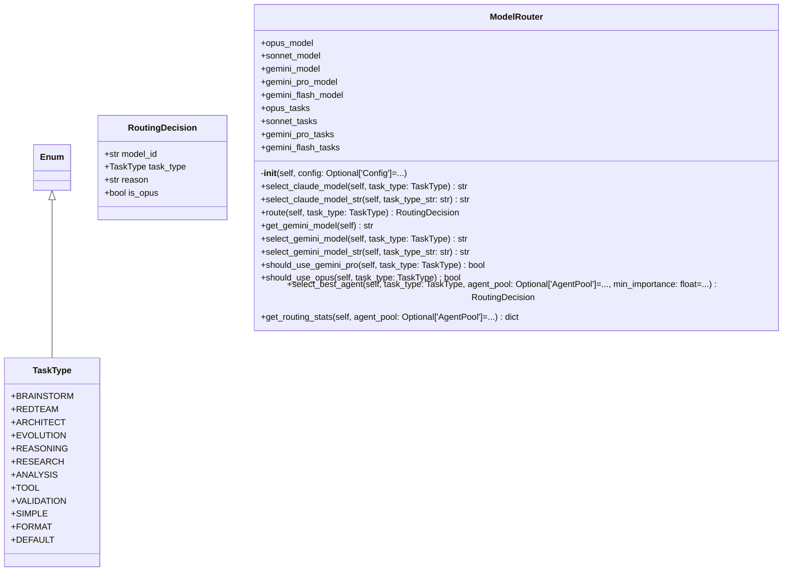

# routing

NEXUS V7 Model Routing Module

Routes tasks to appropriate models based on complexity and task type.
Supports Opus/Sonnet selection for Claude and model variants for Gemini.

## Overview

| Metric | Value |
|--------|-------|
| **Path** | `C:\Code\NEXUS\NEXUS-N7A\core\routing` |
| **Modules** | 2 |
| **Total Lines** | 346 |
| **Classes** | 3 |
| **Functions** | 0 |

## Architecture

## Modules

| Module | Description | Classes | Functions |
|--------|-------------|---------|-----------|
| [model_router](model_router.py) | Model Router - Intelligent Model Selection for NEXUS V7 Chrysalis | 3 | 0 |

---
*Auto-generated by nexus-doc-generator 1.0.0 - 2025-12-16 19:13*