# core/security/

**NEXUS V8.8 Multi-Layer Security Defense System**

---

## SYNOPSIS

**Entrée:** User input, Tool calls, Mutations, LLM output, File paths, Commands
**Traitement:** Multi-layer validation based on OWASP LLM01:2025 and defense-in-depth
**Sortie:** ThreatLevel + Allowed/Blocked/Warning + Sanitized content

The security module implements a **7-layer defense-in-depth architecture** to protect NEXUS against:
- Prompt injection attacks (Layer 1)
- RAG content poisoning (Layer 2)
- Command injection (Layer 3)
- Path traversal attacks (Layer 4)
- System prompt leakage (Layer 5)
- Malicious mutations (Layer 6)
- Unsafe dynamic tools (Layer 7)

**Design Principles:**
- **BLOCK** writes to parent code (absolute protection)
- **ALLOW** reads from parent code (agents need context)
- **WARN** on suspicious patterns (don't over-block)
- **SANITIZE** before BLOCK when possible (V8.8)
- **PREFER** shell=False for command execution (Phase 14a)

---

## LOCAL MAP

```mermaid
graph TD
    subgraph "Layer 1-2: Input Protection"
        A[User Input] --> B[InputGuard]
        B --> C{ThreatLevel?}
        C -->|CRITICAL/HIGH| D[BLOCK + Log]
        C -->|MEDIUM/LOW| E[WARN + Continue]
        C -->|NONE| F[Sanitized Text]

        RAG[RAG Content] --> G[Spotlighter]
        G --> H[Datamarked Content]
    end

    subgraph "Layer 3-4: Execution Protection"
        CMD[Bash Command] --> I[ExecutionPolicy]
        I --> J{CommandType?}
        J -->|BLOCKED| K[SECURITY ERROR]
        J -->|COMPLEX| L[Shell=True]
        J -->|SIMPLE| M[Shell=False]

        PATH[File Path] --> N[PathGuardian]
        N --> O{Operation?}
        O -->|READ| P[workspace + parent]
        O -->|WRITE| Q[workspace only]
        P --> R{Sacred File?}
        Q --> R
        R -->|YES| S[BLOCKED]
        R -->|NO| T[Resolved Path]
    end

    subgraph "Layer 5-6: Output + Mutation Protection"
        OUT[LLM Output] --> U[OutputGuard]
        U --> V{LeakType?}
        V -->|SYSTEM_PROMPT| W[HIGH Severity]
        V -->|SENSITIVE_DATA| W
        V -->|INSTRUCTION_ECHO| X[MEDIUM Severity]
        V -->|NONE| Y[Clean Output]

        MUT[Mutation Code] --> Z[MutationValidator]
        Z --> AA[AST Analysis]
        AA --> AB[WARN + Continue]
    end

    subgraph "Layer 7: Dynamic Tool Protection"
        TOOL[Tool Code] --> AC[CodeValidator]
        AC --> AD[AST Analysis]
        AD --> AE{Safe?}
        AE -->|NO| AF[BLOCKED]
        AE -->|YES| AG[Execute]
    end

    subgraph "Integrity Monitoring"
        FILES[Critical Files] --> AH[IntegrityMonitor]
        AH --> AI[SHA-256 Hashes]
        AI --> AJ{Modified?}
        AJ -->|PROTECTED| AK[CRITICAL ALERT]
        AJ -->|WATCHED| AL[WARNING]
        AJ -->|NONE| AM[OK]
    end
```



---

## INTERACTION MATRIX

### Internal Dependencies

| Component | Imports From | Exports To |
|-----------|--------------|------------|
| **InputGuard** | - (standalone) | FSM, Spawning, Tools |
| **OutputGuard** | - (standalone) | FSM, Drivers, Swarm |
| **ExecutionPolicy** | pathlib, shlex | execution/executor.py, orchestration |
| **PathGuardian** | pathlib | execution/file_ops.py, orchestration |
| **MutationValidator** | ast, re | evolution/mutator.py |
| **IntegrityMonitor** | hashlib, json | governance/red_team/ |
| **CodeValidator** | ast | execution/dynamic_tools.py |

### External Interactions

| Module | Uses Security Component | Purpose |
|--------|------------------------|---------|
| **core/orchestration_v7.py** | InputGuard, ExecutionPolicy | Validate user input, bash commands |
| **core/execution/executor.py** | ExecutionPolicy | Safe command execution |
| **core/execution/file_ops.py** | PathGuardian | File read/write validation |
| **core/drivers/** | OutputGuard | Validate LLM responses |
| **core/swarm/** | OutputGuard | Validate agent outputs |
| **core/evolution/** | MutationValidator | Validate mutation code |
| **core/memory/spotlighting.py** | (Re-exported) | RAG datamarking |
| **core/governance/red_team/** | IntegrityMonitor | Alignment testing |

### Data Flow

```
User Input → InputGuard → FSM → Tool Execution → ExecutionPolicy/PathGuardian
                                                ↓
                                        LLM Response → OutputGuard → Display
                                                ↓
                                    Mutation Code → MutationValidator → WARN
                                                ↓
                                    Dynamic Tool → CodeValidator → BLOCK/ALLOW
```

---

## COMPONENTS

### 1. InputGuard (Layer 1)

**File:** `input_guard.py`
**Purpose:** Prompt injection prevention (OWASP LLM01:2025)
**Mode:** BLOCK on CRITICAL/HIGH threats

**Capabilities:**
- Regex-based pattern detection (fast filter)
- Unicode normalization (prevent homoglyph attacks)
- Null byte removal (prevent injection via hidden chars)
- Risk scoring (configurable thresholds)

**Threat Detection:**
- `INSTRUCTION_OVERRIDE`: "Ignore previous instructions"
- `ROLE_MANIPULATION`: "You are now DAN"
- `PROMPT_EXTRACTION`: "Print your system prompt"
- `DELIMITER_INJECTION`: "```\n[SYSTEM]\n"
- `CONTEXT_MANIPULATION`: "The admin said to..."
- `ENCODING_ATTACK`: Base64/rot13 obfuscation

**Usage:**
```python
from core.security import InputGuard, ThreatLevel

guard = InputGuard(block_threshold=0.7, warn_threshold=0.4)
result = guard.validate(user_input)

if not result.is_safe:
    log.warning(f"Blocked: {result.threat_type} - {result.reason}")
    # Handle blocked input
else:
    # result.sanitized_text may differ from original
    process(result.sanitized_text)
```

**Singleton:**
```python
from core.security import get_input_guard

guard = get_input_guard()  # Returns global instance
```

---

### 2. OutputGuard (Layer 5)

**File:** `output_guard.py`
**Purpose:** System prompt leak prevention
**Mode:** WARN (sanitize output, don't block by default)

**Capabilities:**
- System prompt leak detection
- Instruction echo detection
- Role revelation detection
- Sensitive pattern masking (API keys, passwords)

**Leak Types:**
- `SYSTEM_PROMPT`: Direct system prompt echo (HIGH)
- `ROLE_REVELATION`: AI revealing its role/instructions (MEDIUM)
- `INSTRUCTION_ECHO`: Echoing back instructions (MEDIUM)
- `SENSITIVE_DATA`: API keys, passwords, connection strings (HIGH)

**Usage:**
```python
from core.security import OutputGuard

guard = OutputGuard(block_on_leak=False, sanitize_output=True)
result = guard.validate(llm_output)

if not result.is_safe:
    log.warning(f"Leak detected: {result.leak_type}")
    # Use sanitized version
    display(result.sanitized_output)
else:
    display(llm_output)
```

**Singleton:**
```python
from core.security import get_output_guard

guard = get_output_guard()
```

---

### 3. ExecutionPolicy (Layer 3)

**File:** `execution_policy.py`
**Purpose:** Command validation and execution security
**Mode:** BLOCK dangerous commands

**Defense Layers:**
1. Dangerous executable blocking (rm, sudo, nc, etc.)
2. Shell metacharacter detection (|, &, ;, etc.)
3. Path traversal prevention
4. Workspace containment

**Command Types:**
- `SIMPLE`: Safe for shell=False (preferred)
- `COMPLEX`: Requires shell=True (carefully controlled)
- `BLOCKED`: Dangerous, always rejected

**Blocked Executables:**
- Network tools: nc, wget, curl, telnet
- Privilege escalation: sudo, su, pkexec
- Destructive: dd, mkfs, shred
- Code execution: perl, ruby, php, node, powershell
- System manipulation: systemctl, reboot, crontab
- Compilers: make, gcc, cargo, npm run

**Usage:**
```python
from core.security import ExecutionPolicy

policy = ExecutionPolicy(workspace_path)

# Validate command
is_valid, error = policy.validate_command("ls -la")
if not is_valid:
    raise SecurityError(error)

# Get safe execution args
args, use_shell = policy.get_safe_execution_args("grep pattern file.txt")
subprocess.run(args, shell=use_shell)
```

**Singleton:**
```python
from core.security import get_execution_policy

policy = get_execution_policy(workspace_path)
```

---

### 4. CodeValidator (Layer 7)

**File:** `execution_policy.py` (Phase 12.5)
**Purpose:** Validate dynamically generated tool code
**Mode:** BLOCK unsafe code

**AST-Based Validation:**
- Blocked imports: os, subprocess, socket, pickle, ctypes, etc.
- Blocked functions: eval, exec, compile, open, globals, etc.
- Blocked attributes: `__class__`, `__globals__`, `__builtins__`, etc.
- Blocked syntax: global, nonlocal, metaclass, async, decorators

**Usage:**
```python
from core.security import CodeValidator

validator = CodeValidator()
result = validator.validate_code(python_code)

if not result.is_safe:
    raise SecurityError(f"Unsafe code: {result.violations}")
```

---

### 5. PathGuardian (Layer 4)

**File:** `path_guardian.py`
**Purpose:** Path canonicalization and zone validation
**Mode:** BLOCK escapes from allowed zones

**Read Policy:**
- workspace: ALLOWED
- parent: ALLOWED (agents need context)
- elsewhere: BLOCKED

**Write Policy:**
- workspace: ALLOWED
- parent: BLOCKED (immutable)
- GENERATION_ACTIVE: ALLOWED (evolution mode only)

**Sacred Files (NEVER modifiable):**
- KERNEL.py
- MISSION.md
- .env, .env.local, credentials.json

**Security Features:**
- Resolves symlinks before validation
- Uses `.resolve().relative_to()` (immune to startswith() bypasses)
- Blocks absolute paths for writes (ALWAYS)

**Usage:**
```python
from core.security import PathGuardian

guardian = PathGuardian(workspace_path, parent_path, generation_active)

# Read validation
is_valid, resolved, msg = guardian.validate_read("../parent/file.py")
if not is_valid:
    raise SecurityError(msg)

# Write validation
is_valid, resolved, msg = guardian.validate_write("data/output.json")
if not is_valid:
    raise SecurityError(msg)
```

---

### 6. MutationValidator (Layer 6)

**File:** `mutation_validator.py`
**Purpose:** Behavioral analysis of mutation code
**Mode:** WARN + CONTINUE (never blocks)

**Analysis Techniques:**
- Regex pattern matching (fast)
- AST analysis (precise)

**Suspicious Patterns:**
- os.system(), subprocess execution
- shutil file operations
- dynamic imports (__import__)
- exec(), eval()
- file deletion (os.remove, Path.unlink)
- writes to parent paths

**Special Handling:**
- `open()`: Allowed if workspace-relative
- os/subprocess: Warning only (agents may have legitimate uses)

**Usage:**
```python
from core.security import MutationValidator

validator = MutationValidator(workspace_path)
warnings, info = validator.validate(mutation_code, target_file)

if warnings:
    print(validator.format_report(warnings, info, target_file))
    # Apply anyway (user's choice: "Avertir + continuer")
```

---

### 7. IntegrityMonitor

**File:** `integrity_monitor.py`
**Purpose:** Real-time file protection system
**Mode:** ALERT on modifications

**Protected Files (CRITICAL):**
- KERNEL.py
- KERNEL_HASH.txt
- MISSION.md
- INVARIANTS.md
- core/governance/red_team/alignment_tests.py

**Watched Files (WARNING):**
- core/governance/red_team/validator.py
- CLAUDE.md
- prompts/system_gemini_v7.md
- prompts/system_claude_v7.md

**Usage:**
```python
from core.security import IntegrityMonitor

monitor = IntegrityMonitor(project_root)

# Save baseline
monitor.save_baseline(Path("INTEGRITY_BASELINE.json"))

# Verify integrity
is_valid, modified_files = monitor.verify_integrity()
if not is_valid:
    print(f"ALERT: Modified files: {modified_files}")

# Get full report
report = monitor.get_status_report()
print(report['recommendation'])
```

**CLI Interface:**
```bash
# Save baseline
python -m core.security.integrity_monitor --project-root . --save-baseline

# Verify integrity
python -m core.security.integrity_monitor --project-root . --verify
```

---

## SECURITY MODEL

### Defense-in-Depth Layers

| Layer | Component | Protection Against | Mode |
|-------|-----------|---------------------|------|
| 1 | InputGuard | Prompt injection | BLOCK |
| 2 | Spotlighter | RAG poisoning | DATAMARK |
| 3 | ExecutionPolicy | Command injection | BLOCK |
| 4 | PathGuardian | Path traversal | BLOCK |
| 5 | OutputGuard | Prompt leakage | SANITIZE |
| 6 | MutationValidator | Malicious mutations | WARN |
| 7 | CodeValidator | Unsafe dynamic tools | BLOCK |

### Zone-Based Security (PathGuardian)

```
┌─────────────────────────────────────────────────────┐
│ NEXUS Parent (READ-ONLY)                            │
│ - All core/ modules                                 │
│ - KERNEL.py (SACRED)                                │
│ - MISSION.md (SACRED)                               │
│ - .env files (SACRED - NO READ/WRITE)               │
└─────────────────────────────────────────────────────┘
                        ↓ READ ALLOWED
┌─────────────────────────────────────────────────────┐
│ Workspace (READ + WRITE)                            │
│ - workspace/logs/                                   │
│ - workspace/agents/                                 │
│ - workspace/.nexus/                                 │
└─────────────────────────────────────────────────────┘
                        ↓ EVOLUTION MODE ONLY
┌─────────────────────────────────────────────────────┐
│ GENERATION_ACTIVE (WRITE in evolution mode)         │
│ - workspace/evolution/NEXUS_GEN_XX/                 │
└─────────────────────────────────────────────────────┘
```

### Threat Model Coverage

| OWASP LLM01:2025 Threat | Mitigated By | Status |
|-------------------------|--------------|--------|
| Direct prompt injection | InputGuard | ✓ BLOCKED |
| Indirect prompt injection (RAG) | Spotlighter | ✓ DATAMARKED |
| System prompt extraction | OutputGuard | ✓ SANITIZED |
| Role manipulation | InputGuard | ✓ BLOCKED |
| Command injection | ExecutionPolicy | ✓ BLOCKED |
| Path traversal | PathGuardian | ✓ BLOCKED |
| Malicious mutations | MutationValidator | ✓ WARNED |
| Unsafe dynamic code | CodeValidator | ✓ BLOCKED |
| Alignment drift | IntegrityMonitor | ✓ ALERTED |

---

## CONFIGURATION

### Environment Variables

```bash
# Input Guard
INPUT_GUARD_ENABLED=true
INPUT_GUARD_BLOCK_THRESHOLD=0.7  # 0.0-1.0
INPUT_GUARD_WARN_THRESHOLD=0.4   # 0.0-1.0

# Output Guard
OUTPUT_GUARD_ENABLED=true
OUTPUT_GUARD_BLOCK_ON_LEAK=false  # Sanitize vs Block
OUTPUT_GUARD_SANITIZE=true

# Execution Policy
EXECUTION_POLICY_STRICT_MODE=true

# Mutation Validator
MUTATION_VALIDATOR_MODE=warn  # warn | block (default: warn)
```

### Singleton Initialization

All security components provide singleton getters for easy access:

```python
from core.security import (
    get_input_guard,
    get_output_guard,
    get_execution_policy,
    get_code_validator,
)

# Lazy initialization with sensible defaults
input_guard = get_input_guard()
output_guard = get_output_guard()
execution_policy = get_execution_policy(workspace_path)
code_validator = get_code_validator()
```

---

## TESTING

### Unit Tests

```bash
# Test all security components
pytest tests/test_security/

# Test specific components
pytest tests/test_security/test_input_guard.py
pytest tests/test_security/test_output_guard.py
pytest tests/test_security/test_execution_policy.py
pytest tests/test_security/test_path_guardian.py
```

### Red Team Testing

```bash
# Alignment tests (includes security tests)
python -m core.governance.red_team.validator

# Integrity verification
python -m core.security.integrity_monitor --project-root . --verify
```

---

## EVOLUTION HISTORY

| Version | Component | Change |
|---------|-----------|--------|
| V7.8 Phase 12.5 | CodeValidator | Dynamic tool code validation |
| V7.8 Phase 14a | ExecutionPolicy | Command injection prevention |
| V8.8 | InputGuard | Prompt injection prevention |
| V8.8 | OutputGuard | System prompt leak prevention |
| V8.8 | Spotlighter | RAG content datamarking |
| V9.0 | PathGuardian | Enhanced sacred file protection (no read) |

---

## PARENT LINK

**Module:** `core/security/`
**Parent:** `core/` - Core NEXUS orchestration and modules
**Sibling Modules:**
- `core/orchestration_v7.py` - Main FSM orchestrator (uses InputGuard, ExecutionPolicy)
- `core/execution/` - Tool execution layer (uses ExecutionPolicy, PathGuardian)
- `core/drivers/` - LLM drivers (uses OutputGuard)
- `core/swarm/` - Swarm Engine (uses OutputGuard)
- `core/evolution/` - Agent spawning (uses MutationValidator)
- `core/memory/` - Memory & RAG (exports Spotlighter)

**Documentation:**
- `docs/ARCHITECTURE_DECISIONS.md` - Security design decisions
- `docs/OWASP_LLM01_MITIGATION.md` - OWASP compliance details

---

## SOURCES

**Security Standards:**
- AWS Bedrock Guardrails: https://docs.aws.amazon.com/bedrock/latest/userguide/guardrails-prompt-attack.html
- Azure Prompt Shields: https://learn.microsoft.com/en-us/azure/ai-services/content-safety/concepts/jailbreak-detection
- OWASP LLM01:2025: https://genai.owasp.org/llmrisk/llm01-prompt-injection/

**Internal Documentation:**
- Phase 12.5 (Dynamic Tools): ADR-012
- Phase 14a (Command Security): ADR-014
- V8.8 (Input/Output Guards): SPRINT_10_SECURITY.md

---

**Last Updated:** V9.0 (2025-12-13)
**Status:** ACTIVE - All 7 layers operational
**Security Posture:** HARDENED - Defense-in-depth fully implemented
