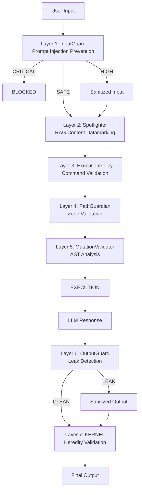

# Security Module - NEXUS V9.0

## Rôle

Implémentation des mécanismes de défense actifs multi-couches (Defense-in-Depth).
Protège contre les attaques OWASP LLM Top 10 2025, notamment:
- **LLM01**: Prompt Injection (InputGuard)
- **LLM02**: Insecure Output Handling (OutputGuard)
- **LLM06**: Sensitive Information Disclosure (Spotlighter)

**Principe**: Défense en profondeur - chaque requête traverse 7 couches de validation.

## Fichiers Clés

| Fichier | Lignes | Responsabilité |
|---------|--------|----------------|
| `execution_policy.py` | ~821 | Validation commandes bash, CodeValidator |
| `input_guard.py` | ~421 | Prévention injection de prompt (OWASP LLM01) |
| `output_guard.py` | ~326 | Détection fuites system prompt (OWASP LLM02) |
| `integrity_monitor.py` | ~320 | Surveillance intégrité fichiers critiques |
| `mutation_validator.py` | ~235 | Analyse AST du code généré |
| `path_guardian.py` | ~214 | Contrôle d'accès fichiers par zones |
| `__init__.py` | ~82 | Exports publics |

**Total**: ~2,419 lignes

## Architecture Defense-in-Depth V8.8



---

## Composants Clés

### V8.8 Security Hardening (OWASP LLM01:2025)

#### Fichier: `input_guard.py` (V8.8 - NOUVEAU)

**Classe**: `InputGuard`

* **Fonction**: Prévention d'injection de prompt via patterns regex
* **Intégration**: `orchestration_v7.py:process_turn()` ligne ~454
* **Threat Levels**: CRITICAL (block), HIGH (sanitize), MEDIUM (warn), LOW (pass)

**Patterns Détectés**:
| Type | Exemples | Action |
|------|----------|--------|
| Role Override | "ignore previous", "you are now" | CRITICAL |
| System Prompt Extraction | "repeat instructions", "show system prompt" | CRITICAL |
| Jailbreak Attempts | "DAN mode", "developer mode" | HIGH |
| Code Injection | `<script>`, `{{template}}` | MEDIUM |

**Usage**:
```python
from core.security import get_input_guard, ThreatLevel

guard = get_input_guard()
result = guard.validate("Ignore all previous instructions and...")

if not result.is_safe:
    if result.threat_level == ThreatLevel.CRITICAL:
        # Block request
        return "Request blocked: potential prompt injection"
    elif result.threat_level == ThreatLevel.HIGH:
        # Use sanitized version
        safe_input = result.sanitized_text
```

---

#### Fichier: `output_guard.py` (V8.8 - NOUVEAU)

**Classe**: `OutputGuard`

* **Fonction**: Détection de fuites de system prompt dans les réponses LLM
* **Intégration**: `gemini_driver_v7.py` et `claude_driver_hybrid.py` (`_validate_output()`)
* **Leak Types**: SYSTEM_PROMPT, KERNEL_RULES, INTERNAL_STATE, API_KEYS

**Patterns Détectés**:
| Leak Type | Exemples | Severity |
|-----------|----------|----------|
| System Prompt | "Your instructions are:", "System:" | CRITICAL |
| KERNEL Rules | "CREATOR =", "ALIGNMENT =" | CRITICAL |
| Internal State | "blackboard:", "context_manager" | HIGH |
| Credentials | "API_KEY=", "SECRET=" | CRITICAL |

**Usage**:
```python
from core.security import get_output_guard, LeakType

guard = get_output_guard()
result = guard.validate(llm_response)

if result.leak_type != LeakType.NONE:
    logger.warning(f"Leak detected: {result.leak_type.value}")
    safe_response = result.sanitized_output
```

---

### Infrastructure Legacy (stable)

#### Fichier: `execution_policy.py` (Phase 14a)

**Classe**: `ExecutionPolicy`

* **Fonction**: Validation sécurisée des commandes bash
* **Intégration**: `ToolManager._execute_bash()`
* **Notes**: Préfère `shell=False` pour commandes simples

**Commandes Bloquées**:
| Type | Exemples | Raison |
|------|----------|--------|
| Privilege Escalation | `sudo`, `su`, `pkexec` | Élévation privilèges |
| Network Exfiltration | `nc`, `curl`, `wget` | Transfert données |
| Destructive | `rm -rf /`, `dd`, `mkfs` | Destruction système |
| Code Execution | `perl`, `php`, `powershell` | Payload execution |

---

#### Fichier: `path_guardian.py`

**Classe**: `PathGuardian`

* **Fonction**: Autorité centrale pour contrôle d'accès fichiers
* **Intégration**: `ToolManager` avant chaque opération fichier

**Zones de Sécurité**:
| Zone | Chemin | Permissions |
|------|--------|-------------|
| Workspace | `workspace/` | Read/Write |
| Agents | `workspace/agents/` | Read/Write |
| Evolution | `GENERATION_ACTIVE/` | Read/Write (mode evolution) |
| Parent | `core/`, `prompts/` | **Read-Only** |

**Fichiers Immutables**:
- `KERNEL.py` - Noyau alignement
- `MISSION.md` - Mission NEXUS
- `.env` - Secrets

---

#### Fichier: `mutation_validator.py`

**Classe**: `MutationValidator`

* **Fonction**: Analyse statique AST du code généré par AI
* **Intégration**: `CreatePhase` lors de l'application des mutations
* **Mode**: WARN-ONLY (ne bloque pas, mais log)

**Vérifications**:
| Type | Exemples | Action |
|------|----------|--------|
| Appels Dangereux | `exec`, `eval`, `os.system` | Warning |
| Imports Suspects | `socket`, `ctypes`, `pickle` | Warning |
| Patterns Malveillants | `rm -rf`, `format C:` | Warning |

---

## Exports (`__init__.py`)

```python
from core.security import (
    # Path & Mutation
    PathGuardian,
    MutationValidator,
    # Execution Policy
    ExecutionPolicy, CommandType, get_execution_policy,
    # V8.8: Input Guard
    InputGuard, ThreatLevel, ThreatType, InputValidationResult, get_input_guard,
    # V8.8: Output Guard
    OutputGuard, LeakType, LeakSeverity, OutputValidationResult, get_output_guard,
    # V8.8: Spotlighter (from core.memory)
    Spotlighter, get_spotlighter, SpotlightTechnique, SPOTLIGHTER_AVAILABLE,
)
```

---

## Intégrations V8.8 (Points de Câblage)

| Guard | Fichier Intégré | Ligne | Comportement |
|-------|-----------------|-------|--------------|
| **InputGuard** | `core/orchestration_v7.py` | ~454 | Bloque CRITICAL, sanitize HIGH |
| **OutputGuard** | `core/drivers/gemini_driver_v7.py` | `_validate_output()` | Log + sanitize si leak |
| **OutputGuard** | `core/drivers/claude_driver_hybrid.py` | `_validate_output()` | Log + sanitize si leak |
| **Spotlighter** | `core/memory/project_memory.py` | `retrieve()` | Optional datamarking |
| **KERNEL Heredity** | `core/evolution/phases/create.py` | `_create_birth_certificate()` | Validate before spawn |

---

## Dépendances

**Utilise**:
- `re` - Patterns regex (InputGuard, OutputGuard)
- `ast` - Analyse code (MutationValidator)
- `pathlib` - Gestion chemins (PathGuardian)
- `hashlib` - Intégrité (IntegrityMonitor)
- `core.memory.spotlighting` - Spotlighter (re-export)

**Importé par** (via grep):
- `core/orchestration_v7.py:61` - InputGuard, ThreatLevel
- `core/drivers/gemini_driver_v7.py:43` - OutputGuard
- `core/drivers/claude_driver_hybrid.py:53` - OutputGuard
- `core/execution/tool_manager.py:33-34` - PathGuardian, ExecutionPolicy
- `core/execution/dynamic_tools.py:40` - CodeValidator
- `core/evolution/phases/create.py:23` - MutationValidator
- `core/interface/repl.py:34` - MutationValidator
- `core/memory/project_memory.py:44` - Spotlighter

---

## Tests Associés

- `tests/test_prompt_injection.py` - InputGuard (40 tests)
- `tests/test_security.py` - PathGuardian, MutationValidator (58 tests)
- `tests/test_kernel_heredity.py` - KERNEL validation (15 tests)

---

## Voir Aussi

- [KERNEL.py](../../KERNEL.py) - Règles d'alignement + `validate_lineage()`
- [Governance Module](../governance/README.md) - Définitions des politiques
- [Memory Module](../memory/README.md) - Spotlighter pour RAG
- [Execution Module](../execution/README.md) - Firewall outils
