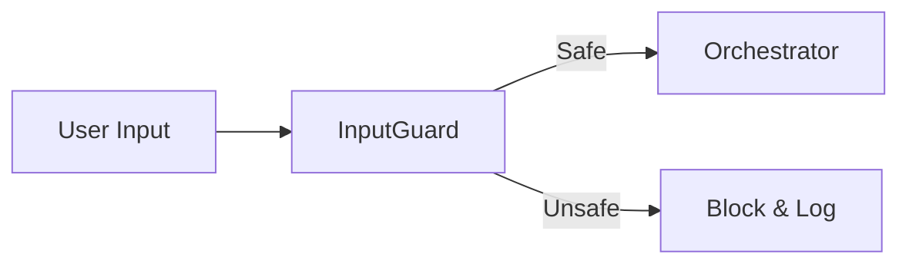
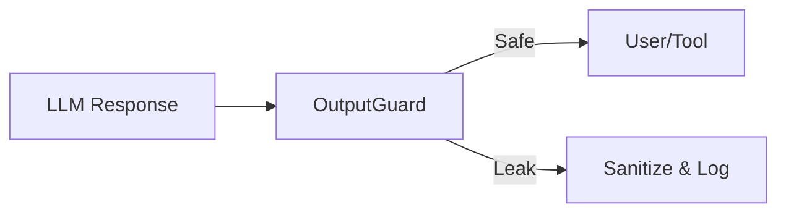

# Security Module - NEXUS V9.2

## Rôle
Le module `core/security` fournit une défense en profondeur contre les attaques adverses (Prompt Injection, System Prompt Leakage) et garantit l'intégrité du système de fichiers via une Sandbox stricte. Il implémente les standards OWASP LLM 2025.

## Fichiers Clés
| Fichier | Lignes | Responsabilité |
|---------|--------|----------------|
| `input_guard.py` | ~420 | **OWASP LLM01**: Bloque les injections de prompt avant exécution. |
| `output_guard.py` | ~330 | **OWASP LLM02**: Détecte les fuites de System Prompt dans les réponses. |
| `spotlighting.py` | ~350 | **RAG Security**: Sanitisation des données externes (Azure Prompt Shields). |
| `execution_policy.py` | ~200 | **Sandbox**: Valide les commandes shell autorisées. |
| `path_guardian.py` | ~150 | **Filesystem**: Empêche l'accès hors de `workspace/` (Path Traversal). |
| `mutation_validator.py` | ~180 | **Code Safety**: Analyse AST pour détecter le code malveillant dans les mutations. |
| `integrity_monitor.py` | ~150 | **Self-Healing**: Vérifie l'intégrité des fichiers core. |

## API Publique
```python
from core.security import (
    get_input_guard,      # Valider l'entrée utilisateur
    get_output_guard,     # Valider la sortie LLM
    get_execution_policy, # Valider une commande shell
    PathGuardian,         # Valider un chemin de fichier
    MutationValidator     # Valider du code Python généré
)
```

## Flux de Données

### Input Validation Flow


### Output Validation Flow


## Dépendances

**Importe :**
- `re` : Regex pour la détection de motifs.
- `ast` : Analyse statique de code (`MutationValidator`).
- `pathlib` : Manipulation de chemins (`PathGuardian`).

**Importé par :**
- `core/orchestration/fsm_handlers.py` : Validation entrée utilisateur (`InputGuard`).
- `core/drivers/gemini_driver_v7.py` : Validation sortie modèle (`OutputGuard`).
- `core/execution/tool_manager.py` : Validation commandes et chemins (`ExecutionPolicy`, `PathGuardian`).
- `core/memory/project_memory.py` : Sanitisation RAG (`Spotlighter`).

## Configuration

| Variable | Default | Description |
|----------|---------|-------------|
| `NEXUS_SECURITY_LEVEL` | `strict` | Niveau de sévérité des guards. |
| `BLOCK_ON_LEAK` | `False` | Si True, bloque la réponse en cas de fuite (sinon log only). |

## Tests

- `tests/security/test_guards_restored.py` (Tests E2E des guards restaurés)
- `tests/security/test_path_guardian.py` (Tests unitaires PathGuardian)
- `tests/security/test_execution_policy.py` (Tests unitaires ExecutionPolicy)
