# security

NEXUS V8.8 Security Module - Multi-Layer Defense System

This module provides defense-in-depth protection:

Layer 1: InputGuard - Prompt injection prevention (V8.8)
Layer 2: Spotlighter - RAG content protection (V8.8, in core/memory/)
Layer 3: ExecutionPolicy - Command validation (Phase 14a)
Layer 4: PathGuardian - Path canonicalization and zone validation
Layer 5: OutputGuard - System prompt leak prevention (V8.8)
Layer 6: MutationValidator - AST-based behavioral analysis
Layer 7: CodeValidator - Dynamic tool code validation (Phase 12.5)

Design Principles:
- BLOCK writes to parent code (absolute protection)
- ALLOW reads from parent code (agents need context)
- WARN on suspicious patterns (don't over-block)
- ALLOW testing in workspace (agents need to experiment)
- PREFER shell=False for command execution (Phase 14a)
- SANITIZE before BLOCK when possible (V8.8)

V8.8 Additions (based on OWASP LLM01:2025):
- InputGuard: Regex-based prompt injection detection
- OutputGuard: System prompt leakage detection
- Spotlighter: RAG content datamarking (in core/memory/)

## Overview

| Metric | Value |
|--------|-------|
| **Path** | `C:\Code\NEXUS\NEXUS-N7A\core\security` |
| **Modules** | 8 |
| **Total Lines** | 2714 |
| **Classes** | 17 |
| **Functions** | 9 |

## Architecture

```mermaid
classDiagram
    class CommandType {
        +SIMPLE
        +COMPLEX
        +BLOCKED
    }
    Enum <|-- CommandType
    class CommandAnalysis {
        +CommandType command_type
        +str executable
        +List[str] arguments
        +bool requires_shell
        +Optional[str] blocked_reason
    }
    class ExecutionPolicy {
        +Set[str] BLOCKED_EXECUTABLES
        +List[Tuple[str, str]] BLOCKED_PATTERNS
        +Set[str] SHELL_METACHARACTERS
        +Set[str] ALLOWED_COMPLEX_EXECUTABLES
        +workspace_path
        -_compiled_patterns
        -__init__(self, workspace_path: Path)
        +validate_command(self, command: str) Tuple[bool, Optional[str]]
        +analyze_command(self, command: str) CommandAnalysis
        +is_path_allowed(self, path: Path, operation: str=...) bool
        +sanitize_arguments(self, args: List[str]) List[str]
        +get_safe_execution_args(self, command: str) Optional[Tuple[List[str], bool]]
    }
    class CodeValidationResult {
        +bool is_safe
        +List[str] violations
        -__bool__(self) bool
    }
    class CodeValidator {
        +Set[str] BLOCKED_IMPORTS
        +Set[str] BLOCKED_FUNCTIONS
        +Set[str] BLOCKED_ATTRIBUTES
        +Set[str] ALLOWED_BUILTINS
        -__init__(self)
        +validate_code(self, code: str) CodeValidationResult
        -_add_violation(self, node: ast.AST, message: str) None
        +visit_Import(self, node: ast.Import) None
        +visit_ImportFrom(self, node: ast.ImportFrom) None
        +visit_Call(self, node: ast.Call) None
        +visit_Attribute(self, node: ast.Attribute) None
        +visit_Name(self, node: ast.Name) None
        +visit_Global(self, node: ast.Global) None
        +visit_Nonlocal(self, node: ast.Nonlocal) None
        +visit_ClassDef(self, node: ast.ClassDef) None
        +visit_FunctionDef(self, node: ast.FunctionDef) None
        +visit_AsyncFunctionDef(self, node: ast.AsyncFunctionDef) None
        +visit_Await(self, node: ast.Await) None
        +visit_With(self, node: ast.With) None
        +visit_Try(self, node: ast.Try) None
        +visit_Raise(self, node: ast.Raise) None
    }
    ast.NodeVisitor <|-- CodeValidator
    class ThreatLevel {
        +NONE
        +LOW
        +MEDIUM
        +HIGH
        +CRITICAL
    }
    Enum <|-- ThreatLevel
    class ThreatType {
        +NONE
        +INSTRUCTION_OVERRIDE
        +ROLE_MANIPULATION
        +PROMPT_EXTRACTION
        +DELIMITER_INJECTION
        +CONTEXT_MANIPULATION
        +ENCODING_ATTACK
    }
    Enum <|-- ThreatType
    class InputValidationResult {
        +bool is_safe
        +str sanitized_text
        +ThreatLevel threat_level
        +ThreatType threat_type
        +Optional[str] reason
        +List[str] matched_patterns
        +float risk_score
        -__bool__(self) bool
    }
    class InputGuard {
        +DANGEROUS_CHARS
        +block_threshold
        +warn_threshold
        +enabled
        -__init__(self, block_threshold: float=..., warn_threshold: float=..., enabled: bool=...)
        +validate(self, text: str) InputValidationResult
        -_sanitize(self, text: str) str
        -_check_patterns(self, text: str) List[Dict]
        -_calculate_risk_score(self, matches: List[Dict]) float
        +is_safe_quick(self, text: str) bool
    }
    class IntegrityMonitor {
        +PROTECTED_FILES
        +WATCHED_FILES
        +project_root
        +baseline_loaded
        -__init__(self, project_root: Path)
        +compute_hash(self, file_path: Path) Optional[str]
        +compute_all_hashes(self) Dict[str, str]
        +verify_integrity(self) Tuple[bool, List[str]]
        +check_watched_files(self) List[str]
        +save_baseline(self, path: Path)
        +load_baseline(self, path: Path) Dict[str, str]
        +get_status_report(self) Dict
    }
    class MutationValidator {
        +SUSPICIOUS_IMPORTS
        +SUSPICIOUS_CALLS
        +SUSPICIOUS_PATTERNS
        +workspace_path
        -__init__(self, workspace_path: Optional[Path]=...)
        +validate(self, code: str, target_file: str) Tuple[List[str], List[str]]
        -_analyze_ast(self, tree: ast.AST) Tuple[List[str], List[str]]
        -_get_func_name(self, node: ast.Call) str
        -_extract_first_string_arg(self, node: ast.Call) str
        -_is_parent_or_absolute_path(self, path: str) bool
        +format_report(self, warnings: List[str], info: List[str], target_file: str) str
    }
    class LeakType {
        +NONE
        +SYSTEM_PROMPT
        +ROLE_REVELATION
        +INSTRUCTION_ECHO
        +SENSITIVE_DATA
    }
    Enum <|-- LeakType
    class LeakSeverity {
        +NONE
        +LOW
        +MEDIUM
        +HIGH
    }
    Enum <|-- LeakSeverity
    class DialogueAct {
        +INFORM
        +EXPLAIN
        +CONFIRM
        +REFUSE
        +CLARIFY
        +ACKNOWLEDGE
        +META
        +UNKNOWN
    }
    Enum <|-- DialogueAct
    class OutputValidationResult {
        +bool is_safe
        +LeakType leak_type
        +LeakSeverity leak_severity
        +Optional[str] reason
        +List[str] leaked_fragments
        +Optional[str] sanitized_output
        +DialogueAct dialogue_act
        -__bool__(self) bool
    }
```

## Modules

| Module | Description | Classes | Functions |
|--------|-------------|---------|-----------|
| [execution_policy](execution_policy.py) | NEXUS V7.8 - Execution Policy (Phase 14a Security Hardening + Phase 12.5 Code Validation) | 5 | 2 |
| [input_guard](input_guard.py) | NEXUS V8.8 - InputGuard (Prompt Injection Prevention) | 4 | 1 |
| [integrity_monitor](integrity_monitor.py) | Integrity Monitor - Real-time file protection system | 1 | 1 |
| [mutation_validator](mutation_validator.py) | MutationValidator - Behavioral analysis of mutation code. | 1 | 0 |
| [output_guard](output_guard.py) | NEXUS V12.4 COGNITIVE BOOST - OutputGuard (System Prompt Leak Prevention) | 5 | 2 |
| [password](password.py) | NEXUS V12.2 IRONCLAD - Password Hashing Utilities | 0 | 3 |
| [path_guardian](path_guardian.py) | PathGuardian - Centralizes ALL path validation for NEXUS V7. | 1 | 0 |

---
*Auto-generated by nexus-doc-generator 1.0.0 - 2025-12-16 19:13*