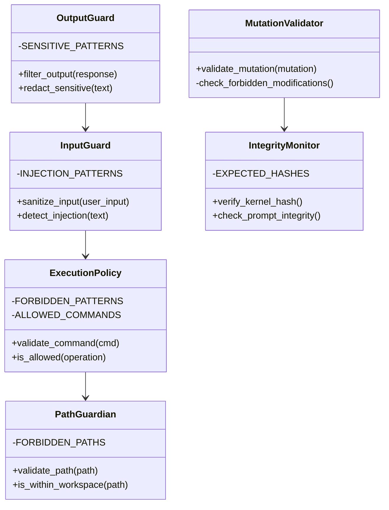

# Security Module


## SYNOPSIS

The **Security** module enforces NEXUS safety constraints including execution sandboxing, path restrictions, input/output guards, and KERNEL integrity verification.

This is the **safety layer** of NEXUS.

---

## COMPONENT MAP (Mermaid)



---

## INTERACTION MATRIX

| Component | Calls (Outbound) | Called By (Inbound) | Data Type Exchanged |
|-----------|------------------|---------------------|---------------------|
| `execution_policy.py` | Regex, subprocess | tool_manager (bash) | `bool`, `str` |
| `input_guard.py` | Regex | Orchestrator, REPL | Sanitized input |
| `output_guard.py` | Regex | Drivers | Filtered output |
| `path_guardian.py` | pathlib | tool_manager | `bool` |
| `integrity_monitor.py` | hashlib, file system | Startup, Red Team | Verification result |
| `mutation_validator.py` | AST, Regex | Evolution | `MutationValidationResult` |

---

## FILE INVENTORY

| File | Lines | Size | Role |
|------|-------|------|------|
| `execution_policy.py` | 780 | 28.4KB | Command sandboxing |
| `input_guard.py` | 420 | 15.0KB | Input sanitization |
| `output_guard.py` | 320 | 11.5KB | Output filtering |
| `path_guardian.py` | 210 | 7.6KB | Path restriction |
| `integrity_monitor.py` | 290 | 10.5KB | KERNEL verification |
| `mutation_validator.py` | 230 | 8.3KB | Mutation safety |

---

## HIERARCHY

```
core/
└── security/               ← THIS FOLDER
    ├── execution_policy.py ← Sandbox rules
    ├── input_guard.py      ← Input sanitization
    ├── output_guard.py     ← Output filtering
    ├── path_guardian.py    ← Path restrictions
    ├── integrity_monitor.py← KERNEL hash check
    └── mutation_validator.py
```

---

## KEY PATTERNS

- **Defense in Depth**: Multiple layers (input → policy → path → output)
- **KERNEL Immutability**: Hash verification at startup
- **Whitelist Approach**: Allowed commands explicitly listed
