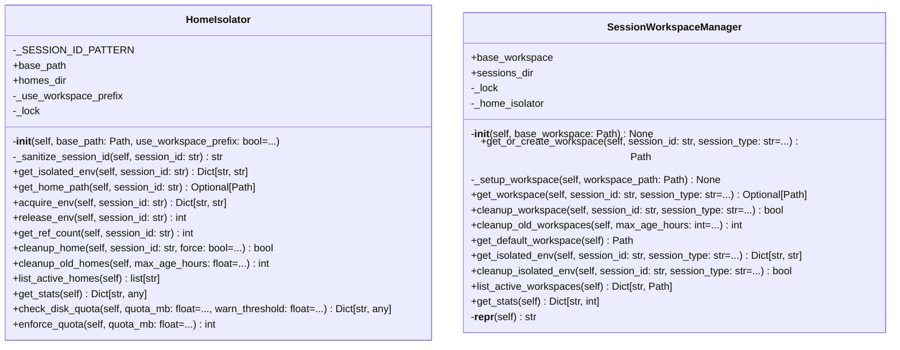

# session

NEXUS Session Management Module.

V9.7.1 - Context Bleeding Fix (Improved)

This module provides session isolation for parallel task execution
without context bleeding between agents.

Key Components:
- SessionWorkspaceManager: Isolated workspaces per session/task
- HomeIsolator: HOME environment spoofing for Gemini session isolation (V9.7.1)

V9.7.1 HOME Spoofing (replaces V9.7 CWD Isolation):
- V9.7 CWD Isolation caused "ghost files" (writes to wrong directory)
- V9.7.1 uses HOME spoofing: CWD stays at project root, HOME is isolated
- Gemini CLI stores sessions in ~/.gemini/tmp/<hash(cwd)>/chats/
- Different HOME = Different session storage = Isolation without ghost files

Usage:
    from core.session import SessionWorkspaceManager, HomeIsolator

    # Create managers
    manager = SessionWorkspaceManager(workspace_path)

    # Get isolated environment for Gemini subprocess (V9.7.1)
    isolated_env = manager.get_isolated_env("task_123_lead", "swarm")

    # Pass to subprocess (CWD stays at project root!)
    subprocess.Popen(cmd, env=isolated_env, cwd=workspace_path)

    # Cleanup after task completion
    manager.cleanup_workspace("task_123_lead", "swarm")

## Overview

| Metric | Value |
|--------|-------|
| **Path** | `C:\Code\NEXUS\NEXUS-N7A\core\session` |
| **Modules** | 3 |
| **Total Lines** | 969 |
| **Classes** | 2 |
| **Functions** | 2 |

## Architecture

## Modules

| Module | Description | Classes | Functions |
|--------|-------------|---------|-----------|
| [home_isolator](home_isolator.py) | HomeIsolator - Session Isolation via HOME Environment Spoofing. | 1 | 0 |
| [workspace_manager](workspace_manager.py) | SessionWorkspaceManager - Isolated Workspaces for Session Isolation. | 1 | 2 |

---
*Auto-generated by nexus-doc-generator 1.0.0 - 2025-12-16 19:13*