# swarm

NEXUS V7 Swarm Module - Hybrid Swarm Engine

Sprint 9: Dynamic multi-agent collaboration where agents negotiate
the optimal mode for each task at runtime.

Architecture:
- TaskAnalyzer: Analyzes task complexity and domains
- ModeSelector: Selects optimal mode using DyLAN scores
- NegotiationProtocol: Hybrid natural+JSON negotiation
- ModeExecutors: 6 collaboration mode executors
- HybridSwarmEngine: Main orchestration engine

Collaboration Modes:
- PARALLEL: Simultaneous work, merge results
- SEQUENTIAL: Ordered execution (first → second)
- LEAD_SUPPORT: Lead drives, support reviews
- PING_PONG: Rapid alternation until convergence
- SPECIALIST: Single expert handles all
- RED_BLUE: Adversarial propose/attack/defend

Usage:
    from core.swarm import HybridSwarmEngine, CollaborationMode

    engine = HybridSwarmEngine(agent_pool, model_router, config)
    result = engine.process_task("Fix the auth bug", blackboard)

## Overview

| Metric | Value |
|--------|-------|
| **Path** | `C:\Code\NEXUS\NEXUS-N7A\core\swarm` |
| **Modules** | 13 |
| **Total Lines** | 7114 |
| **Classes** | 43 |
| **Functions** | 12 |

## Architecture

```mermaid
classDiagram
    class FallbackContext {
        +List[str] domains
        +str complexity
        +str raw_input
        +Optional[str] stagnation_level
        +int messages_since_progress
        +str current_lead
        +Dict[str, Dict[str, float]] agent_metrics
        +List[str] modes_tried
        +List[str] errors_encountered
        +Dict[str, Dict[str, float]] domain_mode_performance
    }
    class FallbackDecision {
        +Optional[CollaborationMode] fallback_mode
        +str reason
        +float confidence
        +bool skip_intermediate
        +Optional[str] recommended_lead
        +to_dict(self) Dict[str, Any]
    }
    class AdaptiveFallbackSelector {
        +predictor
        +success_memory
        -__init__(self, predictor: Optional['StagnationPredictor']=..., success_memory: Optional['SuccessMemory']=...)
        +get_adaptive_fallback(self, current_mode: CollaborationMode, context: FallbackContext) FallbackDecision
        -_should_use_shortcut(self, context: FallbackContext) bool
        -_get_domain_fallback(self, mode_key: str, domains: List[str]) Optional[FallbackDecision]
        -_get_history_fallback(self, mode_key: str, context: FallbackContext) Optional[FallbackDecision]
        -_get_static_fallback(self, current_mode: CollaborationMode) FallbackDecision
        +update_with_prediction(self, context: FallbackContext, messages: List[str]) FallbackContext
    }
    class AgentProvider {
        +GEMINI
        +CLAUDE
    }
    Enum <|-- AgentProvider
    class AgentInvocationResult {
        +str agent_id
        +str task_type
        +datetime timestamp
        +bool success
        +float quality_score
        +int tokens_used
        +float time_seconds
        +Optional[str] error
        +importance_score(self) float
        +to_dict(self) Dict
    }
    class AgentProfile {
        +str agent_id
        +str provider
        +str model
        +List[str] capabilities
        +bool is_active
        +Optional[str] uuid
        +List[AgentInvocationResult] invocation_history
        +int history_window
        +average_importance(self) float
        +success_rate(self) float
        +get_task_importance(self, task_type: str) float
        +record_invocation(self, result: AgentInvocationResult)
        +to_dict(self, include_history: bool=...) Dict
    }
    class AgentPool {
        +Dict[str, AgentProfile] agents
        -Optional[str] _persistence_path
        -bool _auto_save
        -int _save_counter
        -int _save_interval
        +SESSION_BONUS_HIGH
        +SESSION_BONUS_MEDIUM
        +SESSION_BONUS_LOW
        +SESSION_MIN_QUALITY
        +enable_persistence(self, path: str, auto_save: bool=..., save_interval: int=...)
        +register(self, profile: AgentProfile)
        +unregister(self, agent_id: str)
        +get_active_agents(self) List[AgentProfile]
        +get_spawned_agents(self) List[AgentProfile]
        +get_internal_agents(self) List[AgentProfile]
        +select_best_for_task(self, task_type: str, top_k: int=..., min_importance: float=...) List[AgentProfile]
        +select_agents_by_capability(self, domain: str, count: int=..., include_spawned: bool=...) List[AgentProfile]
        +get_best_for_role(self, role: str, domain: str, exclude_agents: Optional[List[str]]=...) Optional[AgentProfile]
        +record_invocation(self, result: AgentInvocationResult)
        +update_from_session_metrics(self, task_id: str, agents_used: list, quality_score: float, domains: list, task_type: str=...) Dict[str, float]
        +get_session_aware_score(self, agent_id: str, task_type: str, success_memory: 'SuccessMemory'=..., dylan_weight: float=...) float
        +get_pool_stats(self) Dict
        +to_dict(self, include_history: bool=...) Dict
        +save_to_file(self, path: str)
        -_load_history_from_file(self, path: str)
        +load_from_file(cls, path: str) 'AgentPool'
    }
    class CollaborationMode {
        +PARALLEL
        +SEQUENTIAL
        +LEAD_SUPPORT
        +PING_PONG
        +SPECIALIST
        +RED_BLUE
        +from_string(cls, value: str) 'CollaborationMode'
        +fallback_mode(self) Optional['CollaborationMode']
    }
    Enum <|-- CollaborationMode
    class ModeCharacteristics {
        +CollaborationMode mode
        +float complexity_affinity
        +float parallelism_benefit
        +bool adversarial
        +int typical_rounds
        +List[str] gemini_strength_fit
        +List[str] claude_strength_fit
        +str description
        +str when_to_use
        +to_dict(self) Dict
    }
    class SwarmPhase {
        +IDLE
        +ANALYZING
        +SELECTING
        +NEGOTIATING
        +EXECUTING
        +COMPLETED
        +FAILED
    }
    Enum <|-- SwarmPhase
    class SwarmResult {
        +SwarmPhase status
        +str final_output
        +CollaborationMode selected_mode
        +TaskAnalysis task_analysis
        +ModeProposal mode_proposal
        +Optional[NegotiationResult] negotiation_result
        +ExecutionResult execution_result
        +float total_time_seconds
        +datetime timestamp
        +to_dict(self) Dict
    }
    class HybridSwarmEngine {
        +agent_pool
        +model_router
        +config
        +invoke_agent
        +workspace_path
        +spawned_agent_loader
        +task_analyzer
        +mode_selector
        +negotiation
        +current_phase
        +session_manager
        +success_memory
        -__init__(self, agent_pool: Optional[AgentPool]=..., model_router: Optional[Any]=..., config: Optional[Any]=..., invoke_agent: Optional[Callable]=..., workspace_path: Optional[Path]=...)
        -_get_config(self, key: str, default: Any) Any
        +process_task(self, task_input: str, blackboard: Optional[Dict]=..., force_mode: Optional[CollaborationMode]=..., skip_negotiation: bool=..., on_negotiation_turn: Optional[Callable]=..., on_execution_round: Optional[Callable]=...) SwarmResult
        -_create_forced_proposal(self, mode: CollaborationMode, analysis: TaskAnalysis) ModeProposal
        -_run_negotiation(self, analysis: TaskAnalysis, proposal: ModeProposal, on_turn: Optional[Callable]=...) NegotiationResult
        -_invoke_for_negotiation(self, agent_id: str, task_type: str, context: str) str
        -_wrap_invoke_agent(self) Callable
        -_update_metrics(self, analysis: TaskAnalysis, result: ExecutionResult)
        -_record_processing(self, result: SwarmResult)
        +start_analysis(self, task_input: str) TaskAnalysis
        +get_analysis(self) Optional[TaskAnalysis]
        +start_selection(self) ModeProposal
        +start_negotiation(self, analysis: Optional[TaskAnalysis]=...) Optional[NegotiationResult]
        +process_negotiation_turn(self) Optional[NegotiationResult]
        +execute_turn(self, task_input: str, blackboard: Optional[Dict]=...) ExecutionResult
        +reset(self)
        +get_stats(self) Dict
        -_discover_spawned_agents(self) int
        -_count_spawned_agents(self) int
        -_get_spawned_agents(self) List[AgentProfile]
        +should_suggest_spawning(self, analysis: TaskAnalysis) bool
        +get_spawning_suggestion(self, analysis: TaskAnalysis) Optional[Dict]
    }
    class MergeStrategyType {
        +NAIVE
        +DEDUPLICATE
        +WEIGHTED
    }
    Enum <|-- MergeStrategyType
    class MergeContext {
        +str task_input
        +List['AgentResponse'] outputs
        +Optional[Dict[str, Any]] task_analysis
        +Optional[List[Any]] agent_assignments
    }
    class MergeResult {
        +str content
        +MergeStrategyType strategy_used
        +Dict[str, Any] metadata
    }
```

## Modules

| Module | Description | Classes | Functions |
|--------|-------------|---------|-----------|
| [adaptive_fallback](adaptive_fallback.py) | NEXUS V8.8 - Adaptive Fallback Selector (GROK-004) | 3 | 1 |
| [agent_metrics](agent_metrics.py) | Agent Metrics - DyLAN-inspired Performance Tracking | 4 | 1 |
| [collaboration_modes](collaboration_modes.py) | Collaboration Modes - Sprint 9 Hybrid Swarm Engine | 2 | 5 |
| [hybrid_swarm_engine](hybrid_swarm_engine.py) | Hybrid Swarm Engine - Sprint 9 Main Orchestration | 3 | 0 |
| [merge_strategies](merge_strategies.py) | Parallel Merge Strategies for NEXUS V8.3.3 | 7 | 2 |
| [mode_executors](mode_executors.py) | Mode Executors - V9.6 Re-export Module | 0 | 0 |
| [mode_selector](mode_selector.py) | Mode Selector - Sprint 9 Hybrid Swarm Engine | 3 | 0 |
| [negotiation_protocol](negotiation_protocol.py) | Negotiation Protocol - Sprint 9 Hybrid Swarm Engine | 5 | 1 |
| [service](service.py) | NEXUS V9.1 - SwarmService | 3 | 0 |
| [session_manager](session_manager.py) | SwarmSessionManager - Session Isolation for Parallel Task Execution. | 5 | 1 |
| [task_analyzer](task_analyzer.py) | Task Analyzer - Sprint 9 Hybrid Swarm Engine | 5 | 0 |
| [task_completion_validator](task_completion_validator.py) | Task Completion Validator - V7.9 Fix for Premature FINISHED Signal | 3 | 1 |

## Subpackages

| Package | Description | Modules |
|---------|-------------|---------|
| [executors/](C:\Code\NEXUS\NEXUS-N7A\core\swarm\executors/README.md) |  | 0 |

## Aggregated Statistics

Statistics from all subpackages:

| Metric | Value |
|--------|-------|
| Subpackages | 1 |
| Total Modules | 0 |
| Total Lines of Code | 0 |
| Total Classes | 0 |
| Total Functions | 0 |

---
*Auto-generated by nexus-doc-generator 1.0.0 - 2025-12-16 19:13*