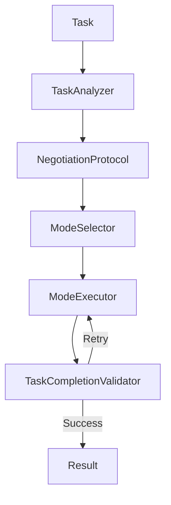

# Swarm Module - NEXUS V9.2

## Rôle
Le module `core/swarm` est le moteur de collaboration multi-agents dynamique de NEXUS. Il permet à plusieurs agents (Gemini, Claude, et agents spécialisés) de collaborer sur une tâche complexe en négociant le mode de travail optimal (Parallèle, Séquentiel, Lead/Support, etc.) au runtime.

## Fichiers Clés
| Fichier | Lignes | Responsabilité |
|---------|--------|----------------|
| `hybrid_swarm_engine.py` | ~300 | **Orchestrator**: Coordonne le cycle de vie du Swarm (Analyze -> Negotiate -> Execute). |
| `mode_selector.py` | ~350 | **Decision**: Sélectionne le mode optimal basé sur la complexité (DyLAN). |
| `negotiation_protocol.py` | ~230 | **Protocol**: Gère l'échange de messages de négociation entre agents. |
| `mode_executors.py` | ~480 | **Executors**: Implémente la logique d'exécution pour chaque mode (Parallel, Sequential, etc.). |
| `task_analyzer.py` | ~180 | **Analysis**: Détermine la complexité et le domaine de la tâche. |

## API Publique
```python
from core.swarm import (
    HybridSwarmEngine,
    CollaborationMode,
    SwarmResult
)

# Usage
engine = HybridSwarmEngine(agent_pool, model_router, config)
result = await engine.process_task(task, blackboard)
```

## Flux de Données

### Swarm Lifecycle


## Modes de Collaboration
1.  **PARALLEL**: Exécution simultanée, fusion des résultats.
2.  **SEQUENTIAL**: Chaîne de responsabilité (A -> B -> C).
3.  **LEAD_SUPPORT**: Un leader dirige, les supports exécutent/vérifient.
4.  **PING_PONG**: Alternance rapide jusqu'à convergence.
5.  **SPECIALIST**: Un seul expert gère tout.
6.  **RED_BLUE**: Adversarial (Propose vs Critique).

## Dépendances

**Importe :**
- `core/drivers` : Pour invoquer les agents.
- `core/synapse` : Blackboard pour le partage d'état.

**Importé par :**
- `core/orchestration_v7.py` : Point d'entrée principal du Swarm.
- `core/orchestration/fsm_handlers.py` : Gestion des états FSM liés au Swarm.
- `core/hive_mind/swarm_bridge.py` : Pont entre Hive Mind (Strategic) et Swarm (Tactical).

## Configuration

| Variable | Default | Description |
|----------|---------|-------------|
| `SWARM_AUTO_ROUTE` | `True` | Active le routage automatique vers le Swarm. |
| `MAX_SWARM_ROUNDS` | `5` | Nombre max d'itérations en mode Ping-Pong/Red-Blue. |

## Session Isolation (V10)

### SwarmSessionManager

Prevents **Context Bleeding** by assigning unique `session_uuid` to each agent-role combination:

```
TaskSession (task_id)
    └── roles: {
          "lead":    AgentSession(agent_id="gemini", session_uuid="uuid-1")
          "worker":  AgentSession(agent_id="claude", session_uuid="uuid-2")
        }
```

### Session Modes
| Mode | Description | Persisted |
|------|-------------|-----------|
| `FRESH` | New session | ✅ Yes |
| `CONTINUE` | Resume existing | ✅ Yes |
| `BRANCH` | Fork from parent | ✅ Yes |
| `EPHEMERAL` | Memory-only (TRIVIAL) | ❌ No |

### Storage
Sessions persisted to: `workspace/.nexus/session_registry.json`

### Key File
- `session_manager.py` - `SwarmSessionManager` class

## Tests

- `tests/swarm/test_hybrid_swarm_engine.py`
- `tests/swarm/test_negotiation.py`
- `tests/e2e/test_swarm_collaboration.py`
- `tests/test_session_manager.py` **(V7.5)**
- `tests/test_ephemeral_sessions.py` **(V7.8)**

