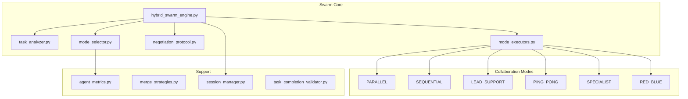

# Swarm Engine Module

## SYNOPSIS

The **Swarm Engine** implements dynamic multi-agent collaboration with 6 distinct modes. It analyzes task complexity, negotiates the optimal collaboration mode between agents, and executes with mode-specific strategies.

This is the **tactical coordinator** for agent interactions.

---

## COMPONENT MAP (Mermaid)

---

## INTERACTION MATRIX

| Component | Calls (Outbound) | Called By (Inbound) | Data Type Exchanged |
|-----------|------------------|---------------------|---------------------|
| `hybrid_swarm_engine.py` | All submodules, drivers | HiveMind SwarmBridge, REPL | `SwarmResult` |
| `task_analyzer.py` | None (pure analysis) | Engine | `TaskAnalysis` |
| `mode_selector.py` | agent_metrics, DyLAN | Engine | `ModeProposal` |
| `negotiation_protocol.py` | Drivers | Engine | `NegotiationResult` |
| `mode_executors.py` | Drivers, merge_strategies | Engine | Mode-specific results |
| `agent_metrics.py` | Blackboard, persistence | mode_selector | `AgentMetrics` |
| `session_manager.py` | File system | Engine | `SwarmSession` |

---

## COLLABORATION MODES

| Mode | Description | Use Case |
|------|-------------|----------|
| `PARALLEL` | Both agents work simultaneously, merge results | Independent subtasks |
| `SEQUENTIAL` | Ordered execution (first → second) | Dependent steps |
| `LEAD_SUPPORT` | Lead drives, support reviews/assists | Complex implementation |
| `PING_PONG` | Rapid alternation until convergence | Iterative refinement |
| `SPECIALIST` | Single expert handles all | Clear domain expertise |
| `RED_BLUE` | Adversarial propose/attack/defend | Security review |

---

## FILE INVENTORY

| File | Lines | Size | Role |
|------|-------|------|------|
| `__init__.py` | 120 | 4.2KB | Module exports |
| `hybrid_swarm_engine.py` | 920 | 33.8KB | Main engine |
| `task_analyzer.py` | 500 | 18.1KB | Complexity analysis |
| `mode_selector.py` | 950 | 35.0KB | Mode selection (DyLAN) |
| `mode_executors.py` | 1300 | 48.1KB | 6 mode implementations |
| `negotiation_protocol.py` | 620 | 22.9KB | Agent negotiation |
| `agent_metrics.py` | 590 | 21.7KB | Performance tracking |
| `session_manager.py` | 610 | 22.4KB | Session isolation |

---

## KEY PATTERNS

- **DyLAN Routing**: Dynamic agent selection based on historical metrics
- **EPHEMERAL Sessions**: Memory-only sessions for TRIVIAL tasks
- **Negotiation Protocol**: Max 4 turns, fallback to forced vote
- **Merge Strategies**: Mode-specific result merging
