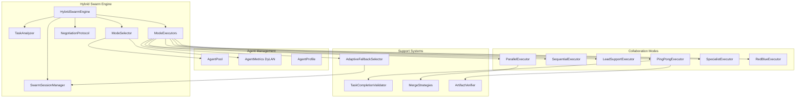

# core/swarm - Hybrid Swarm Engine

**Version:** V9.6 (Sprint 5.3) | **Status:** Production

Dynamic multi-agent collaboration system where agents negotiate optimal collaboration modes at runtime.

**Key V9.6 Features:**
- **Dictator Mode:** HiveMind can force a specific mode (e.g., forcing `RED_BLUE` for security checks).
- **SwarmTool:** Swarm Engine invocable as a tool (`swarm_delegate`) by agents.
- **Merge Strategies:** Intelligent merging for PARALLEL mode results.

---

## SYNOPSIS

```
Entree: Task description + Agent pool
Traitement:
  1. Task analysis (complexity, domains)
  2. Mode selection (DyLAN-based)
  3. Agent negotiation (hybrid natural+JSON)
  4. Mode execution (6 collaboration modes)
  5. Result merging & metrics update
Sortie: CollaborationResult with execution history
```

**Example:**
```python
from core.swarm import HybridSwarmEngine, AgentPool

engine = HybridSwarmEngine(agent_pool, model_router, config)
result = engine.process_task(
    "Fix authentication bug in auth.py",
    blackboard={"workspace_path": Path("workspace")}
)
# → Analyses task → Selects LEAD_SUPPORT mode → Executes → Returns result
```

---

## LOCAL MAP



---

## COMPONENT DETAILS

### 1. HybridSwarmEngine
**File:** `hybrid_swarm_engine.py` (757 lines)
**Purpose:** Main orchestrator for the entire swarm pipeline

**Key Methods:**
- `process_task(task, blackboard, force_mode=None)` - Full pipeline execution
- `start_analysis(task)` - Phase 1: Task analysis
- `start_selection()` - Phase 2: Mode selection
- `start_negotiation()` - Phase 3: Agent negotiation
- `execute_turn()` - Phase 4: Mode execution

**Dependencies:**
- TaskAnalyzer - Task analysis
- ModeSelector - Mode selection with DyLAN
- NegotiationProtocol - Agent negotiation
- ModeExecutors - Execution (6 modes)
- SwarmSessionManager - Session isolation (V7.5)

---

### 2. TaskAnalyzer
**File:** `task_analyzer.py` (518 lines)
**Purpose:** Analyzes user input to determine task characteristics

**Analyzes:**
- **Complexity:** TRIVIAL (1) → EXPERT (5)
- **Domains:** CODING, RESEARCH, DEBUGGING, SECURITY, etc.
- **Requirements:** Web access, code execution, deep reasoning
- **Agent Fit:** Gemini vs Claude fit scores (0.0-1.0)

**Example:**
```python
analyzer = TaskAnalyzer()
analysis = analyzer.analyze("Fix auth bug and add tests")
# → complexity=MODERATE, domains=[DEBUGGING, TESTING],
#    claude_fit=0.85, gemini_fit=0.65
```

**V7 Fix:** Detects trivial conversational inputs ("hello", "ok") to skip multi-agent.

---

### 3. ModeSelector
**File:** `mode_selector.py` (981 lines)
**Purpose:** Selects optimal collaboration mode using DyLAN importance scores

**Selection Factors:**
1. **Complexity fit** (30%) - Mode matches task complexity
2. **Domain fit** (25%) - Agent strengths match domains
3. **DyLAN scores** (25%) - Historical performance
4. **Requirements fit** (20%) - Web, reasoning, iteration needs

**Memory Augmentation (V7.6):**
- **SuccessMemory:** Boosts modes that worked for similar tasks (semantic similarity)
- **AutoMemory:** Suggests mode/lead based on task_type (gradient confidence)

**Example:**
```python
selector = ModeSelector(agent_pool, success_memory=memory)
proposal = selector.select_mode(task_analysis)
# → mode=LEAD_SUPPORT, lead=claude, support=gemini, confidence=0.82
```

---

### 4. NegotiationProtocol
**File:** `negotiation_protocol.py` (635 lines)
**Purpose:** Hybrid negotiation (natural language + structured JSON)

**Protocol:**
```
1. ModeSelector proposes initial mode
2. Agent 1 (Gemini) reacts/counter-proposes
   → Natural discussion + <negotiate>{...}</negotiate> JSON
3. Agent 2 (Claude) reacts/accepts
4. Repeat until consensus or max_turns (default 4)
5. Fallback to initial proposal if no consensus
```

**Example Exchange:**
```
Gemini: "Pour cette tache de debugging, je pense que LEAD_SUPPORT serait optimal.
<negotiate>
{"proposed_mode": "lead_support", "proposed_lead": "Claude", "confidence": 0.85}
</negotiate>"

Claude: "D'accord, je menerai l'investigation.
<negotiate>
{"agrees_with_partner": true, "consensus_reached": true}
</negotiate>"
```

---

### 5. ModeExecutors
**File:** `mode_executors.py` (1324 lines)
**Purpose:** Implements 6 collaboration modes

#### 5.1 ParallelExecutor
**Pattern:** Agents work simultaneously, merge results
**Use Case:** Independent subtasks, time-critical
**V9:** True async execution with `asyncio.gather()`
**V8.3.3:** Pluggable merge strategies (NAIVE, DEDUPLICATE, WEIGHTED)

```python
# PARALLEL mode with 2 agents on independent subtasks
executor.execute_async(context)  # V9: non-blocking I/O
# → Both agents work in parallel
# → Results merged via MergeStrategy
```

#### 5.2 SequentialExecutor
**Pattern:** First agent → Second agent refines
**Use Case:** Clear dependencies, pipeline tasks

#### 5.3 LeadSupportExecutor
**Pattern:** Lead (80%) drives, Support (20%) reviews
**Use Case:** Clear expertise dominance, complex coding

#### 5.4 PingPongExecutor
**Pattern:** Rapid alternation until convergence
**Use Case:** Creative tasks, brainstorming, iterative refinement
**V7.9:** TaskCompletionValidator prevents premature FINISHED

#### 5.5 SpecialistExecutor
**Pattern:** Single expert handles everything
**Use Case:** Exclusive expertise, highly specialized tasks
**V7:** Failover to backup agent if specialist fails

#### 5.6 RedBlueExecutor
**Pattern:** Blue proposes → Red attacks → Blue defends → Red verifies
**Use Case:** Security reviews, critical decisions
**Phases:**
1. Blue proposes solution
2. Red finds weaknesses
3. Blue defends/revises
4. Red gives verdict (PASS/FAIL)

---

### 6. AgentPool & Metrics (DyLAN)
**File:** `agent_metrics.py` (628 lines)
**Purpose:** DyLAN-inspired agent selection and performance tracking

**DyLAN Formula:**
```
importance_score = quality / cost
where:
  quality = task success rate * quality_score (0.0-1.0)
  cost = (tokens_used / 1000) + time_seconds
```

**AgentPool Methods:**
- `register(AgentProfile)` - Register agent
- `select_best_for_task(task_type, top_k=1)` - Select by importance
- `select_agents_by_capability(domain, count=1)` - Select by capability
- `record_invocation(AgentInvocationResult)` - Update metrics

**V7.6 Phase 10d:** Session-aware scoring (DyLAN + session success rate).

**Example:**
```python
pool = AgentPool()
pool.register(AgentProfile(
    agent_id="claude_opus",
    provider="claude",
    model="claude-opus-4-5-20251101",
    capabilities=["coding", "debugging"]
))

# After task execution
result = AgentInvocationResult(
    agent_id="claude_opus",
    task_type="debugging",
    success=True,
    quality_score=0.85,
    tokens_used=1500,
    time_seconds=12.5
)
pool.record_invocation(result)
# → importance_score = 0.85 / ((1500/1000) + 12.5) = 0.061
```

---

### 7. SwarmSessionManager
**File:** `session_manager.py` (669 lines)
**Purpose:** Session isolation for parallel task execution (V7.5 Phase 7)

**Problem Solved:** "Context Bleeding" where parallel tasks corrupt each other's context.

**Architecture:**
- Each task gets unique `task_id`
- Each agent-role gets unique `session_uuid`
- Sessions persisted via `AtomicJsonStore`
- UUIDs passed to CLI drivers for session resumption

**Example:**
```python
manager = SwarmSessionManager(workspace_path)
manager.create_task("task_001", "PARALLEL")
uuid = manager.get_or_create_session("task_001", "lead", "gemini")
# → Pass uuid to gemini CLI: gemini --resume {uuid}
```

**V7.8.2:** Ephemeral sessions for trivial tasks (no file I/O).

---

### 8. TaskCompletionValidator
**File:** `task_completion_validator.py` (319 lines)
**Purpose:** Validates that tasks are truly complete (V7.9)

**Validation Layers:**
1. **Keyword Detection** - "FINISHED", "DONE" (word boundaries)
2. **Artifact Verification** - Files mentioned actually exist
3. **Semantic Completion** - Agent addressed the task
4. **Tool Usage Validation** - Appropriate tools used

**Example:**
```python
validator = TaskCompletionValidator(workspace_path)
result = validator.validate_completion(
    task_input="Fix auth bug",
    agent_response="I fixed the bug. FINISHED.",
    task_analysis=analysis,
    tool_results=[...]
)
# → is_valid=False, reason="No evidence of file changes"
```

**V8.3.4 FL-002:** Fixed false positives ("I'm not DONE yet" no longer triggers).

---

### 9. AdaptiveFallbackSelector
**File:** `adaptive_fallback.py` (417 lines)
**Purpose:** Context-aware fallback mode selection (V8.8 GROK-004)

**Problem Solved:** Static fallback chains don't adapt to context.

**Selection Factors:**
1. **Stagnation level** - High stagnation skips intermediate modes
2. **Domain affinity** - Certain modes work better for domains
3. **Historical performance** - SuccessMemory for domain+mode
4. **Agent metrics** - DyLAN scores
5. **Complexity** - Simpler tasks skip complex modes

**Example:**
```python
selector = AdaptiveFallbackSelector(predictor, success_memory)
decision = selector.get_adaptive_fallback(
    current_mode=CollaborationMode.PARALLEL,
    context=FallbackContext(
        domains=["coding"],
        stagnation_level="high"
    )
)
# → fallback=SPECIALIST (skip SEQUENTIAL), reason="High stagnation"
```

---

### 10. MergeStrategies
**File:** `merge_strategies.py` (353 lines)
**Purpose:** Intelligent merging of parallel execution results (V8.3.3)

**Available Strategies:**
- **NAIVE:** Simple concatenation (backward compatible, default)
- **DEDUPLICATE:** Remove semantically similar sentences (Jaccard similarity)
- **WEIGHTED:** Prioritize by domain fit scores from TaskAnalysis

**Configuration:**
```bash
# .env
NEXUS_PARALLEL_MERGE_STRATEGY=deduplicate  # or naive, weighted
```

**Example:**
```python
from core.swarm.merge_strategies import get_merge_strategy, MergeStrategyType

strategy = get_merge_strategy(MergeStrategyType.DEDUPLICATE)
result = strategy.merge(merge_context)
# → Removes duplicate sentences, keeps unique content
```

---

### 11. CollaborationModes
**File:** `collaboration_modes.py` (234 lines)
**Purpose:** Defines the 6 collaboration modes and their characteristics

**Modes:**
```python
class CollaborationMode(Enum):
    PARALLEL = "parallel"
    SEQUENTIAL = "sequential"
    LEAD_SUPPORT = "lead_support"
    PING_PONG = "ping_pong"
    SPECIALIST = "specialist"
    RED_BLUE = "red_blue"
```

**Mode Characteristics:**
- `complexity_affinity` - Fit for task complexity (0.0-1.0)
- `parallelism_benefit` - Benefit from parallel execution
- `adversarial` - Is adversarial mode (RED_BLUE only)
- `typical_rounds` - Expected number of rounds
- `gemini_strength_fit` - Domains where Gemini excels
- `claude_strength_fit` - Domains where Claude excels

**V7.5 Phase 8:** Fallback modes for graceful degradation.

---

### 12. SwarmService
**File:** `service.py` (330 lines)
**Purpose:** Service layer for swarm operations (V9.1)

**Methods:**
- `run_task(task)` - Execute via swarm
- `run_task_fsm(task)` - Execute via FSM states (debug)
- `get_status()` - Get swarm statistics

**Example:**
```python
service = SwarmService(orchestrator, console, config)
result = service.run_task("Analyze this codebase")
# → Executes via swarm, streams progress to console
```

---

## INTERACTION MATRIX

| Component | Outbound Dependencies | Inbound From | Data Types |
|-----------|----------------------|--------------|------------|
| **HybridSwarmEngine** | TaskAnalyzer, ModeSelector, NegotiationProtocol, ModeExecutors, SwarmSessionManager | OrchestratorV7, SwarmService | TaskAnalysis, ModeProposal, NegotiationResult, ExecutionResult |
| **TaskAnalyzer** | - | HybridSwarmEngine, ModeSelector | TaskAnalysis |
| **ModeSelector** | AgentPool, SuccessMemory, AutoMemory | HybridSwarmEngine | ModeProposal, AgentAssignment |
| **NegotiationProtocol** | ModeSelector | HybridSwarmEngine | NegotiationResult, HybridNegotiationMessage |
| **ModeExecutors** | AgentPool, SwarmSessionManager, TaskCompletionValidator, ArtifactVerifier, AdaptiveFallbackSelector | HybridSwarmEngine | ExecutionResult, AgentResponse |
| **AgentPool** | - | ModeSelector, ModeExecutors | AgentProfile, AgentInvocationResult |
| **SwarmSessionManager** | AtomicJsonStore | HybridSwarmEngine, ModeExecutors | TaskSession, AgentSession |
| **TaskCompletionValidator** | ArtifactVerifier | ModeExecutors (PingPong) | ValidationResult, CompletionCriteria |
| **AdaptiveFallbackSelector** | SuccessMemory, StagnationPredictor | ModeExecutors | FallbackDecision, FallbackContext |
| **MergeStrategies** | UnifiedRegistry | ModeExecutors (Parallel) | MergeResult, MergeContext |

---

## PARENT LINK

**Parent Module:** [core/](../README.md)

**Related Modules:**
- [core/drivers/](../drivers/README.md) - Agent drivers (Gemini, Claude)
- [core/fsm/](../fsm/README.md) - FSM orchestrator states
- [core/memory/](../memory/README.md) - SuccessMemory, AutoMemory
- [core/agents/](../agents/README.md) - UnifiedRegistry, agent management

---

## VERSION HISTORY

- **V9.1:** SwarmService extraction for separation of concerns
- **V9.0:** True async parallel execution with `asyncio.gather()`
- **V8.8 (GROK-004):** AdaptiveFallbackSelector for context-aware fallbacks
- **V8.8 (GROK-002):** Exponential decay + domain boost (SuccessMemory)
- **V8.5.0:** Adaptive fallback integration with HybridSwarmEngine
- **V8.4.5:** Rate limiting in ModeExecutors (PARALLEL mode)
- **V8.4.4:** Thread-safety fix (ThreadPoolExecutor + Lock)
- **V8.4.0:** UnifiedRegistry integration
- **V8.3.4 (FL-002):** Fixed FINISHED false positives with word boundaries
- **V8.3.3:** Pluggable merge strategies for PARALLEL mode
- **V8.3.1-hotfix:** Depth Guard anti-recursion (MAX_DEPTH=2)
- **V8.3.1:** SwarmTool (swarm_delegate)
- **V8.3.0:** SwarmBridge - HiveMind delegation
- **V8.1.6:** Thread-safe session_uuid for parallel execution
- **V7.9:** TaskCompletionValidator, spawned agent integration
- **V7.8.2:** Ephemeral sessions for trivial tasks
- **V7.8:** Phase 15 Agent-as-Tool, GoT code removal
- **V7.7 (Phase 14e):** Force CoT for EXPERT complexity
- **V7.6 (Phase 10d):** Session-aware DyLAN scoring
- **V7.6 (Phase 10b):** SuccessMemory integration
- **V7.6 (Phase 10a):** Success Memory recording
- **V7.5 (Phase 8):** Self-Healing Swarm with fallback
- **V7.5 (Phase 7):** Session isolation with SwarmSessionManager
- **V7.5:** Streaming callbacks for real-time updates
- **Sprint 9:** Initial Hybrid Swarm Engine implementation

---

## CONFIGURATION

**Environment Variables:**
```bash
# Swarm Engine
SWARM_ENABLED=True                     # Enable swarm engine
SWARM_AUTO_ROUTE=True                  # Auto-route MODERATE+ tasks to swarm
SWARM_NEGOTIATION_ENABLED=True         # Enable negotiation
SWARM_NEGOTIATION_MAX_TURNS=4          # Max negotiation turns
SWARM_SKIP_TRIVIAL=True                # Skip negotiation for trivial
SWARM_MAX_ROUNDS=6                     # Default max rounds (adaptive per complexity)
SWARM_SELF_HEALING=True                # Enable fallback on failure
SWARM_MAX_FALLBACKS=2                  # Max fallback attempts

# Merge Strategies (V8.3.3)
NEXUS_PARALLEL_MERGE_STRATEGY=naive    # naive | deduplicate | weighted

# Session (Phase 7)
SWARM_SESSION_RETENTION_HOURS=24       # Session cleanup retention
```

---

## USAGE EXAMPLES

### Example 1: Basic Task Execution
```python
from core.swarm import HybridSwarmEngine, AgentPool, create_default_pool
from pathlib import Path

# Create engine
pool = create_default_pool(config)
engine = HybridSwarmEngine(
    agent_pool=pool,
    model_router=router,
    config=config,
    invoke_agent=invoke_fn,
    workspace_path=Path("workspace")
)

# Process task
result = engine.process_task(
    task_input="Fix authentication bug in auth.py",
    blackboard={"workspace_path": Path("workspace")}
)

print(f"Mode: {result.selected_mode.value}")
print(f"Status: {result.status.value}")
print(f"Output: {result.final_output}")
```

### Example 2: Force Specific Mode
```python
from core.swarm import CollaborationMode

result = engine.process_task(
    task_input="Security review of authentication module",
    force_mode=CollaborationMode.RED_BLUE  # Force adversarial mode
)
```

### Example 3: Streaming Progress
```python
def on_negotiation_turn(message):
    print(f"[NEGOTIATION] {message.sender}: {message.natural_content[:100]}")

def on_execution_round(round_num, response):
    print(f"[ROUND {round_num}] {response.agent_id}: {response.content[:100]}")

result = engine.process_task(
    task_input="Refactor authentication module",
    on_negotiation_turn=on_negotiation_turn,
    on_execution_round=on_execution_round
)
```

### Example 4: Agent Pool Management
```python
from core.swarm import AgentPool, AgentProfile, AgentInvocationResult

# Create pool
pool = AgentPool()

# Register agents
pool.register(AgentProfile(
    agent_id="claude_opus",
    provider="claude",
    model="claude-opus-4-5-20251101",
    capabilities=["coding", "debugging", "architecture"]
))

# Enable persistence
pool.enable_persistence("workspace/.nexus/dylan_scores.json")

# After execution, record metrics
pool.record_invocation(AgentInvocationResult(
    agent_id="claude_opus",
    task_type="debugging",
    success=True,
    quality_score=0.85,
    tokens_used=1500,
    time_seconds=12.5
))

# Get stats
stats = pool.get_pool_stats()
print(f"Average importance: {stats['average_pool_importance']}")
```

---

## TESTING

**Test Files:**
- `tests/test_swarm_engine.py` - HybridSwarmEngine tests
- `tests/test_task_analyzer.py` - TaskAnalyzer tests
- `tests/test_mode_selector.py` - ModeSelector tests
- `tests/test_negotiation.py` - NegotiationProtocol tests
- `tests/test_mode_executors.py` - All 6 mode executors
- `tests/test_self_healing.py` - Fallback chain
- `tests/test_cot_enforcement.py` - Force CoT EXPERT
- `tests/test_automemory_integration.py` - Memory-augmented selection

**Run Tests:**
```bash
pytest tests/test_swarm*.py -v
```

---

## FILE INVENTORY

| Fichier | Lignes | Responsabilité |
|---------|--------|----------------|
| `mode_executors.py` | ~1324 | Exécution modes + self-healing fallback |
| `mode_selector.py` | ~981 | Sélection mode via DyLAN scores |
| `hybrid_swarm_engine.py` | ~757 | Moteur principal d'orchestration |
| `session_manager.py` | ~669 | Isolation sessions parallèles |
| `negotiation_protocol.py` | ~635 | Négociation inter-agents |
| `agent_metrics.py` | ~628 | DyLAN metrics + AgentPool |
| `task_analyzer.py` | ~518 | Analyse complexité/domaines |
| `adaptive_fallback.py` | ~417 | GROK-004: Fallback contextuel |
| `merge_strategies.py` | ~353 | Fusion résultats (IntelligentMerger) |
| `service.py` | ~330 | Service layer (V9.1) |
| `task_completion_validator.py` | ~319 | Validation complétion tâches |
| `collaboration_modes.py` | ~234 | Définitions 6 modes |
| `__init__.py` | ~197 | Exports publics |

**Total**: ~7,362 lignes

---

## KNOWN ISSUES

**V8.3.4 FL-002 (RESOLVED):** FINISHED false positives with word boundaries
**V7.9 (RESOLVED):** Premature task completion in PingPong mode
**V8.8:** StagnationPredictor integration needs refinement

---

## FUTURE ENHANCEMENTS

- **V9.2:** Consensus merge strategy using LLM for PARALLEL
- **V9.3:** Multi-agent negotiation (3+ agents)
- **V10.0:** Dynamic mode composition (hybrid modes)
- **V10.5:** RL-based mode selection (replace DyLAN)

---

**Maintained by:** NEXUS Core Team
**Last Updated:** 2025-12-13
**Contact:** See [CLAUDE.md](../../CLAUDE.md)
