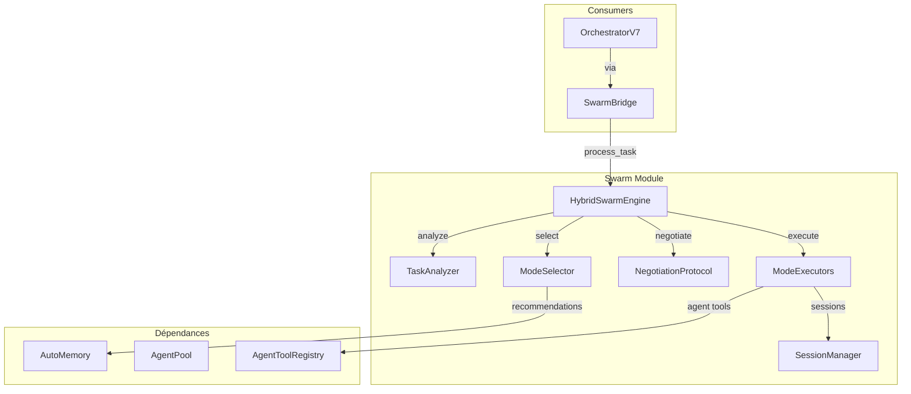

# Module : Swarm - NEXUS V7.8 "HIVE MIND"

Hybrid Swarm Engine pour collaboration multi-agent dynamique.

## Rôle dans l'Architecture NEXUS V7.8

Le module Swarm (Sprint 9) permet la **sélection dynamique du mode de collaboration** où les agents négocient la manière optimale de travailler ensemble pour chaque tâche.

**Nouveauté V7.8**: Suppression code GoT mort, intégration Phase 15 Agent-as-Tool.

## Architecture

```
                         USER INPUT
                              │
                              ▼
┌─────────────────────────────────────────────────────────────────┐
│                    HYBRID SWARM ENGINE                          │
│                                                                 │
│  ┌──────────────────┐   ┌──────────────────┐   ┌─────────────┐  │
│  │   TaskAnalyzer   │──▶│   ModeSelector   │──▶│ Negotiation │  │
│  │  • Complexity    │   │   • DyLAN scores │   │  Protocol   │  │
│  │  • Domains       │   │   • Mode scoring │   │  • Hybrid   │  │
│  └──────────────────┘   └──────────────────┘   └─────────────┘  │
│                                                      │          │
│                                                      ▼          │
│  ┌─────────────────────────────────────────────────────────┐   │
│  │                    MODE EXECUTORS                        │   │
│  │  ┌──────────┐ ┌──────────┐ ┌────────────┐ ┌──────────┐  │   │
│  │  │ PARALLEL │ │SEQUENTIAL│ │LEAD_SUPPORT│ │PING_PONG │  │   │
│  │  └──────────┘ └──────────┘ └────────────┘ └──────────┘  │   │
│  │  ┌────────────┐ ┌──────────┐                             │   │
│  │  │ SPECIALIST │ │ RED_BLUE │                             │   │
│  │  └────────────┘ └──────────┘                             │   │
│  └─────────────────────────────────────────────────────────┘   │
└─────────────────────────────────────────────────────────────────┘
```

## Composants Principaux

| Fichier | Rôle | Classes/Fonctions clés |
|---------|------|------------------------|
| `hybrid_swarm_engine.py` | Moteur principal | `HybridSwarmEngine`, `SwarmResult` |
| `task_analyzer.py` | Analyse tâches | `TaskAnalyzer`, `TaskComplexity`, `TaskDomain` |
| `mode_selector.py` | Sélection mode | `ModeSelector`, `ModeProposal` |
| `collaboration_modes.py` | Définitions modes | `CollaborationMode`, `ModeCharacteristics` |
| `negotiation_protocol.py` | Négociation agents | `NegotiationProtocol`, `NegotiationResult` |
| `mode_executors.py` | Exécution + self-healing | `ParallelExecutor`, `execute_with_fallback()` |
| `agent_metrics.py` | DyLAN + scoring | `AgentProfile`, `AgentPool` |
| `session_manager.py` | Isolation session | `SwarmSessionManager`, `TaskSession` |

## Modes de Collaboration (6)

| Mode | Description | Cas d'usage | Affinité Complexité |
|------|-------------|-------------|---------------------|
| **PARALLEL** | Travail simultané, fusion résultats | Sous-tâches indépendantes | 0.5 |
| **SEQUENTIAL** | Exécution ordonnée | Dépendances claires | 0.6 |
| **LEAD_SUPPORT** | Lead (80%) + Support (20%) | Expertise dominante | 0.7 |
| **PING_PONG** | Alternance rapide | Brainstorming, créativité | 0.6 |
| **SPECIALIST** | Un seul expert | Expertise exclusive | 0.8 |
| **RED_BLUE** | Adversarial propose/attaque/défend | Sécurité, décisions critiques | 1.0 |

### Chaîne de Fallback (Phase 8: Self-Healing)

```
PARALLEL    → SEQUENTIAL
RED_BLUE    → LEAD_SUPPORT
LEAD_SUPPORT → SPECIALIST
PING_PONG   → SEQUENTIAL
SEQUENTIAL  → SPECIALIST
SPECIALIST  → None (terminal)
```

## Phase Status (V7.8)

| Phase | Description | Status |
|-------|-------------|--------|
| **Phase 7** | Session Isolation (SwarmSessionManager) | ✅ |
| **Phase 8** | Self-Healing Swarm (Fallback) | ✅ |
| **Phase 10a** | Success Memory | ✅ |
| **Phase 10b** | Memory-Augmented Mode Selection | ✅ |
| **Phase 10d** | Session-Aware Agent Selection | ✅ |
| **Phase 5b** | N-Agent Agnosticism (Spawned Agents) | ✅ |
| **Phase 14e** | Force Chain-of-Thought (EXPERT) | ✅ |
| **Phase 14c** | GoT code removal (-206 lignes) | ✅ **[V7.8]** |
| **Phase 15** | Agent-as-Tool integration | ✅ **[V7.8]** |

---

## Complexité des Tâches

| Niveau | Valeur | Description | Négociation | CoT Forcé |
|--------|--------|-------------|-------------|-----------|
| `TRIVIAL` | 1 | Tâches mono-étape | Skip | Non |
| `SIMPLE` | 2 | Opérations basiques | Minimal | Non |
| `MODERATE` | 3 | Tâches standard | Full | Non |
| `COMPLEX` | 4 | Planification multi-étapes | Extended | Non |
| `EXPERT` | 5 | Décisions critiques | RED_BLUE | **Oui** |

### Force Chain-of-Thought (Phase 14e)

Pour EXPERT, injection automatique de l'instruction CoT:

```xml
<instruction>BEFORE answering or using tools, you MUST wrap your step-by-step reasoning in <thinking>...</thinking> tags.</instruction>
```

---

## Scoring Session-Aware (Phase 10d)

```python
Score = (DyLAN_importance × 0.7) + (Session_success_rate × 0.3)

# Bonus session
HIGH_SESSION_BONUS = 0.08   # Success rate ≥ 0.8
MEDIUM_SESSION_BONUS = 0.05 # Success rate ≥ 0.6
LOW_SESSION_BONUS = 0.02    # Success rate ≥ 0.4
```

---

## Interactions et Flux de Données



---

## Usage

### Traitement Basique

```python
from core.swarm import HybridSwarmEngine

engine = HybridSwarmEngine(
    agent_pool=agent_pool,
    model_router=router,
    config=config,
    invoke_agent=orchestrator._invoke_for_swarm,
    workspace_path=workspace_path
)

result = engine.process_task("Review the auth module security")

print(f"Mode: {result.mode}")        # RED_BLUE
print(f"Status: {result.status}")    # SUCCESS
```

### Force Mode Spécifique

```python
result = engine.process_task(
    "Write unit tests",
    forced_mode=CollaborationMode.SPECIALIST
)
```

### Skip Négociation

```python
result = engine.process_task(
    "Quick fix",
    skip_negotiation=True
)
```

---

## Configuration

```bash
# Core
SWARM_ENABLED=True                  # Activer swarm engine
SWARM_AUTO_ROUTE=True               # Auto-route MODERATE+ tasks
SWARM_NEGOTIATION=True              # Activer phase négociation
SWARM_NEGOTIATION_TURNS=4           # Max rounds négociation
SWARM_DEFAULT_MODE=ping_pong        # Mode fallback
SWARM_MAX_ROUNDS=6                  # Max rounds exécution

# Session (Phase 7)
SWARM_SESSION_RETENTION_HOURS=24    # Durée rétention sessions

# Self-Healing (Phase 8)
SWARM_MAX_FALLBACKS=2               # Max tentatives fallback
```

---

## Métriques V7.8

| Fichier | Lignes | Changement V7.8 |
|---------|--------|-----------------|
| `hybrid_swarm_engine.py` | 595 | -206 (GoT removal) |
| `mode_executors.py` | 450 | Stable |
| `mode_selector.py` | 620 | Stable |
| `session_manager.py` | 380 | Stable |
| **Total module** | ~3200 | -6% |

---

## Notes d'Audit Local

### [V7.8] Changements

**Phase 14c Cleanup:**
- Code GoT (Graph of Thought) supprimé (801 → 595 lignes)
- Méthodes retirées: `should_use_got()`, `decompose_with_got()`, `execute_thought_graph()`
- Flag `_GOT_AVAILABLE` retiré

**Phase 15 Integration:**
- Support `AgentToolRegistry` pour invoquer agents spawnés comme outils
- Mode executors peuvent appeler agent tools

### Points d'attention
- **Thread-safety**: `threading.RLock` sur opérations critiques
- **Session cleanup**: 24h retention par défaut
- **Fallback chain**: Testé via `test_self_healing.py`

---

## Voir Aussi

- [core/memory/README.md](../memory/README.md) - SuccessMemory pour scoring
- [core/orchestration/README.md](../orchestration/README.md) - SwarmBridge
- [core/execution/README.md](../execution/README.md) - AgentToolRegistry
- [core/fsm/README.md](../fsm/README.md) - États SWARM_*
- [docs/PHASE_14E_COT_ENFORCEMENT.md](../../docs/PHASE_14E_COT_ENFORCEMENT.md) - Force CoT
