# executors

Swarm Mode Executors - V9.6 Complete Extraction

Decomposed from mode_executors.py (1187 LOC) for Single Responsibility.

Each executor implements one collaboration mode:
- ParallelExecutor: Simultaneous work with result merging
- SequentialExecutor: Ordered execution (first → second)
- LeadSupportExecutor: Lead drives, support reviews
- PingPongExecutor: Rapid alternation until convergence
- SpecialistExecutor: Single expert handles all
- RedBlueExecutor: Adversarial propose/attack/defend

## Overview

| Metric | Value |
|--------|-------|
| **Path** | `C:\Code\NEXUS\NEXUS-N7A\core\swarm\executors` |
| **Modules** | 9 |
| **Total Lines** | 1718 |
| **Classes** | 14 |
| **Functions** | 3 |

## Architecture

```mermaid
classDiagram
    class ExecutionStatus {
        +PENDING
        +IN_PROGRESS
        +COMPLETED
        +FAILED
        +CONVERGED
        +INCOMPLETE
    }
    Enum <|-- ExecutionStatus
    class AgentResponse {
        +str agent_id
        +str content
        +str status
        +List[Dict] tool_results
        +int tokens_used
        +float time_seconds
        +Optional[str] error
        +is_finished(self) bool
        +to_dict(self) Dict
    }
    class ExecutionContext {
        +str task_input
        +List[AgentAssignment] agent_assignments
        +Dict blackboard
        +int max_rounds
        +Optional[Callable] invoke_agent
        +Optional[Callable[..., None]] on_round
        +Optional[str] task_id
        +Optional[Any] session_manager
        +bool force_cot
        +get_agent_by_role(self, role: str) Optional[AgentAssignment]
        +get_all_agents(self) List[AgentAssignment]
        +get_session_uuid(self, role: str, agent_id: str) Optional[str]
        +get_workspace_path(self, role: str, agent_id: str) Optional[Path]
        +get_isolated_env(self, role: str, agent_id: str) Optional[Dict[str, str]]
    }
    class ExecutionResult {
        +CollaborationMode mode
        +ExecutionStatus status
        +str final_output
        +List[AgentResponse] agent_outputs
        +int total_rounds
        +int total_tokens
        +float total_time_seconds
        +Dict metadata
        +finished(self) bool
        +to_dict(self) Dict
    }
    class ExecutionError {
    }
    Exception <|-- ExecutionError
    class ModeExecutor {
        +CollaborationMode mode
        +execute(self, context: ExecutionContext) ExecutionResult
        -_invoke(self, context: ExecutionContext, agent_id: str, task_context: str, role: Optional[str]=...) AgentResponse
        -_invoke_async(self, context: ExecutionContext, agent_id: str, task_context: str, role: Optional[str]=...) AgentResponse
        -_invoke_with_failover(self, context: ExecutionContext, primary_agent_id: str, backup_agent_id: str, task_context: str, primary_role: Optional[str]=..., backup_role: Optional[str]=...) AgentResponse
        -_get_backup_agent(self, agent_id: str) str
        -_verify_artifacts(self, content: str, context: ExecutionContext) Dict[str, Any]
        +execute_with_fallback(self, context: ExecutionContext, max_fallbacks: int=...) ExecutionResult
    }
    class LeadSupportExecutor {
        +mode
        +execute(self, context: ExecutionContext) ExecutionResult
    }
    ModeExecutor <|-- LeadSupportExecutor
    class ConflictReport {
        +bool has_conflicts
        +List[str] file_conflicts
        +List[str] command_conflicts
        +List[str] semantic_conflicts
        +str severity
        +to_dict(self) Dict
    }
    class ConflictDetector {
        +FILE_PATH_PATTERNS
        +BASH_PATTERNS
        +CONTRADICTION_PATTERNS
        +detect_conflicts(self, outputs: List['AgentResponse']) ConflictReport
        -_commands_conflict(self, cmd1: str, cmd2: str) bool
        -_detect_semantic_conflicts(self, outputs: List['AgentResponse']) List[str]
    }
    class ParallelExecutor {
        +mode
        -_merge_strategy
        -_conflict_detector
        -__init__(self, merge_strategy: Optional['MergeStrategy']=...)
        +execute(self, context: ExecutionContext) ExecutionResult
        +execute_async(self, context: ExecutionContext) ExecutionResult
        -_merge_with_strategy(self, context: ExecutionContext, outputs: List[AgentResponse]) 'MergeResult'
        -_merge_outputs(self, outputs: List[AgentResponse], task: str) str
    }
    ModeExecutor <|-- ParallelExecutor
    class PingPongExecutor {
        +mode
        -_workspace_path
        -__init__(self, workspace_path: Optional[Path]=...)
        +execute(self, context: ExecutionContext) ExecutionResult
    }
    ModeExecutor <|-- PingPongExecutor
    class RedBlueExecutor {
        +mode
        +execute(self, context: ExecutionContext) ExecutionResult
    }
    ModeExecutor <|-- RedBlueExecutor
    class SequentialExecutor {
        +mode
        +execute(self, context: ExecutionContext) ExecutionResult
    }
    ModeExecutor <|-- SequentialExecutor
    class SpecialistExecutor {
        +mode
        +execute(self, context: ExecutionContext) ExecutionResult
    }
    ModeExecutor <|-- SpecialistExecutor
```

## Modules

| Module | Description | Classes | Functions |
|--------|-------------|---------|-----------|
| [base](base.py) | Base Executor Classes - V9.5 Refactored | 6 | 0 |
| [lead_support_executor](lead_support_executor.py) | LeadSupportExecutor - V9.6 Extracted | 1 | 0 |
| [parallel_executor](parallel_executor.py) | ParallelExecutor - Simultaneous Agent Execution. | 3 | 0 |
| [ping_pong_executor](ping_pong_executor.py) | PingPongExecutor - V9.6 Extracted | 1 | 0 |
| [red_blue_executor](red_blue_executor.py) | RedBlueExecutor - V9.6 Extracted | 1 | 0 |
| [registry](registry.py) | Executor Registry - V9.6 Extracted | 0 | 3 |
| [sequential_executor](sequential_executor.py) | SequentialExecutor - V9.6 Extracted | 1 | 0 |
| [specialist_executor](specialist_executor.py) | SpecialistExecutor - V9.6 Extracted | 1 | 0 |

---
*Auto-generated by nexus-doc-generator 1.0.0 - 2025-12-16 19:13*