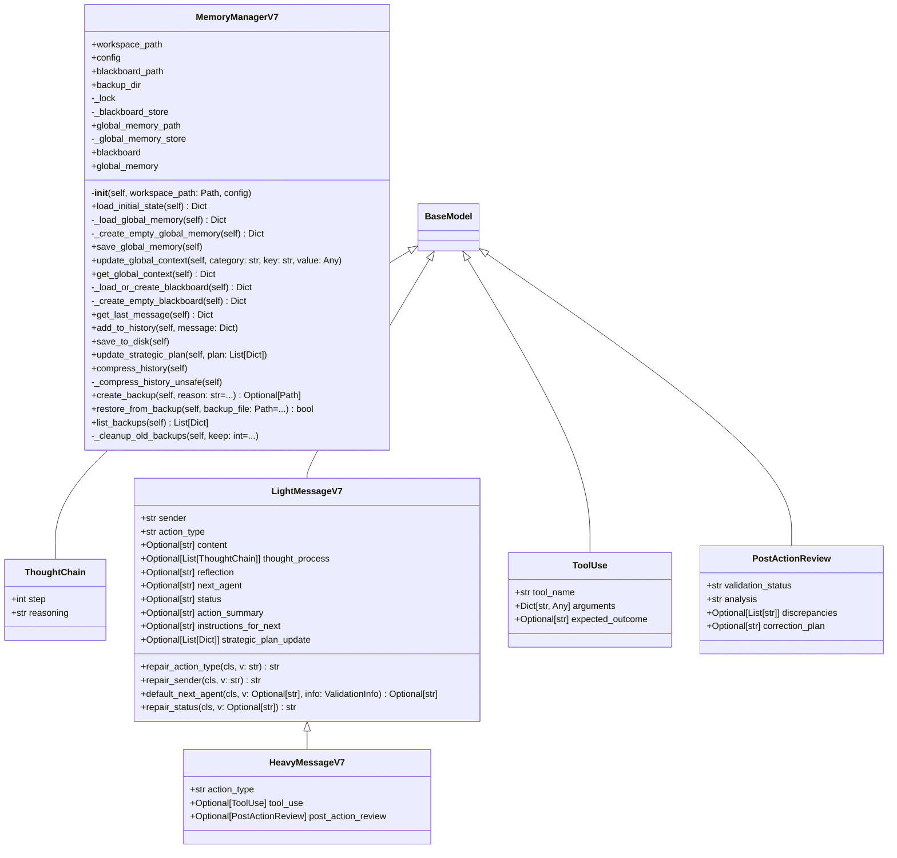

# synapse

NEXUS V7 Synapse - Protocol & Memory

## Overview

| Metric | Value |
|--------|-------|
| **Path** | `C:\Code\NEXUS\NEXUS-N7A\core\synapse` |
| **Modules** | 3 |
| **Total Lines** | 508 |
| **Classes** | 6 |
| **Functions** | 0 |

## Architecture

## Modules

| Module | Description | Classes | Functions |
|--------|-------------|---------|-----------|
| [memory_v7](memory_v7.py) | Memory Manager V7 - Persistent in-RAM state | 1 | 0 |
| [protocol_v7](protocol_v7.py) | Protocol V7 - Schémas Pydantic souples avec auto-repair | 5 | 0 |

---
*Auto-generated by nexus-doc-generator 1.0.0 - 2025-12-16 19:13*