# telemetry

NEXUS Telemetry Module

Simple file-based telemetry for tracking:
- API calls (tokens, latency, model)
- Session metrics
- Swarm collaboration metrics
- Error rates
- Budget/cost tracking (Phase 14d)

V7 Sprint 10: Basic telemetry foundation
V7.6 Phase 13c: Telemetry Export (CSV, reports)
V7.6 Phase 14d: Budget Cap & Cost Tracking
V9.1: Service Layer (TelemetryService, BudgetService)
Future: Export to Langfuse, OTLP, or other backends

## Overview

| Metric | Value |
|--------|-------|
| **Path** | `C:\Code\NEXUS\NEXUS-N7A\core\telemetry` |
| **Modules** | 6 |
| **Total Lines** | 2085 |
| **Classes** | 16 |
| **Functions** | 6 |

## Architecture

```mermaid
classDiagram
    class BudgetExceededError {
        +spent
        +limit
        +message
        -__init__(self, spent: float, limit: float, message: str=...)
    }
    Exception <|-- BudgetExceededError
    class BudgetWarning {
    }
    Warning <|-- BudgetWarning
    class BudgetState {
        +float spent_today_usd
        +str reset_date
        +float total_lifetime_usd
        +int api_calls_today
        +str last_updated
        +to_dict(self) Dict
        +from_dict(cls, data: Dict) 'BudgetState'
    }
    class CostRecord {
        +str timestamp
        +str model
        +int input_tokens
        +int output_tokens
        +float cost_usd
    }
    class BudgetTracker {
        -_lock
        +limit_usd
        -_state
        +budget_file
        -__init__(self, config=..., workspace_path: Optional[Path]=..., budget_file: Optional[Path]=...)
        -_load_state(self) BudgetState
        -_save_state(self)
        -_check_daily_reset(self)
        +estimate_tokens(self, text: str) int
        +get_model_pricing(self, model: str) Dict[str, float]
        +calculate_cost(self, model: str, input_tokens: int, output_tokens: int) float
        +track_cost(self, model: str, input_tokens: int=..., output_tokens: int=..., input_text: Optional[str]=..., output_text: Optional[str]=...) float
        +get_budget_status(self) Tuple[float, float, float]
        +check_budget(self) bool
        +get_warning_level(self) Optional[str]
        +get_remaining(self) float
        +get_stats(self) Dict
        +reset_daily(self)
        +add_credit(self, amount_usd: float)
    }
    class TelemetryEvent {
        +str event_type
        +str session_id
        +datetime timestamp
        +Dict[str, Any] data
        +from_json(cls, line: str) Optional['TelemetryEvent']
    }
    class TelemetryExporter {
        +workspace_path
        +telemetry_file
        -__init__(self, workspace_path: Path, telemetry_file: Optional[str]=...)
        -_iter_events(self, since: Optional[datetime]=..., event_types: Optional[List[str]]=...) Iterator[TelemetryEvent]
        +get_event_count(self) int
        +read_events(self, days: int=..., event_types: Optional[List[str]]=...) List[TelemetryEvent]
        +export_to_csv(self, output_dir: Optional[Path]=..., days: Optional[int]=...) Path
        -_event_to_csv_row(self, event: TelemetryEvent) Dict[str, Any]
        +generate_report(self, days: int=...) Dict[str, Any]
        +format_report_for_console(self, report: Dict[str, Any]) str
    }
    class MetricType {
        +API_CALL
        +SWARM_TASK
        +TOOL_EXECUTION
        +ERROR
        +SESSION
        +EVOLUTION
    }
    Enum <|-- MetricType
    class APICallMetric {
        +str timestamp
        +str provider
        +str model
        +int tokens_in
        +int tokens_out
        +float latency_seconds
        +bool success
        +Optional[str] task_type
        +Optional[str] error
    }
    class SwarmTaskMetric {
        +str timestamp
        +str mode
        +int rounds
        +float duration_seconds
        +bool success
        +List[str] agents_used
        +int negotiation_turns
    }
    class SessionMetric {
        +str session_id
        +str start_time
        +int total_api_calls
        +int total_tokens
        +int total_errors
        +int swarm_tasks
        +int tool_executions
        +float duration_seconds
    }
    class TelemetryCollector {
        +enabled
        +config
        +session_id
        +session_start
        -_lock
        -_api_calls
        -_total_tokens
        -_total_cost_usd
        -_errors
        -_swarm_tasks
        -_tool_executions
        +output_file
        -_budget_tracker
        -__init__(self, config=..., output_file: Optional[Path]=...)
        -_write_event(self, event_type: MetricType, data: Dict[str, Any])
        +record_api_call(self, provider: str, model: str, tokens_in: int=..., tokens_out: int=..., latency_seconds: float=..., success: bool=..., task_type: Optional[str]=..., error: Optional[str]=..., input_text: Optional[str]=..., output_text: Optional[str]=...)
        +record_swarm_task(self, mode: str, rounds: int, duration_seconds: float, success: bool, agents_used: Optional[List[str]]=..., negotiation_turns: int=...)
        +record_tool_execution(self, tool_name: str, duration_seconds: float, success: bool, error: Optional[str]=...)
        +record_error(self, error_type: str, message: str, context: Optional[Dict]=...)
        +record_evolution(self, generation: int, child_id: str, parent_score: float, child_score: float, promoted: bool, mutations: List[str])
        +get_session_summary(self) SessionMetric
        +write_session_summary(self)
        +print_summary(self)
        +enforce_budget(self) bool
        +get_budget_stats(self) Optional[Dict]
        +get_budget_warning_level(self) Optional[str]
    }
    class RedisLogHandler {
        -_redis_url
        -_tenant_id
        -_workspace_id
        -_running
        -_stats
        -__init__(self, redis_url: str=..., tenant_id: str=..., workspace_id: str=..., queue_size: int=..., level: int=...)
        +start(self) bool
        +stop(self, timeout: float=...) None
        +emit(self, record: logging.LogRecord) None
        -_worker(self) None
        +get_stats(self) Dict[str, Any]
        +flush(self) None
        +close(self) None
    }
    logging.Handler <|-- RedisLogHandler
    class ServiceResult {
        +bool success
        +Optional[str] message
        +Optional[str] error
        +Optional[Dict[str, Any]] data
    }
    class TelemetryService {
        +workspace_path
        +console
        +config
        -__init__(self, workspace_path: Path, console: 'ConsoleV7', config: Optional['Config']=...)
        -_get_exporter(self)
        +report(self, days: int=...) ServiceResult
        +status(self) ServiceResult
        +export(self, days: Optional[int]=...) ServiceResult
    }
```

## Modules

| Module | Description | Classes | Functions |
|--------|-------------|---------|-----------|
| [budget_tracker](budget_tracker.py) | NEXUS Budget Tracker - Phase 14d | 5 | 2 |
| [exporter](exporter.py) | Telemetry Exporter - Phase 13c | 2 | 0 |
| [metrics](metrics.py) | NEXUS Telemetry Metrics Collector | 5 | 1 |
| [redis_bridge](redis_bridge.py) | NEXUS V10 CEREBRO - Redis Log Bridge | 1 | 1 |
| [service](service.py) | NEXUS V9.1 - TelemetryService & BudgetService | 3 | 2 |

---
*Auto-generated by nexus-doc-generator 1.0.0 - 2025-12-16 19:13*