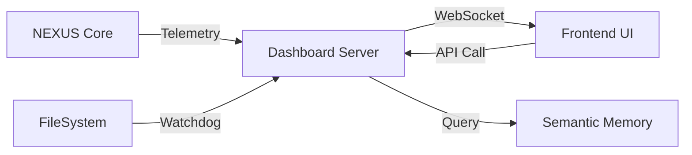

# Module: core/ui

## Rôle dans l'Architecture NEXUS V9.2
Ce module gère l'interface "Réalité" de NEXUS, permettant de visualiser l'état interne du système en temps réel. Il transforme NEXUS d'une "boîte noire" en une "boîte de verre".

## Composants Clés
*   `dashboard_server.py`: Serveur FastAPI (Backend). Sert les fichiers statiques et les endpoints API.
*   `telemetry.py`: Client asynchrone (Singleton) pour émettre des événements depuis le Core vers le Dashboard.
*   `code_mapper.py`: Analyseur statique (AST) pour générer le graphe de dépendances (Neural Code Map).
*   `static/`: Frontend (HTML/JS/CSS) utilisant Cytoscape.js et WebSockets.

## Architecture & Flux
*   **Entrées :**
    *   Événements FSM (`TASK_STARTED`, `TOOL_USE`) via `TelemetryClient`.
    *   Modifications de fichiers via `watchdog` (dans `dashboard_server.py`).
    *   Requêtes API (`/api/agents`, `/api/memory/vectors`).
*   **Sorties :**
    *   Flux WebSocket (`/ws/logs`) vers le navigateur.
    *   JSON pour les graphes et nuages de points.
*   **Configuration :**
    *   Port par défaut : 8000 (configurable via `uvicorn`).

## Protocole WebSocket
Les messages sont des objets JSON avec un champ `type` :
*   `log`: Message textuel standard.
*   `TASK_STARTED`: Début d'une tâche (`data: { task, complexity }`).
*   `TOOL_USE`: Utilisation d'un outil (`data: { agent, tool, args }`).
*   `TASK_COMPLETED`: Fin de tâche.
*   `FILE_EVENT`: Modification système de fichiers (`data: { event, path }`).

## Dépendances
*   **Utilise :** `fastapi`, `uvicorn`, `watchdog`, `core.agents`, `core.memory`.
*   **Utilisé par :** `core.orchestration.fsm_handlers` (via `telemetry`).

## Diagramme

