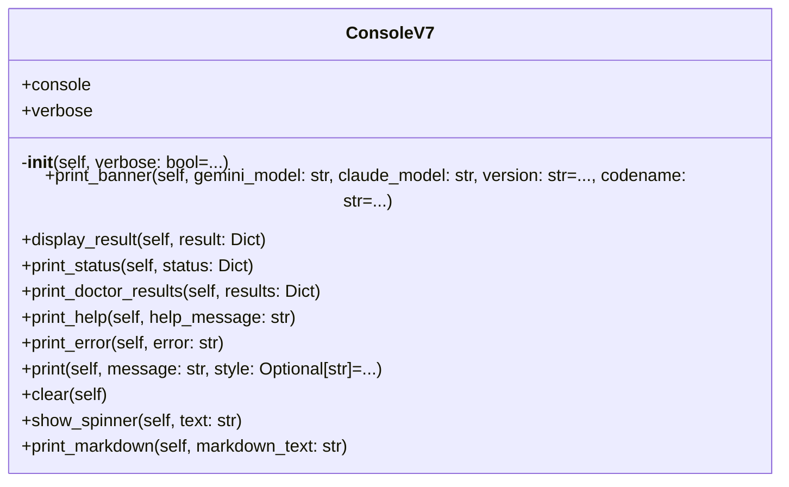

# ui

NEXUS V7 UI Module

## Overview

| Metric | Value |
|--------|-------|
| **Path** | `C:\Code\NEXUS\NEXUS-N7A\core\ui` |
| **Modules** | 2 |
| **Total Lines** | 233 |
| **Classes** | 1 |
| **Functions** | 0 |

## Architecture

## Modules

| Module | Description | Classes | Functions |
|--------|-------------|---------|-----------|
| [console_v7](console_v7.py) | Console UI V7 - Interface minimaliste avec Rich | 1 | 0 |

---
*Auto-generated by nexus-doc-generator 1.0.0 - 2025-12-16 19:13*