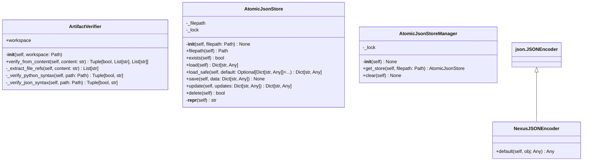

# utils

NEXUS V7.5 HIVE MIND Utility modules.

## Overview

| Metric | Value |
|--------|-------|
| **Path** | `C:\Code\NEXUS\NEXUS-N7A\core\utils` |
| **Modules** | 7 |
| **Total Lines** | 1211 |
| **Classes** | 4 |
| **Functions** | 20 |

## Architecture

## Modules

| Module | Description | Classes | Functions |
|--------|-------------|---------|-----------|
| [artifact_verifier](artifact_verifier.py) | Artifact Verifier - Robust validation of agent-produced artifacts. | 1 | 0 |
| [async_utils](async_utils.py) | NEXUS V8.4.4a - Async Utilities | 0 | 3 |
| [atomic_store](atomic_store.py) | AtomicJsonStore - Thread-safe atomic JSON persistence layer. | 2 | 2 |
| [json_extractor](json_extractor.py) | Robust JSON Extractor - NEXUS V7.5 HIVE MIND | 0 | 4 |
| [serialization](serialization.py) | NexusJSONEncoder - Robust JSON serialization for NEXUS types. | 1 | 3 |
| [stream_parser](stream_parser.py) | Stream Parser for NEXUS V7.7 - Phase 15 | 0 | 8 |

---
*Auto-generated by nexus-doc-generator 1.0.0 - 2025-12-16 19:13*