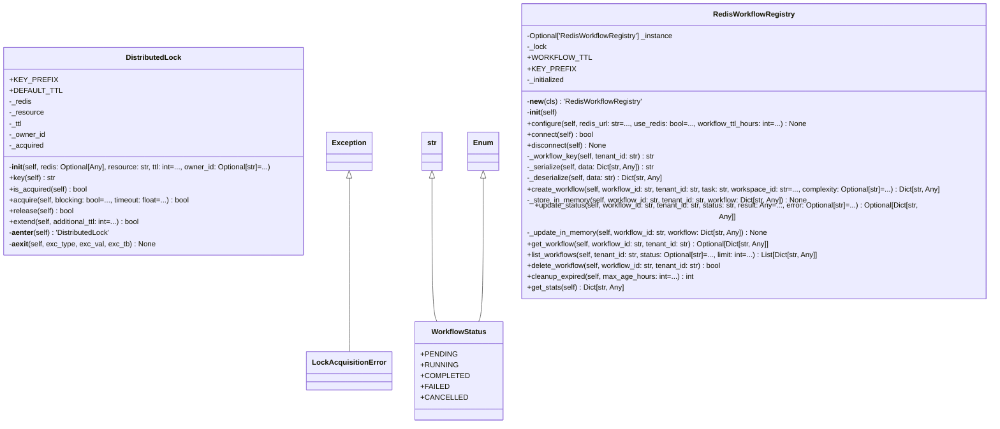

# workflow

NEXUS V12.3 SCALE-OUT - Workflow Module

Redis-backed workflow registry with graceful degradation to in-memory.
Enables multi-instance deployment where workflows are visible across all nodes.

Components:
- RedisWorkflowRegistry: Redis-backed workflow storage
- DistributedLock: Redlock pattern for concurrent safety
- get_workflow_registry(): Factory function with graceful degradation

Author: Claude (NEXUS V12.3 SCALE-OUT)
Date: 2025-12-16

## Overview

| Metric | Value |
|--------|-------|
| **Path** | `C:\Code\NEXUS\NEXUS-N7A\core\workflow` |
| **Modules** | 3 |
| **Total Lines** | 826 |
| **Classes** | 4 |
| **Functions** | 4 |

## Architecture

## Modules

| Module | Description | Classes | Functions |
|--------|-------------|---------|-----------|
| [distributed_lock](distributed_lock.py) | NEXUS V12.3 SCALE-OUT - Distributed Lock | 2 | 2 |
| [redis_registry](redis_registry.py) | NEXUS V12.3 SCALE-OUT - Redis Workflow Registry | 2 | 2 |

---
*Auto-generated by nexus-doc-generator 1.0.0 - 2025-12-16 19:13*