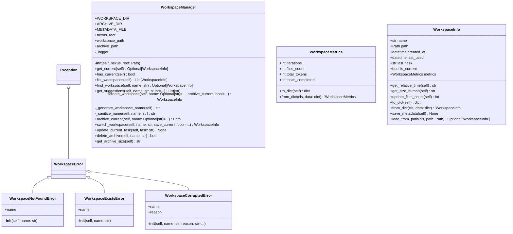

# workspace

NEXUS V7.6 - Workspace Management Module

Provides multi-workspace support for NEXUS sessions.
Allows creating, archiving, and switching between workspaces.

Components:
- manager.py: WorkspaceManager class
- models.py: WorkspaceInfo, WorkspaceMetrics dataclasses
- exceptions.py: Workspace-related exceptions

Usage:
    from core.workspace import WorkspaceManager

    manager = WorkspaceManager(nexus_root)
    current = manager.get_current()
    workspaces = manager.list_workspaces()
    new_ws = manager.create_workspace("my-project")
    manager.switch_workspace("old-project")

## Overview

| Metric | Value |
|--------|-------|
| **Path** | `C:\Code\NEXUS\NEXUS-N7A\core\workspace` |
| **Modules** | 4 |
| **Total Lines** | 628 |
| **Classes** | 7 |
| **Functions** | 0 |

## Architecture

## Modules

| Module | Description | Classes | Functions |
|--------|-------------|---------|-----------|
| [exceptions](exceptions.py) | Workspace Exceptions | 4 | 0 |
| [manager](manager.py) | WorkspaceManager - Multi-workspace management for NEXUS | 1 | 0 |
| [models](models.py) | Workspace Models | 2 | 0 |

---
*Auto-generated by nexus-doc-generator 1.0.0 - 2025-12-16 19:13*